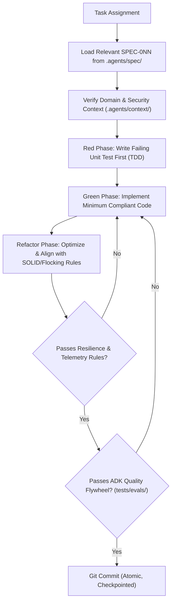
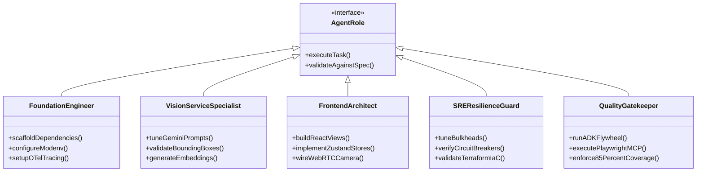

# Agent Operating System & Specification Directives (`AGENTS.md`)

## 1. Executive Charter & Architectural Mission

This document defines the operational protocol, engineering standards, and behavioral contracts for autonomous AI agents (operating via Google Antigravity, Gemini 3.8 Flash, or the Google Agent Development Kit) executing within the Retail Cortex Price Comparison platform.

Agents must not improvise architecture, speculate on domain requirements, or inject unverified third-party libraries. All code generation, refactoring, and infrastructure provisioning must be strictly spec-driven, adhering to the specifications housed in `.agents/spec/` and the rules set forth in this document.

---

## 2. Directory Layout & Proposed `.agents/` Workspace Structure

To decouple agent governance, operational context, and specifications from application source code, the greenfield repository structure organizes all agentic metadata under `.agents/`:

```
.
├── .agents/                               # Central Agentic Governance & Specification Engine
│   ├── config.yaml                        # Agent execution runtime, model backends & safety gates
│   ├── AGENTS.md                          # Global agent directives, standards & role definitions
│   ├── context/                           # Domain knowledge, retail dictionaries & grounding rules
│   │   ├── retail_domain_rules.md         # UPC validation, unit pricing math, promo pack parsing
│   │   ├── security_rules.md              # ADC auth, Secret Manager URI schemes, IAM policies
│   │   └── telemetry_conventions.md       # OTel span naming, attribute keys, W3C traceparent headers
│   ├── skills/                            # Specialized toolkits & Antigravity execution skills
│   │   ├── modenv-resolver/SKILL.md       # Cascading TOML & secret decryption workflows
│   │   ├── bigquery-streaming/SKILL.md    # Fully qualified BQ SQL validation & CDC verification
│   │   └── resilience-verifier/SKILL.md   # Bulkhead saturation & circuit breaker tripping tests
│   ├── evals/                             # Quality Flywheel benchmark datasets & judge prompts
│   │   ├── golden_shelf_dataset.json      # 100 benchmark shelf photographs with ground truth
│   │   └── judge_rubric.md                # Multi-modal evaluation criteria (IoU, OCR, Top-1 Recall)
│   └── spec/                              # Actionable Spec-Driven Development (SDD) contracts
│       ├── SPEC-001-foundation-modenv.md
│       ├── SPEC-002-telemetry-otel.md
│       ├── SPEC-003-storage-gcs.md
│       ├── SPEC-004-multimodal-vision.md
│       ├── SPEC-005-vector-matcher.md
│       ├── SPEC-006-adk-agent-reasoning.md
│       ├── SPEC-007-api-gateway-schemas.md
│       ├── SPEC-008-client-state-zustand.md
│       ├── SPEC-009-hardware-webrtc-camera.md
│       ├── SPEC-010-disambiguation-ui-review.md
│       ├── SPEC-011-verification-testing-gates.md
│       ├── SPEC-012-bigquery-lakehouse-hitl.md
│       ├── SPEC-013-terraform-iac-cloud.md
│       └── SPEC-014-resilience-sre-maintenance.md
├── .gemini/                               # Antigravity IDE workspace configuration
│   └── GEMINI.md                          # Active workspace directives and developer memory rules
├── backend/                               # Python 3.13 / FastAPI enterprise microservice
│   ├── pyproject.toml                     # uv package manager configuration
│   ├── src/price_comp_backend/            # Production service code
│   └── tests/                             # Pytest unit, resilience, and integration test suites
├── client/                                # React 19 / TypeScript 5.9 / Vite 7 single-page application
│   ├── package.json                       # npm package manifest & script definitions
│   ├── src/                               # Frontend components, hooks, stores, and views
│   └── tests/                             # Vitest component tests & Playwright browser suites
└── deployments/terraform/                 # Modular Terraform infrastructure as code
    ├── modules/                           # Reusable GCP provisioning modules
    └── environments/                      # Environment parameterizations (dev, prod)
```

---

## 3. Spec-Driven Development (SDD) Lifecycle

Agents must execute tasks using the Spec-Driven Development (SDD) loop. When assigned a feature, refactor, or bug fix:



### 3.1 Mandatory TDD Protocol
- **Test First, Always:** Write tests confirming behavior *before* implementing code. Tests target concretions, not abstractions.
- **Compiler / Linter First:** Always run static checks (`uv run ruff check .`, `tsc -b`) and fix syntax errors *before* executing tests.
- **Flocking Rules for Refactoring:**
  1. Select the most alike code patterns.
  2. Identify the smallest difference.
  3. Make the simplest change to eliminate the difference.

### 3.2 Git Commit Strategy
- **Development Checkpoints:** Commit as soon as tests pass and code compiles cleanly (e.g., `checkpoint: implemented modenv cascading resolution`).
- **Feature Completion:** Distinct, descriptive commit once all unit and integration tests pass (e.g., `feat: implement async GCS storage service with V4 signed URLs`).
- **Single Feature Rule:** Never begin work on a subsequent specification until the current specification passes all tests and is committed.

---

## 4. Architectural Rules & Technology Constraints

Agents must enforce the following non-negotiable standards across all generated artifacts:

### 4.1 Python Standards (Backend)
- **Runtime:** Python 3.13 executed strictly via `uv` within the project virtual environment.
- **Type Safety:** Strict static typing with Python `typing` library. `Any` is strictly forbidden unless interfacing with un-typed external payloads; use Pydantic v2 schemas or generic typevars.
- **Configuration:** Exclusively managed via [`retail-cortex/modenv`](https://github.com/retail-cortex/modenv). Never read `os.environ` directly in business logic. Secrets must resolve via `cloud://`, `pks://`, or `simple://` URI schemes.
- **GenAI SDK:** Standardize exclusively on `google-genai` for Gemini interactions (`gemini-2.5-flash-lite`, `gemini-3.8-flash`). The legacy `google-generativeai` package is deprecated and prohibited.
- **Observability:** Propagate W3C `traceparent` headers through OpenTelemetry. All structured logs emitted via `google-cloud-logging` must include correlated `logging.googleapis.com/trace` and `logging.googleapis.com/spanId` fields.
- **Data Lake (BigQuery):** Every SQL query targeting BigQuery MUST utilize fully qualified table identifiers:
  `<gcp-project>.<dataset>.<table-name>` (e.g., `<gcp-project>.retail_cortex.price_comparison_audits`).

### 4.2 React Standards (Frontend)
- **Runtime & Tooling:** React 19, TypeScript 5.9, Vite 7.
- **Component Style:** Arrow function component syntax exclusively:
  ```tsx
  const ComponentName = ({ prop1, prop2 }: PropsType) => { ... };
  ```
- **State Management:** Zustand 5 with `persist` middleware. State must survive browser refreshes via `sessionStorage` and query parameter synchronization. Context API is reserved strictly for static runtime providers (e.g., Theme, Google Maps loader).
- **Data Tables & Lists:** The `actions` column must always be right-aligned using a flex container with `justify-end`.
- **Hardware Integration:** Real WebRTC camera streams (`navigator.mediaDevices.getUserMedia`) with canvas frame capture and torch controls. No non-functional placeholder viewfinders.
- **Zero Mock Fallbacks:** Do not hardcode dummy UPCs (`"1234567890"`), static prices (`"$2.00"`), or dead asset paths (`./broken.png`). Use `lucide-react` for all visual icons.

### 4.3 Resilience Engineering (`core/resilience.py`)
To prevent server starvation under store traffic bursts:
- **Bulkheads:** Wrap external calls with bounded `asyncio.Semaphore` pools (Vision: 15, Vector Search: 30, Storage: 25, DB: 20). Saturated pools must immediately reject with `HTTP 503`.
- **Circuit Breakers:** Monitor consecutive errors against Vertex AI and external APIs. Trip to `OPEN` after 5 failures in 30 seconds, routing to in-memory/disk FAISS index or degraded barcode scanning mode.
- **Deadlines & Ingress Limits:** Enforce a strict 5.0s end-to-end distributed deadline budget across spans and reject request bodies $> 15\text{ MB}$ (`HTTP 413`).

### 4.4 Infrastructure as Code (Terraform)
- **Engine:** Terraform >= 1.9.0 with remote state hosted in encrypted GCS buckets (`backend "gcs"`).
- **Quality Gates:** All Terraform manifests must pass `terraform fmt -check` and `tflint` before committing.
- **Modularization:** Maintain clean separation under `deployments/terraform/modules/` (`storage`, `bigquery`, `database`, `secret_manager`, `cloud_run`, `iam`).

---

## 5. Agent Specialized Roles

When delegating or assuming operational focus, agents act under these specialized profiles:



1. **Foundation Engineer:** Owns `SPEC-001`, `SPEC-002`, `SPEC-007`. Sets up `uv`, FastAPI lifespan, `modenv` configurations, and OpenTelemetry instrumentation.
2. **Vision & Matcher Specialist:** Owns `SPEC-004`, `SPEC-005`, `SPEC-006`. Manages `google-genai` prompts, Gemini Multimodal Embeddings 2, Vertex AI Vector Search, FAISS fallbacks, and ADK agent reasoning.
3. **Frontend Architect:** Owns `SPEC-008`, `SPEC-009`, `SPEC-010`. Implements React 19 UI, Zustand 5 persistent state, WebRTC camera capture, and OpenTelemetry web tracing.
4. **Lakehouse & Data Engineer:** Owns `SPEC-003`, `SPEC-012`. Manages Cloud Storage uploads, BigQuery streaming CDC, contrastive triplet extraction, and vector persistence.
5. **SRE & Resilience Guard:** Owns `SPEC-013`, `SPEC-014`. Enforces bulkheads, circuit breakers, deadline propagation, health probes (`/healthz`, `/readyz`), and Terraform modules.
6. **Quality Gatekeeper:** Owns `SPEC-011` and the ADK Quality Flywheel. Runs Pytest, Vitest, Playwright MCP browser automation, and 100-fixture golden benchmark regressions.

---

## 6. Execution Protocol for Scaffolding a Greenfield Workspace

When starting in a fresh workspace:

1. **Initialize Directory Tree:** Scaffold the root directory layout, including `.agents/spec/`, `.agents/context/`, `.gemini/`, `backend/`, `client/`, and `deployments/terraform/`.
2. **Copy Specifications:** Populate `.agents/spec/` with `SPEC-001` through `SPEC-014`.
3. **Configure Workspace Directives:** Link `.gemini/GEMINI.md` to this `AGENTS.md` file.
4. **Step-by-Step Implementation:** Execute against `SPEC-001` through `SPEC-014` in sequential order using the Red-Green-Refactor TDD cycle.
5. **Continuous Quality Gate:** Never mark a step complete without passing unit tests, static typing checks, and linting.

