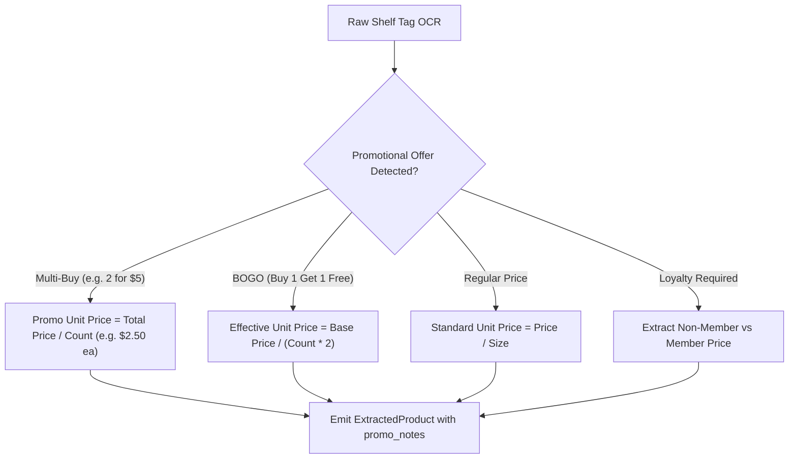

# Retail Domain & Grounding Rules (`retail_domain_rules.md`)

## 1. Overview
This document defines the retail business logic, UPC/barcode checksum verification rules, promotional pack decomposition algorithms, and unit pricing mathematics for the Retail Cortex Price Comparison platform. All autonomous agents, vision parsers, and ADK reasoning tools must strictly adhere to these formulas.

---

## 2. Universal Product Code (UPC) Validation Standards

### 2.1 UPC-A Checksum Calculation (Modulo 10)
A standard UPC-A barcode consists of 12 numerical digits: $d_1 d_2 d_3 \dots d_{11} d_{12}$.
The 12th digit $d_{12}$ is the check digit, computed as follows:

$$\text{Odd Sum} = \sum_{i \in \{1, 3, 5, 7, 9, 11\}} d_i$$
$$\text{Even Sum} = \sum_{i \in \{2, 4, 6, 8, 10\}} d_i$$
$$\text{Total} = (3 \times \text{Odd Sum}) + \text{Even Sum}$$
$$d_{12} = (10 - (\text{Total} \pmod{10})) \pmod{10}$$

```python
def validate_upc_a(upc_str: str) -> bool:
    """Validates a 12-digit UPC-A barcode against modulo 10 checksum."""
    if not upc_str or not upc_str.isdigit() or len(upc_str) != 12:
        return False
    digits = [int(ch) for ch in upc_str]
    odd_sum = sum(digits[0:11:2])
    even_sum = sum(digits[1:10:2])
    total = (odd_sum * 3) + even_sum
    check_digit = (10 - (total % 10)) % 10
    return digits[11] == check_digit
```

### 2.2 UPC-E to UPC-A Expansion
When electronic shelf labels (ESLs) print zero-suppressed 8-digit UPC-E codes (number system 0 or 1), expand them to standard 12-digit UPC-A before querying catalog indexes:
- If last digit is 0, 1, 2: Manufacturer code $= d_1 d_2 d_6 00$, Product code $= 00 d_3 d_4 d_5$.
- If last digit is 3: Manufacturer code $= d_1 d_2 d_3 00$, Product code $= 000 d_4 d_5$.
- If last digit is 4: Manufacturer code $= d_1 d_2 d_3 d_4 0$, Product code $= 0000 d_5$.
- If last digit is 5, 6, 7, 8, 9: Manufacturer code $= d_1 d_2 d_3 d_4 d_5$, Product code $= 0000 d_6$.

---

## 3. Unit Pricing & Standardization Mathematics

Retail shelf comparisons must normalize prices to standard base units using high-precision arithmetic (`decimal.Decimal` to 4 decimal places) to eliminate floating-point representation anomalies:

| Domain Category | Standard Base Unit | Conversion Multiplier | Target Unit Price String |
| :--- | :--- | :--- | :--- |
| **Dry Grocery / Snacks** | Ounces (`OZ`) | $1\text{ LB} = 16\text{ OZ}$, $1\text{ KG} = 35.274\text{ OZ}$, $1\text{ G} = 0.035274\text{ OZ}$ | `\$0.28 / OZ` |
| **Meat & Produce** | Pounds (`LB`) | $1\text{ KG} = 2.20462\text{ LB}$, $1\text{ OZ} = 0.0625\text{ LB}$ | `\$4.99 / LB` |
| **Beverages / Liquids** | Fluid Ounces (`FL_OZ`) | $1\text{ GAL} = 128\text{ FL_OZ}$, $1\text{ L} = 33.814\text{ FL_OZ}$, $1\text{ PT} = 16\text{ FL_OZ}$ | `\$0.06 / FL_OZ` |
| **Household / Paper** | Count (`CT`) | Individual sheet, roll, pod, or wipe count | `\$0.18 / CT` |

### Precision Calculation Formula
$$\text{Unit Price} = \frac{\text{Shelf Price}}{\text{Standardized Quantity}}$$

```python
from decimal import Decimal, ROUND_HALF_UP

def calculate_unit_price(shelf_price: Decimal, quantity: Decimal, base_unit: str) -> Decimal:
    """Calculates standardized unit price rounded to 4 decimal places."""
    if quantity <= 0:
        raise ValueError("Quantity must be greater than zero.")
    unit_price = (shelf_price / quantity).quantize(Decimal("0.0001"), rounding=ROUND_HALF_UP)
    return unit_price
```

---

## 4. Promotional Pack & Multi-Buy Parsing Rules

Shelf tags often display multi-buy offers or promotional language. The vision extraction layer must decouple the promotional condition from the baseline unit price:



1. **"X for \$Y" (Multi-Buy):**
   - Single item cost $= \frac{Y}{X}$.
   - Store both `single_item_promo_price` and required purchase threshold $X$.
2. **"Buy X, Get Y Free / at Z% Off" (BOGO):**
   - Effective price $= \frac{\text{Base Price} \times (X + (1 - \frac{Z}{100}) \times Y)}{X + Y}$.
   - Example: Buy 1 Get 1 Free ($X=1, Y=1, Z=100$) $\implies \text{Effective Price} = \frac{\text{Base Price}}{2}$.
3. **Loyalty / Cardholder Pricing:**
   - Extract both the regular price and the cardholder price. Set `price` to regular price unless the user explicitly activates store loyalty mode in store settings.

