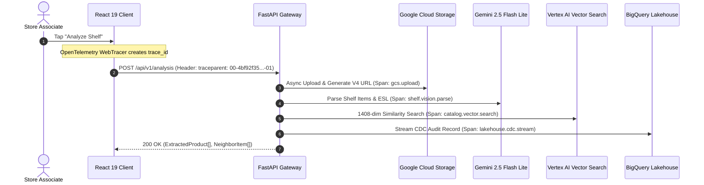

# OpenTelemetry & Observability Conventions (`telemetry_conventions.md`)

## 1. Overview
This document specifies the OpenTelemetry (OTel) conventions, distributed span naming standards, semantic attribute dictionaries, and Google Cloud Trace/Logging correlation formats for the Retail Cortex Price Comparison platform.

---

## 2. Distributed Tracing Architecture & W3C `traceparent`

All client-initiated actions propagate a W3C `traceparent` header to guarantee end-to-end distributed trace continuity from the browser through FastAPI, GCS, Gemini models, and the BigQuery analytical lakehouse:

$$\text{traceparent} = \texttt{00-\{trace\_id\}-\{span\_id\}-\{trace\_flags\}}$$



---

## 3. Standardized Span Names

To ensure predictable querying and alerting in Google Cloud Trace, all spans must use dot-delimited lowercase domain verbs:

| Span Name | Component | Description |
| :--- | :--- | :--- |
| `client.camera.capture` | React WebRTC | Captures raw video frame from HTML5 canvas. |
| `http.client.request` | React Fetch | Outbound API call with injected W3C traceparent. |
| `http.server.request` | FastAPI Middleware | Ingress request span wrapping router endpoints. |
| `gcs.media.upload` | StorageService | Asynchronous upload of image payload to Cloud Storage. |
| `gcs.signed_url.generate`| StorageService | V4 signed read URL generation. |
| `shelf.vision.parse` | VisionService | Multimodal inference call to Gemini 2.5 Flash Lite. |
| `catalog.vector.embed` | EmbeddingService | Generates 1408-dimensional dense vector embeddings. |
| `catalog.vector.search`| MatcherService | Cosine similarity query against Vertex AI / FAISS. |
| `lakehouse.cdc.stream` | LakehouseService | Streaming insert of audit row and vector into BigQuery. |

---

## 4. Semantic Attribute Dictionary

Spans must be decorated with standard OpenTelemetry attributes and domain-specific retail keys:

| Attribute Key | Type | Example | Description |
| :--- | :--- | :--- | :--- |
| `retail.store_id` | string | `"100"` | Identifier of store where photo was captured. |
| `retail.competitor_name` | string | `"Target"` | Competitor brand being audited. |
| `retail.detected_upc` | string | `"012345678905"` | Barcode detected from shelf tag. |
| `retail.detected_price` | float | `3.99` | Shelf tag price in USD. |
| `genai.model_id` | string | `"gemini-2.5-flash-lite"`| Model utilized for visual parsing. |
| `genai.tokens.prompt` | int | `1240` | Input token count for multimodal prompt. |
| `genai.tokens.completion` | int | `320` | Output token count for JSON schema response. |
| `resilience.bulkhead.pool` | string | `"vision"` | Concurrency semaphore pool acquired. |
| `resilience.circuit_breaker.state`| string | `"CLOSED"` | Current circuit breaker state machine status. |

---

## 5. Google Cloud Logging Correlation Format

All backend logs emitted via `google-cloud-logging` or the JSON console formatter must inject the active trace and span identifiers to enable single-click navigation from Cloud Trace to correlated log entries:

```json
{
  "severity": "INFO",
  "message": "Successfully parsed 4 products from shelf capture",
  "logging.googleapis.com/trace": "projects/<gcp-project>/traces/4bf92f3577b34da6a3ce929d0e0e4736",
  "logging.googleapis.com/spanId": "00f067aa0ba902b7",
  "logging.googleapis.com/trace_sampled": true,
  "retail.store_id": "100",
  "product_count": 4
}
```

