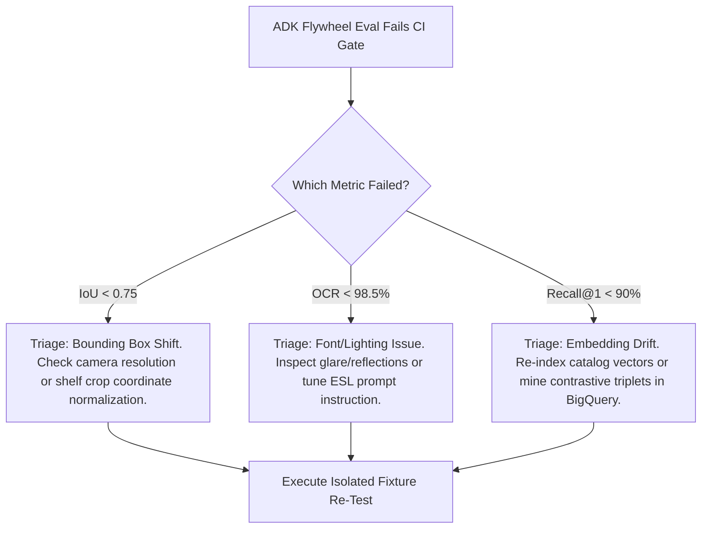

# ADK Quality Flywheel Evaluation Rubric & Judge Protocol (`judge_rubric.md`)

## 1. Overview
This document defines the quantitative evaluation gates, LLM-as-a-judge scoring prompts, and automated CI triage protocols for benchmark evaluations run against `.agents/evals/golden_shelf_dataset.json`.

---

## 2. Evaluation Dimensions & Passing Thresholds

An evaluation run is marked **PASSED** only when all three dimensions meet or exceed their production certification thresholds:

| Metric | Target Dimension | Passing Threshold | Evaluation Method |
| :--- | :--- | :--- | :--- |
| **Bounding Box IoU** | Object detection & cropping accuracy | $\text{Mean IoU} \ge 0.75$ | Deterministic polygon overlap calculation |
| **OCR Field Precision** | Price, Brand & UPC character correctness | $\text{Accuracy} \ge 98.5\%$ | Exact match & Normalized Levenshtein distance |
| **Top-1 Catalog Recall**| Multimodal Embedding retrieval quality | $\text{Recall@1} \ge 90.0\%$ | Cosine similarity ranking against catalog index |

---

## 3. Mathematical Scoring Formulas

### 3.1 Mean Intersection-over-Union (mIoU)
For each detected box $B_{\text{pred}}$ matched to ground truth box $B_{\text{gt}}$:
$$\text{IoU} = \frac{\text{Area}(B_{\text{pred}} \cap B_{\text{gt}})}{\text{Area}(B_{\text{pred}} \cup B_{\text{gt}})}$$
$$\text{mIoU} = \frac{1}{N} \sum_{i=1}^{N} \text{IoU}_i$$

### 3.2 OCR Field Accuracy
$$\text{Accuracy}_{\text{price}} = \frac{1}{N} \sum_{i=1}^{N} \mathbf{1}(|P_{\text{pred}} - P_{\text{gt}}| < 0.01)$$
$$\text{Accuracy}_{\text{upc}} = \frac{1}{N} \sum_{i=1}^{N} \mathbf{1}(\text{UPC}_{\text{pred}} = \text{UPC}_{\text{gt}})$$
$$\text{OCR Overall} = \frac{\text{Accuracy}_{\text{price}} + \text{Accuracy}_{\text{upc}}}{2}$$

### 3.3 Top-1 Recall ($\text{Recall@1}$)
$$\text{Recall@1} = \frac{1}{N} \sum_{i=1}^{N} \mathbf{1}(\text{Top1}(\text{Neighbors}_i) = \text{SKU}_{\text{expected}})$$

---

## 4. LLM-as-a-Judge Prompt Specification

For qualitative entity alignment (e.g. assessing whether brand or variant discrepancies like "Honey Nut Cheerios" vs "Cheerios Honey Nut" constitute a match), the judge agent evaluates using the following prompt:

```text
You are an impartial retail catalog judge evaluating automated vision extraction.
Compare the PREDICTED product entity with the GROUND TRUTH entity.

[GROUND TRUTH]
Product Name: {gt_product_name}
Brand: {gt_brand}
Size: {gt_size} {gt_uom}
Price: ${gt_price}
UPC: {gt_upc}

[PREDICTED EXTRACTION]
Product Name: {pred_product_name}
Brand: {pred_brand}
Size: {pred_size} {pred_uom}
Price: ${pred_price}
UPC: {pred_upc}

Evaluate the prediction on a 1-5 integer scale across three dimensions:
1. Product Identity Match (1-5): Does the predicted name/variant represent the exact same SKU?
2. Pricing Precision (1-5): Is the shelf price and unit of measure parsed without error?
3. Extraction Completeness (1-5): Are brand, pack size, and unit correctly isolated?

Output your evaluation strictly in JSON format:
{
  "identity_score": <1-5>,
  "pricing_score": <1-5>,
  "completeness_score": <1-5>,
  "is_certified_match": <true|false>,
  "explanation": "<concise justification>"
}
```

---

## 5. Failure Triage & Action Plan

When an automated CI eval run fails a threshold:



