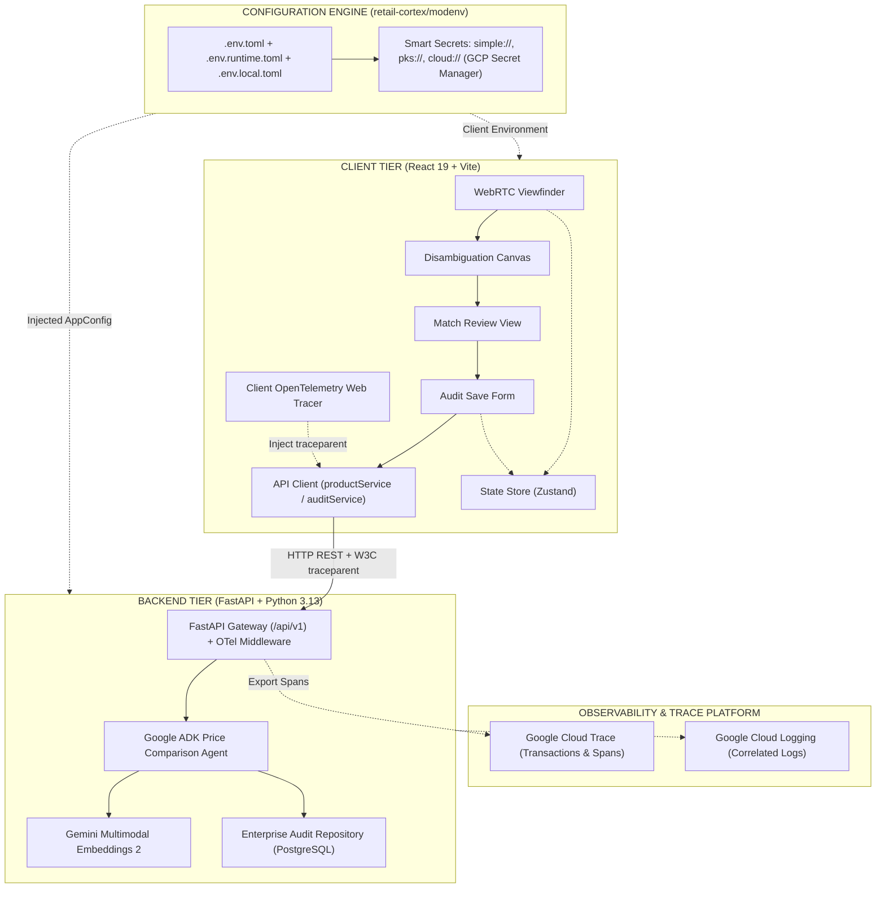

# Technical Specification & Implementation Plan: Multimodal Price Comparison Platform

## 1. System Architecture & Target Specification

### 1.1 Overview
This document specifies the technical design, architectural patterns, and phased implementation tasks for migrating and modernizing the Walmart Price Comparison System. The new architecture transitions the backend from Java/Spring Boot to a high-performance Python 3.13 microservice using **FastAPI**, **Pydantic v2**, and the **Google Agent Development Kit (ADK)**. 

The computer vision and retrieval pipeline pivots from barcode-centric lookups to direct **multimodal image recognition and vector similarity comparison** powered by **Gemini Multimodal Embeddings 2** (`multimodalembedding@001` / Gemini multimodal embedding models) and **Gemini 2.5 Flash**. The client tier is refactored into a resilient, fully tested **React 19 / TypeScript 5.9 / Vite 7** application featuring real WebRTC hardware camera integration, centralized state management, and price audit persistence.



### 1.2 Target Stack
| Layer | Technologies | Standards & Requirements |
| :--- | :--- | :--- |
| **Backend Runtime** | Python 3.13 | Strict typing with `typing` library, managed via `uv` |
| **Configuration & Secrets**| `retail-cortex/modenv` | Hierarchical TOML cascading (`.env.toml`, `.env.${MODENV_RUNTIME}.toml`, `.env.local.toml`), deep merging, transparent secret decryption (`simple://`, `pks://`, `cloud://` GCP Secret Manager) |
| **Web Framework** | FastAPI 0.115+, Starlette | Async handlers, dependency injection, OpenAPI 3.1, lifespan events |
| **Validation & Schema** | Pydantic v2 | Strict parsing, immutable configurations, dataclasses binding |
| **Agent Framework** | Google Agent Development Kit (ADK) | ADK core agents, state sessions, tool execution |
| **GenAI / Multimodal** | `google-genai` SDK | Gemini 2.5 Flash, Gemini Multimodal Embeddings 2 |
| **Vector Engine** | Vertex AI Vector Search / FAISS | Cosine similarity, 1408-dimension multimodal vectors |
| **Storage & Blob** | `google-cloud-storage` | GCS authenticated upload with signed URL generation |
| **Persistence** | PostgreSQL / Cloud SQL via SQLAlchemy 2.0 (asyncio) | Price audit log, store registry, manual overrides |
| **Observability (Backend)**| OpenTelemetry Python SDK, `opentelemetry-exporter-gcp-trace` | Google Cloud Trace integration (FastAPI, HTTPX, DB, Gemini model spans), structured Cloud Logging with `logging.googleapis.com/trace` correlation |
| **Frontend Runtime** | React 19, TypeScript 5.9, Vite 7 | Functional components, arrow functions, strict mode |
| **Observability (Frontend)**| `@opentelemetry/sdk-trace-web`, `@opentelemetry/instrumentation-fetch` | W3C `traceparent` context propagation, client transaction spans |
| **Routing & State** | React Router 7, Zustand 5 | Deep-link hydration, session-backed persistent state |
| **Maps & Places** | `@vis.gl/react-google-maps` | Google Places API (New) with live distance calculation |
| **Hardware / Video** | WebRTC MediaStream API | In-browser camera capture with canvas snapshot |
| **Testing Backend** | `pytest`, `pytest-asyncio`, `pytest-cov`, `httpx` | >= 85% test coverage, mock responses, integration |
| **Testing Frontend** | Vitest, React Testing Library, Playwright MCP | Unit, component isolation, end-to-end browser flows |

---

## 2. Target Directory & Module Structure

The project will be organized using a standardized monorepo structure:

```
price-comp/
├── .github/workflows/          # CI/CD pipelines (Ruff, Pytest, Build, Vitest, Playwright, Terraform)
├── .gemini/                    # Antigravity agent configuration & workspace rules
│   ├── GEMINI.md               # Repository rules (TDD, Playwright MCP, BigQuery naming)
│   └── skills/                 # Custom domain skills (indexing, modenv validation)
├── deployments/
│   └── terraform/              # Declarative Infrastructure as Code (GCS, BigQuery, Cloud Run)
│       ├── environments/       # dev, prod environment compositions
│       └── modules/            # storage, database, bigquery, vertex_ai, secret_manager, cloud_run
├── Makefile                    # Root orchestration for dev, test, build, lint
├── pyproject.toml              # UV workspace root managing backend dependencies
├── uv.lock                     # Deterministic Python dependency lockfile
├── .env.toml                   # [modenv] Base configuration layer (committed)
├── .env.dev.toml               # [modenv] Development environment overlay (committed)
├── .env.prod.toml              # [modenv] Production environment overlay (committed)
├── .env.local.toml             # [modenv] Local developer override (gitignored, loaded last)
├── backend/
│   ├── pyproject.toml          # Backend package configuration (modenv, opentelemetry, etc.)
│   ├── src/
│   │   └── price_comp_backend/
│   │       ├── __init__.py
│   │       ├── main.py         # FastAPI entrypoint, lifespan & OTel middleware
│   │       ├── config.py       # modenv loader: strongly-typed AppConfig schema
│   │       ├── api/
│   │       │   ├── __init__.py
│   │       │   ├── dependencies.py # Auth context, DB session, storage injection
│   │       │   └── v1/
│   │       │       ├── __init__.py
│   │       │       ├── router.py   # Aggregated API router
│   │       │       ├── analysis.py # /extract-product-info, /compare-item
│   │       │       ├── stores.py   # /stores endpoints
│   │       │       └── audits.py   # /audits endpoints (saving verified prices)
│   │       ├── core/
│   │       │   ├── __init__.py
│   │       │   ├── telemetry.py    # OpenTelemetry Cloud Trace & structured JSON logging
│   │       │   ├── resilience.py   # Bulkheads, circuit breakers, and timeout budgets
│   │       │   ├── agent.py    # Google ADK Price Comparison Agent definition
│   │       │   ├── prompt.py   # In-memory structured prompt & extraction schemas
│   │       │   └── tools.py    # ADK tools (catalog search, vector similarity)
│   │       ├── models/
│   │       │   ├── __init__.py
│   │       │   ├── schemas.py  # Pydantic models (Product, Neighbor, Audit)
│   │       │   └── entities.py # SQLAlchemy ORM models for audits and overrides
│   │       ├── services/
│   │       │   ├── __init__.py
│   │       │   ├── storage.py  # Google Cloud Storage upload & V4 signed URLs
│   │       │   ├── vision.py   # Gemini 2.5 Flash image parsing & crop extractor
│   │       │   ├── embedding.py# Gemini Multimodal Embeddings 2 generator
│   │       │   ├── matcher.py  # Vector similarity & nearest neighbor resolution
│   │       │   ├── lakehouse.py# BigQuery Data Lake streaming & CDC export
│   │       │   └── audit.py    # Price persistence and discrepancy service
│   │       └── utils/
│   │           ├── __init__.py
│   │           └── context.py  # ContextVars for request tokens and tracing
│   └── tests/
│       ├── conftest.py         # Pytest fixtures (async client, storage mock, LLM mock)
│       ├── test_config.py      # modenv cascading layers & secret decryption tests
│       ├── test_telemetry.py   # Cloud Trace span and header propagation tests
│       ├── test_resilience.py  # Bulkhead and circuit breaker failure tests
│       ├── test_api_analysis.py# Endpoint test cases with multipart upload
│       ├── test_agent.py       # ADK reasoning and tool invocation tests
│       ├── test_embedding.py   # Multimodal embedding vector validation tests
│       ├── test_lakehouse.py   # BigQuery schema, CDC export & vector integrity tests
│       ├── test_storage.py     # GCS upload and signed URL tests
│       └── evals/              # ADK Quality Flywheel golden dataset evaluation suite
│           ├── fixtures/       # 100 benchmark shelf image fixtures
│           └── test_adk_flywheel.py # Accuracy, recall, and trajectory evaluation
├── client/
│   ├── package.json            # Node dependencies (@retail-cortex/modenv, OTel, etc.)
│   ├── vite.config.ts          # Vite configuration with proxy and Vitest setup
│   ├── tsconfig.json           # Root TypeScript configuration
│   ├── tsconfig.app.json       # Browser TypeScript configuration
│   ├── public/
│   │   ├── favicon.ico
│   │   └── assets/             # Verified static assets (icons, fallback imagery)
│   ├── src/
│   │   ├── main.tsx            # Application entrypoint with telemetry init
│   │   ├── telemetry.ts        # OpenTelemetry Web Tracer & fetch instrumentation
│   │   ├── App.tsx             # Root layout with AuthProvider & Global Error Boundary
│   │   ├── components/
│   │   │   ├── common/         # Button, Header, LoadingSpinner, ImageModal
│   │   │   ├── camera/         # WebRTC CameraViewfinder, SnapshotPreview
│   │   │   ├── maps/           # GoogleMapViewer, StoreList, StoreCard
│   │   │   └── products/       # ProductSelectionCard, NeighborItemCard, ProductForm
│   │   ├── hooks/
│   │   │   ├── useCamera.ts    # WebRTC stream lifecycle and frame capture
│   │   │   ├── useProductExtraction.ts # API mutation with abort and retry
│   │   │   └── useStoreLocator.ts      # Places API geolocation and query filter
│   │   ├── stores/
│   │   │   └── useComparisonStore.ts   # Zustand state store with persistence
│   │   ├── services/
│   │   │   ├── api.ts          # Axios/fetch HTTP client with traceparent propagation
│   │   │   ├── productService.ts # Product extraction and catalog matching
│   │   │   └── auditService.ts # Submitting associate price adjustments
│   │   ├── types/
│   │   │   ├── product.ts      # TypeScript interfaces matching backend schemas
│   │   │   └── store.ts        # Store location and Places types
│   │   └── views/
│   │       ├── AddStoreView.tsx
│   │       ├── ScanView.tsx
│   │       ├── ProductSelectionView.tsx
│   │       ├── ItemReviewView.tsx
│   │       └── AuditConfirmationView.tsx
│   └── tests/
│       ├── setup.ts            # Test environment configuration
│       ├── components/         # Vitest + React Testing Library component tests
│       └── e2e/                # Playwright end-to-end user journey test suite
└── product-info/               # Catalog datasets & FAISS ingestion utilities
    ├── catalog_embeddings.parquet
    └── scripts/                # Offline catalog indexing with Gemini Embeddings 2
```

---

## 3. Domain Models & Schemas

### 3.1 Backend Pydantic Schemas (`backend/src/price_comp_backend/models/schemas.py`)
```python
from datetime import datetime
from decimal import Decimal
from enum import Enum
from typing import Optional, List, Dict, Any
from pydantic import BaseModel, Field, HttpUrl, ConfigDict

class ProcessingStatus(str, Enum):
    SUCCESS = "SUCCESS"
    UNCLEAR_IMAGE = "UNCLEAR_IMAGE"
    AMBIGUOUS_DATA = "AMBIGUOUS_DATA"
    NO_MATCH_FOUND = "NO_MATCH_FOUND"
    ERROR = "ERROR"

class CatalogNeighbor(BaseModel):
    item_id: str = Field(..., description="Walmart internal item identifier or GTIN")
    description: str = Field(..., description="Canonical product description")
    brand: Optional[str] = Field(None, description="Catalog brand name")
    image_url: HttpUrl = Field(..., description="Catalog product imagery URL")
    walmart_price: Decimal = Field(..., ge=0, description="Current Walmart retail price")
    similarity_score: float = Field(..., ge=0.0, le=1.0, description="Cosine similarity score (0-1)")
    embedding_dimension: int = Field(default=1408, description="Vector embedding length")

class ExtractedProduct(BaseModel):
    model_config = ConfigDict(populate_by_name=True)

    upc: Optional[str] = Field(None, description="Extracted barcode/UPC if visible on ESL")
    brand: str = Field(..., min_length=1, description="Brand extracted from label or packaging")
    description: str = Field(..., min_length=1, description="Product description from shelf label")
    competitor_price: Decimal = Field(..., gt=0, description="Observed competitor price on ESL")
    size: Optional[float] = Field(None, gt=0, description="Package quantity or weight")
    unit_of_measure: str = Field(default="EA", description="Unit of measure (e.g., OZ, LB, EA, CT)")
    processing_status: ProcessingStatus = Field(default=ProcessingStatus.SUCCESS)
    notes: Optional[str] = Field(None, description="Extraction annotations or diagnostic notices")
    image_signed_url: Optional[HttpUrl] = Field(None, description="GCS authenticated image URL")
    crop_bounding_box: Optional[List[float]] = Field(None, description="Normalized coordinates [ymin, xmin, ymax, xmax]")
    neighbors: List[CatalogNeighbor] = Field(default_factory=list, description="Top-K catalog neighbors")

class ExtractionResponse(BaseModel):
    session_id: str = Field(..., description="Unique extraction trace ID")
    store_id: Optional[str] = Field(None, description="Selected competitor store identifier")
    captured_at: datetime = Field(default_factory=datetime.utcnow)
    image_signed_url: HttpUrl = Field(..., description="Signed URL of original shelf image")
    detected_products: List[ExtractedProduct] = Field(..., description="List of products found on shelf")

class AuditSubmissionRequest(BaseModel):
    store_id: str = Field(..., description="Competitor store ID")
    store_name: str = Field(..., description="Competitor store name")
    competitor_product: ExtractedProduct = Field(..., description="Observed competitor item details")
    selected_walmart_item_id: Optional[str] = Field(None, description="Matched Walmart item ID")
    associate_id: str = Field(..., description="ID of store associate completing audit")
    verified_price: Decimal = Field(..., gt=0, description="Final confirmed competitor price")
    discrepancy_reason: Optional[str] = Field(None, description="Reason if manual override applied")

class AuditSubmissionResponse(BaseModel):
    audit_id: str = Field(..., description="Generated audit record confirmation ID")
    status: str = Field(default="SAVED")
    recorded_at: datetime = Field(default_factory=datetime.utcnow)
```

### 3.2 Frontend TypeScript Interfaces (`client/src/types/product.ts`)
```typescript
export interface CatalogNeighbor {
  itemId: string;
  description: string;
  brand?: string;
  imageUrl: string;
  walmartPrice: number;
  similarityScore: number;
  embeddingDimension: number;
}

export type ProcessingStatus = 'SUCCESS' | 'UNCLEAR_IMAGE' | 'AMBIGUOUS_DATA' | 'NO_MATCH_FOUND' | 'ERROR';

export interface ExtractedProduct {
  upc?: string;
  brand: string;
  description: string;
  competitorPrice: number;
  size?: number;
  unitOfMeasure: string;
  processingStatus: ProcessingStatus;
  notes?: string;
  imageSignedUrl?: string;
  cropBoundingBox?: [number, number, number, number];
  neighbors: CatalogNeighbor[];
}

export interface ExtractionResponse {
  sessionId: string;
  storeId?: string;
  capturedAt: string;
  imageSignedUrl: string;
  detectedProducts: ExtractedProduct[];
}

export interface AuditSubmissionPayload {
  storeId: string;
  storeName: string;
  competitorProduct: ExtractedProduct;
  selectedWalmartItemId?: string;
  associateId: string;
  verifiedPrice: number;
  discrepancyReason?: string;
}
```

### 3.3 Configuration Schema & modenv Integration (`.env.toml` & `config.py`)

Configuration management is standardized exclusively on [`retail-cortex/modenv`](https://github.com/retail-cortex/modenv). The system merges cascading TOML layers:
1. `.env.toml` (Base required layer, checked into source control)
2. `.env.${MODENV_RUNTIME}.toml` (Runtime environment overlay, e.g., `dev`, `prod`)
3. `.env.local.toml` (Local developer overrides, uncommitted)

#### Base Configuration Template (`.env.toml`)
```toml
[server]
app_name = "walmart-price-comp-backend"
port = 8080
host = "0.0.0.0"
cors_origins = ["http://localhost:5173", "http://localhost:3000"]

[gcp]
project_id = "retail-cortex-price-comp"
region = "us-central1"
storage_bucket = "wmt-price-comp-scans"

[secrets_store]
type = "cloud"
google_cloud_project = "retail-cortex-price-comp"

[models]
vision_model = "gemini-2.5-flash"
embedding_model = "multimodalembedding@001"
embedding_dimension = 1408

[database]
# Transparently decrypted at runtime via GCP Secret Manager
url = "cloud://price-comp-db-connection-url"
pool_size = 20

[telemetry]
enabled = true
service_name = "price-comp-backend"
cloud_trace_enabled = true
log_level = "INFO"
sample_rate = 1.0
```

#### Strongly-Typed Backend Configuration Loader (`backend/src/price_comp_backend/config.py`)
```python
from dataclasses import dataclass, field
from typing import List
from modenv import load

@dataclass
class ServerConfig:
    app_name: str = "walmart-price-comp-backend"
    port: int = 8080
    host: str = "0.0.0.0"
    cors_origins: List[str] = field(default_factory=lambda: ["http://localhost:5173"])

@dataclass
class GCPConfig:
    project_id: str = "retail-cortex-price-comp"
    region: str = "us-central1"
    storage_bucket: str = "wmt-price-comp-scans"

@dataclass
class ModelsConfig:
    vision_model: str = "gemini-2.5-flash"
    embedding_model: str = "multimodalembedding@001"
    embedding_dimension: int = 1408

@dataclass
class DatabaseConfig:
    url: str = ""  # Decrypted transparently via cloud://, pks://, or simple://
    pool_size: int = 20

@dataclass
class TelemetryConfig:
    enabled: bool = True
    service_name: str = "price-comp-backend"
    cloud_trace_enabled: bool = True
    log_level: str = "INFO"
    sample_rate: float = 1.0

@dataclass
class AppConfig:
    server: ServerConfig = field(default_factory=ServerConfig)
    gcp: GCPConfig = field(default_factory=GCPConfig)
    models: ModelsConfig = field(default_factory=ModelsConfig)
    database: DatabaseConfig = field(default_factory=DatabaseConfig)
    telemetry: TelemetryConfig = field(default_factory=TelemetryConfig)

def get_config() -> AppConfig:
    """Loads configuration by cascading .env.toml, .env.${MODENV_RUNTIME}.toml, and .env.local.toml."""
    return load(AppConfig())
```

### 3.4 Distributed Tracing & Cloud Logging Specifications
- **Trace Context Propagation**: Complies with W3C TraceContext standards. Frontend requests inject the `traceparent` header:
  `traceparent: 00-4bf92f3577b34da6a3ce929d0e0e4736-00f067aa0ba902b7-01`
- **Cloud Logging JSON Schema**: All backend structured logs emit JSON to stdout with Google Cloud correlation fields:
```json
{
  "severity": "INFO",
  "message": "Processed multimodal product extraction for shelf scan",
  "logging.googleapis.com/trace": "projects/retail-cortex-price-comp/traces/4bf92f3577b34da6a3ce929d0e0e4736",
  "logging.googleapis.com/spanId": "00f067aa0ba902b7",
  "logging.googleapis.com/trace_sampled": true,
  "component": "vision_service",
  "store_id": "target-1042",
  "items_detected": 3,
  "latency_ms": 412.5
}
```

---

## 4. Capability Specifications

### Capability 1: Multimodal Vision & Gemini Multimodal Embeddings 2 Comparison
- **Functional Objective:** Eliminate brittle 1D barcode scanning dependency. Use Gemini 2.5 Flash to segment shelf display images, read electronic shelf labels (ESL), extract price/metadata, and leverage **Gemini Multimodal Embeddings 2** to calculate dense feature vectors for both the shelf crop and product text, matching against Walmart's catalog visual vector index.
- **Components:**
  - `VisionService` ([services/vision.py](file:///Users/rmcguinness/Projects/customers/walmart/price-comp/backend/src/price_comp_backend/services/vision.py)): Ingests raw image bytes, constructs structured prompt with strict JSON output schema, and calls `google-genai` client model `gemini-2.5-flash`. Extracts normalized bounding boxes for each product.
  - `MultimodalEmbeddingService` ([services/embedding.py](file:///Users/rmcguinness/Projects/customers/walmart/price-comp/backend/src/price_comp_backend/services/embedding.py)): Calls Vertex AI / GenAI Multimodal Embedding model (`multimodalembedding@001`). Supports joint image + text input. Generates normalized 1408-dimensional embeddings.
  - `CatalogMatcherService` ([services/matcher.py](file:///Users/rmcguinness/Projects/customers/walmart/price-comp/backend/src/price_comp_backend/services/matcher.py)): Executes nearest neighbor search against the catalog vector database (either FAISS IndexFlatIP locally or Vertex AI Vector Search endpoint in cloud) using Cosine Similarity `S_c = (A · B) / (||A|| * ||B||)`. Returns top `K=5` items with images, title, price, and match confidence score.

### Capability 2: Google Agent Development Kit (ADK) Orchestration
- **Functional Objective:** Provide a cognitive orchestration layer for edge cases (e.g., promotional bundles, unreadable shelf tags, multi-pack variations). The ADK Agent decomposes complex shelf displays, evaluates candidate neighbor matches, triggers secondary OCR verification tools if similarity scores fall within ambiguous ranges (0.65 - 0.80), and returns authoritative structured recommendations.
- **Components:**
  - `PriceCompAgent` ([core/agent.py](file:///Users/rmcguinness/Projects/customers/walmart/price-comp/backend/src/price_comp_backend/core/agent.py)): Configured with ADK `Agent` definition, instructions, and session memory.
  - `ADK Tools` ([core/tools.py](file:///Users/rmcguinness/Projects/customers/walmart/price-comp/backend/src/price_comp_backend/core/tools.py)):
    - `search_catalog_by_multimodal_vector(image_bytes, description_hint, top_k)`: Executes vector similarity search.
    - `lookup_walmart_item_details(item_id)`: Fetches live Walmart inventory and omnichannel pricing.
    - `calculate_unit_price_equivalence(comp_size, comp_uom, comp_price, wmt_size, wmt_uom, wmt_price)`: Normalizes unit pricing (e.g., price per ounce vs price per gram) to guarantee apple-to-apple comparison.

### Capability 3: Enterprise Cloud Storage & Asset Security
- **Functional Objective:** Remediate the completely stubbed [CloudStorageService.java](file:///Users/rmcguinness/Projects/customers/walmart/price-comp/backend/src/main/java/com/example/geminimultimodal/service/CloudStorageService.java#L27) blindspot. Provide secure, production-grade GCS asset storage with signed URLs for image rendering and audit immutability.
- **Components:**
  - `StorageService` ([services/storage.py](file:///Users/rmcguinness/Projects/customers/walmart/price-comp/backend/src/price_comp_backend/services/storage.py)):
    - Generates unique UUID-based object paths: `competitor_scans/{tenant_id}/{store_id}/{YYYY-MM-DD}/{uuid}.jpg`.
    - Uploads image buffer with appropriate `Content-Type` and metadata.
    - Generates Google Cloud Storage V4 Signed URLs with 60-minute expiration for secure client-side preview rendering.
    - Provides integration with Application Default Credentials (ADC) and local fallback storage mode for disconnected offline development.

### Capability 4: FastAPI Gateway & Price Audit Persistence
- **Functional Objective:** Replace Spring Boot backend with a lightweight, high-performance async FastAPI implementation. Implement persistent audit logging so associate price verifications are not lost in dead form states.
- **Components:**
  - `FastAPI App` ([main.py](file:///Users/rmcguinness/Projects/customers/walmart/price-comp/backend/src/price_comp_backend/main.py)):
    - Lifespan management for initializing vector search indexes, connection pools, and GenAI clients.
    - Global exception handler intercepting `ValidationError`, `GCSException`, and `ModelInferenceException` returning RFC 7807 `ProblemDetails` JSON.
  - `Audits Router` ([api/v1/audits.py](file:///Users/rmcguinness/Projects/customers/walmart/price-comp/backend/src/price_comp_backend/api/v1/audits.py)):
    - `POST /api/v1/audits`: Receives validated competitor prices and store associate confirmations. Persists to database table `price_comparison_audits`.
    - `GET /api/v1/audits`: Retrieves historical price comparisons filtered by store or GTIN.

### Capability 5: React Client Transformation & Hardware Camera Integration
- **Functional Objective:** Overhaul frontend to eliminate hardcoded values, broken assets, and simulated camera navigation. Implement real WebRTC video capture, resilient state storage, and dynamic catalog matching.
- **Components:**
  - `WebRTC CameraViewfinder` ([components/camera/CameraViewfinder.tsx](file:///Users/rmcguinness/Projects/customers/walmart/price-comp/client/src/components/camera/CameraViewfinder.tsx)):
    - Accesses `navigator.mediaDevices.getUserMedia({ video: { facingMode: 'environment' } })`.
    - Streams live video to `<video>` element with custom CSS viewfinder overlay and hardware torch control if supported.
    - Freezes frame onto HTML5 `<canvas>`, exports Blob/File, and automatically triggers backend analysis.
  - `Comparison State Store` ([stores/useComparisonStore.ts](file:///Users/rmcguinness/Projects/customers/walmart/price-comp/client/src/stores/useComparisonStore.ts)):
    - Centralized Zustand store holding `selectedStore`, `activeSession`, `detectedProducts`, `selectedProductIndex`, and `auditHistory`.
    - Synchronized with `sessionStorage` via `persist` middleware so refreshing a page does not lose scan context or crash router navigation.
    - **Architectural Rationale (Zustand vs Modern React 18/19 Context):**
      - *Selective Subscriptions:* React Context (even in React 18/19 with Concurrent Rendering or the React 19 Compiler) lacks native fine-grained selectors; any context value object reference change schedules a re-render for all subscribing consumer components. Zustand leverages `useSyncExternalStore` with slice-based selectors (`useComparisonStore(state => state.selectedProductIndex)`), preventing high-frequency form or camera updates from triggering full component tree re-renders.
      - *Out-of-Tree Access:* Non-React code (e.g. WebRTC stream teardown callbacks, HTML5 canvas frame extraction, OpenTelemetry fetch instrumentation) can inspect and update state directly via `useComparisonStore.getState()` and `setState()` without requiring component tree nesting.
      - *Deterministic Hydration:* Provides built-in `persist` middleware to safely serialize to `sessionStorage` without custom, brittle `useEffect` synchronization loops.
  - `Product Form & Audit Mutation` ([components/products/ProductForm.tsx](file:///Users/rmcguinness/Projects/customers/walmart/price-comp/client/src/components/products/ProductForm.tsx)):
    - Fully reactive form with validation (Zod + React Hook Form).
    - Submits confirmed match and competitor price to `/api/v1/audits` with immediate UI confirmation toast.
  - `Store Search & Places Filter` ([views/AddStoreView.tsx](file:///Users/rmcguinness/Projects/customers/walmart/price-comp/client/src/views/AddStoreView.tsx)):
    - Active search bar with debounced input filtering nearby stores by name and address.

### Capability 6: End-to-End OpenTelemetry Distributed Tracing & Cloud Logging
- **Functional Objective:** Account for full transaction and span lifecycle across both frontend and backend. Eliminate blind transaction failures by providing end-to-end W3C distributed tracing, automated span metrics, and Google Cloud Logging structured correlation (`logging.googleapis.com/trace`).
- **Components:**
  - `Backend OpenTelemetry & Cloud Trace Provider` ([core/telemetry.py](file:///Users/rmcguinness/Projects/customers/walmart/price-comp/backend/src/price_comp_backend/core/telemetry.py)):
    - Configures OpenTelemetry `TracerProvider` with `CloudTraceSpanExporter` for Google Cloud Trace ingestion.
    - Automatically instruments the FastAPI app (`FastAPIInstrumentor`) and HTTP client (`HTTPXClientInstrumentor`).
    - Standardized Span Hierarchy:
      - `client.interaction` (Root client transaction from WebRTC snapshot)
      - `fastapi.request` (Ingress gateway span extracting W3C `traceparent`)
      - `gcs.upload_image` (Image upload and signed URL generation span)
      - `gemini.vision_extract` (Gemini 2.5 Flash bounding box & label extraction span, recording input/output token counts and latency)
      - `gemini.multimodal_embedding` (Multimodal Embeddings 2 computation span)
      - `vector_search.cosine_match` (Catalog vector database similarity query span)
      - `database.persist_audit` (PostgreSQL price audit persistence span)
  - `Correlated Cloud Logging Formatter` ([core/telemetry.py](file:///Users/rmcguinness/Projects/customers/walmart/price-comp/backend/src/price_comp_backend/core/telemetry.py)):
    - Custom JSON logging formatter injecting active OpenTelemetry context into Google Cloud Logging attributes:
      `logging.googleapis.com/trace: projects/${GCP_PROJECT}/traces/${trace_id}`
      `logging.googleapis.com/spanId: ${span_id}`
      `logging.googleapis.com/trace_sampled: true`
    - Guarantees instant "Log-to-Trace" navigation in Google Cloud Operations Console.
  - `Frontend Web Tracer` ([client/src/telemetry.ts](file:///Users/rmcguinness/Projects/customers/walmart/price-comp/client/src/telemetry.ts)):
    - Configures `@opentelemetry/sdk-trace-web` with `WebTracerProvider` and `ZoneContextManager`.
    - Automatically instruments `window.fetch` using `@opentelemetry/instrumentation-fetch`, propagating the W3C `traceparent` HTTP header to all `/api/v1/*` backend calls.
    - Measures client camera snapshot latency and canvas image compression duration as child spans.

### Capability 7: Enterprise Configuration & Smart Secrets via `retail-cortex/modenv`
- **Functional Objective:** Establish deterministic, cascading configuration management across environments while eliminating hardcoded credentials. Transparently decrypt enterprise secrets via Google Cloud Secret Manager and asymmetric RSA keys.
- **Components:**
  - `Cascading Configuration Layers`:
    - Base configuration: `.env.toml` (committed defaults, schema structures).
    - Runtime overlay: `.env.${MODENV_RUNTIME}.toml` (e.g., `.env.dev.toml`, `.env.prod.toml`).
    - Local override: `.env.local.toml` (uncommitted local overrides, loaded last).
    - Prefix routing: Resolves relative to `MODENV_PREFIX` for flexible container mounting.
  - `Deep Merge Engine`:
    - Merges nested TOML tables without clobbering sibling keys, allowing environment overlays to modify only specific parameters (e.g., log levels or model names).
  - `Smart Secret Decryption Engine`:
    - Transparently resolves URI-encoded secret schemes upon loading:
      - `cloud://<secret-name>`: Fetches directly from Google Cloud Secret Manager using Application Default Credentials (ADC).
      - `pks://<ciphertext>`: Asymmetric RSA PKCS#1 v1.5 decryption using private keys.
      - `simple://<ciphertext>`: Symmetric XOR decryption via `MODENV_KEY`.
    - Local fallback mocking via `MODENV_CLOUD_SECRET_<NAME>` for offline unit and integration tests.
  - `Type-Safe Bindings`:
    - Python: Strongly-typed dataclass binding via `modenv.load(AppConfig())`.
    - TypeScript: Interface-driven client loading via `@retail-cortex/modenv`.

### Capability 9: Resilience Engineering (Bulkheads, Circuit Breakers & Ingress Protections)
- **Functional Objective:** Guarantee high availability in spotty cellular retail environments and protect backend dependencies from cascading failure under bursty associate scan workloads.
- **Components:**
  - `Bulkhead Concurrency Isolation` ([core/resilience.py](file:///Users/rmcguinness/Projects/customers/walmart/price-comp/backend/src/price_comp_backend/core/resilience.py)):
    - Bounded `asyncio.Semaphore` execution pools per dependency (Vision: 15, Vector Search: 30, Storage: 25, DB Pool: 20).
    - Requests exceeding pool capacity fail fast with `HTTP 503 Service Unavailable` rather than queuing indefinitely.
  - `Circuit Breakers & Degradation Fallbacks`:
    - Tracks consecutive failures across Gemini Vision and Vertex AI Vector Search.
    - When tripped to `OPEN`, immediately falls back to in-memory/disk FAISS index or prompts associate barcode scan mode, preserving operational workflow.
  - `Distributed Deadline Budgets & Load Shedding`:
    - Ingress attaches a strict 5.0-second end-to-end deadline budget via `contextvars`. If upstream vision takes 4.2s, remaining budget is enforced on vector search to prevent runaway latency.
    - Strictly rejects payloads $> 15\text{ MB}$ with `HTTP 413 Payload Too Large`.

### Capability 10: Declarative Infrastructure as Code (Terraform)
- **Functional Objective:** Eliminate manual cloud configuration and enforce reproducible, audited environments across `dev`, `staging`, and `prod` using Terraform.
- **Components:**
  - `Remote GCS State Backend` (`deployments/terraform/environments/{dev,prod}/backend.tf`):
    - Encrypted, versioned GCS state bucket (`walmart-price-comp-tfstate-*`) with object-level state locking.
  - `Modular Terraform Architecture` (`deployments/terraform/modules/`):
    - `storage`: GCS buckets for shelf images and crops with 90-day Nearline transition lifecycle rules.
    - `bigquery`: `retail_cortex` dataset and partitioned/clustered `price_comparison_audits` table.
    - `database`: AlloyDB / Cloud SQL PostgreSQL instances and connection secrets.
    - `secret_manager`: Secret containers mapped to `modenv` smart URIs (`cloud://`).
    - `cloud_run`: Serverless container deployment with auto-scaling (0-50 instances) and VPC access.
    - `iam`: Workload Identity federation and least-privilege service accounts.
  - `Static Analysis & CI Gates`:
    - Integration of `terraform fmt -check` and `tflint` into the CI/CD pipeline.

### Capability 11: Production SRE & Antigravity Agentic Maintenance
- **Functional Objective:** Operationalize production runtime monitoring while establishing an autonomous, regression-proof developer and AI agent lifecycle using Antigravity and the Google ADK.
- **Components:**
  - `Production Health Probes`:
    - Liveness probe (`/healthz`) validating event loop health.
    - Readiness probe (`/readyz`) performing active health checks against DB connection pools, Secret Manager, and GCS.
  - `Cloud Monitoring SLOs & Drift Alerts`:
    - P95 latency SLO $< 3.5$ seconds; availability SLO $99.9\%$.
    - Automated catalog drift alert firing when `verification_action == 'OVERRIDDEN_SKU'` exceeds $20\%$ in 24 hours.
  - `Antigravity Workspace Lifecycle` (`.gemini/`):
    - Repository rules enforcing red-green-refactor TDD, Playwright MCP tool restrictions, and modenv cascading rules.
    - Custom Antigravity skills for catalog indexing, modenv validation, and automated test running.
  - `ADK Quality Flywheel & Eval Gates` (`backend/tests/evals/`):
    - Golden evaluation dataset of 100 benchmark retail shelf images.
    - Automated LLM-as-a-judge CI gate asserting Bounding Box IoU $\ge 0.75$, OCR Price accuracy $\ge 98.5\%$, and Top-1 vector recall $\ge 90\%$.
  - `Offline Development Sidecars`:
    - In-memory FAISS vector index, mock GCS local filesystem emulator, and `modenv` secret mocks (`MODENV_CLOUD_SECRET_*`) enabling complete local testing without consuming cloud quota.

---

## 5. Remediation Plan for Identified Blindspots

| Category | Existing Blindspot (Spring/React) | Proposed Architectural Remediation (FastAPI/React 19) |
| :--- | :--- | :--- |
| **Backend Storage** | `CloudStorageService.java` is commented out; returns `""`. | Implement [services/storage.py](file:///Users/rmcguinness/Projects/customers/walmart/price-comp/backend/src/price_comp_backend/services/storage.py) using `google-cloud-storage` with V4 signed URLs and local filesystem emulation for dev. |
| **Data Lake & HITL** | Zero enterprise analytical persistence; image embeddings discarded; no mechanism for human feedback to improve vision or vector matching. | Stream audits to **BigQuery** (`<gcp-project>.retail_cortex.price_comparison_audits`) with 1408-dim embeddings (`ARRAY<FLOAT64>`); implement exemplar vector injection and triplet fine-tuning on Vertex AI. |
| **Resilience & Faults** | Unbounded concurrency; failing external Gemini/Vector Search calls cascade to server starvation; no circuit breakers or fallbacks. | Implement **Bulkheads** (`asyncio.Semaphore`), **Circuit Breakers** with local FAISS fallbacks, 15MB request limits, and 5.0s distributed deadline budgets in [core/resilience.py](file:///Users/rmcguinness/Projects/customers/walmart/price-comp/backend/src/price_comp_backend/core/resilience.py). |
| **Infrastructure as Code** | Zero declarative provisioning; cloud resources configured manually without auditing or repeatability. | Author modular **Terraform** (`deployments/terraform/`) with GCS remote state, provisioning GCS, BigQuery, AlloyDB, Secret Manager, Cloud Run, and IAM with `tflint` CI enforcement. |
| **Production SRE & Ops** | No health/readiness probes; no SLO alerting; prototype-only deployment. | Implement `/healthz` and `/readyz` probes in FastAPI, Cloud Run containerization, and Cloud Monitoring alerting for P95 latency ($< 3.5s$) and catalog drift. |
| **Agentic Maintenance** | No agent guardrails; AI code generators cause pattern drift; no test sidecars or evaluation flywheel. | Formalize **Antigravity** workspace config (`.gemini/`), offline mock sidecars, and **ADK Quality Flywheel** with 100-fixture golden dataset regression testing. |
| **Backend Config** | Relative path `Paths.get("PROMPT.md")` crashes if run outside `backend/`. Hardcoded configuration in `application.properties`. | Adopt **`retail-cortex/modenv`** with cascading TOML (`.env.toml`, `.env.${MODENV_RUNTIME}.toml`, `.env.local.toml`) and strongly-typed dataclass binding in [config.py](file:///Users/rmcguinness/Projects/customers/walmart/price-comp/backend/src/price_comp_backend/config.py). |
| **Secret Management** | Database credentials and GCP secrets hardcoded in properties. | Standardize on `modenv` smart secret schemes (`cloud://` for GCP Secret Manager, `pks://` for RSA, `simple://` for XOR). |
| **Backend Tracing** | Zero distributed tracing; impossible to trace latency between vision, embedding, and vector search. | Implement **OpenTelemetry** with **Google Cloud Trace** exporter in [core/telemetry.py](file:///Users/rmcguinness/Projects/customers/walmart/price-comp/backend/src/price_comp_backend/core/telemetry.py) covering ingress, GCS, Gemini models, and DB spans. |
| **Backend Logging** | Unstructured `System.out.println` and `e.printStackTrace()` polluting logs without trace correlation. | Structured JSON logging using Google Cloud Logging standards, correlating `logging.googleapis.com/trace` and `logging.googleapis.com/spanId`. |
| **Frontend Tracing** | Network failures and camera latency untracked in browser. | Implement `@opentelemetry/sdk-trace-web` and `FetchInstrumentation` in [client/src/telemetry.ts](file:///Users/rmcguinness/Projects/customers/walmart/price-comp/client/src/telemetry.ts), propagating W3C `traceparent` headers. |
| **Backend Endpoints** | Hardcoded GCP project IDs, index numbers, and endpoints. | Standardize all GCP parameters into `modenv` config tables loaded from `.env.toml` with strict schema validation. |
| **Backend Errors** | Enrichers silently swallow exceptions with `logger.error` and return partials. | Implement structured error envelopes with typed fallback strategies; enrichers report diagnostic status per product in `ProcessingStatus`. |
| **Backend Models** | No integration tests for real Gemini / Vector Search schemas. | Build comprehensive Pytest suite with `respx` / `pytest-asyncio` mocking Vertex AI and live smoke tests behind `--run-live` flag. |
| **Frontend Testing**| Zero automated unit, component, or E2E tests in `package.json`. | Install and configure **Vitest**, **React Testing Library**, and **Playwright MCP** integration tests with CI enforcement. |
| **Frontend Camera** | Non-functional viewfinder; clicks navigate directly to empty error view. | Implement WebRTC `getUserMedia` hook with real camera streaming, canvas image extraction, and graceful fallback to file upload. |
| **Frontend Data** | Static `"1234567890"`, `"$2.00 at store #100"`, external candy bag images. | Fully eliminate hardcoded fallbacks; bind dynamically to backend `ExtractedProduct` and `CatalogNeighbor` schemas. |
| **Frontend State** | Transient router `location.state` drops on reload/bookmark. | Implement **Zustand** store with `persist` middleware, hydrating state from session storage and URL query params. |
| **Frontend Assets**| Broken link `./broken.png` that does not exist in `public/`. | Provide verified SVG icons and fallback placeholder imagery in `client/public/assets/`. |
| **Frontend Form** | Form fields in `Item.tsx` have no submit handler or persistence. | Wire form submission to backend `POST /api/v1/audits` with success confirmation and shopping list integration. |
| **Frontend Search**| Store search input in `AddStore.tsx` does nothing. | Wire search input to client-side filter and Places API text search with debounced typing. |

---

## 6. Phased Implementation Roadmap

### Phase 1: Environment, Configuration & Foundation Setup
1. **Initialize UV Environment & Core Dependencies:**
   - Configure root `pyproject.toml` with Python 3.13 and dependencies: `fastapi`, `uvicorn[standard]`, `pydantic`, `modenv`, `opentelemetry-api`, `opentelemetry-sdk`, `opentelemetry-exporter-gcp-trace`, `opentelemetry-instrumentation-fastapi`, `opentelemetry-instrumentation-httpx`, `google-genai`, `google-cloud-storage`, `google-cloud-logging`, `numpy`, `faiss-cpu`, `pytest`, `ruff`.
   - Setup root `Makefile` with targets: `install`, `lint`, `test`, `dev-backend`, `dev-client`.
2. **Setup modenv Configuration Engine:**
   - Define baseline `.env.toml` with server, GCP, model, and telemetry parameters.
   - Define runtime overlays `.env.dev.toml` and `.env.prod.toml`. Add `.env.local.toml` to `.gitignore`.
   - Implement strongly-typed `backend/src/price_comp_backend/config.py` using `modenv.load(AppConfig())`.
3. **Setup Modern Client Tooling & Web Telemetry:**
   - Install `zustand`, `@retail-cortex/modenv`, `@opentelemetry/sdk-trace-web`, `@opentelemetry/instrumentation-fetch`, `@opentelemetry/context-zone`, `lucide-react`, `vitest`, `@testing-library/react`, `@testing-library/user-event`, `zod`, `react-hook-form`.
   - Implement `client/src/telemetry.ts` and verify `vite.config.ts` test runners and API proxy targets.

### Phase 2: Backend Core Services, Telemetry & Multimodal Embedding Pipeline
1. **OpenTelemetry Cloud Trace & Structured Logging:**
   - Implement `backend/src/price_comp_backend/core/telemetry.py` configuring tracer provider, span exporters, and structured JSON Cloud Logging handler.
   - Attach OpenTelemetry middleware to FastAPI in `main.py`.
2. **Cloud Storage Service:**
   - Implement `StorageService` in `services/storage.py` with signed URL generation and span recording.
3. **Gemini 2.5 Flash Vision Extractor:**
   - Implement `VisionService` in `services/vision.py` using `google-genai` to parse shelf images and ESL tags into `ExtractedProduct` objects with span attribute metrics.
4. **Gemini Multimodal Embeddings 2 Service:**
   - Implement `MultimodalEmbeddingService` in `services/embedding.py` calling the multimodal embedding model (`multimodalembedding@001`).
   - Build `CatalogMatcherService` in `services/matcher.py` performing cosine similarity search over catalog item vectors.
5. **Google ADK Agent Integration:**
   - Construct `PriceCompAgent` in `core/agent.py` and register ADK tools in `core/tools.py`.
6. **FastAPI Endpoints:**
   - Expose `POST /api/v1/analysis/extract-product-info` taking multipart images.
   - Expose `POST /api/v1/audits` (accepting `verification_action` and 1408-dim vector) and `GET /api/v1/audits`.
7. **BigQuery CDC & Lakehouse Ingestion Service:**
   - Implement `LakehouseService` in `services/lakehouse.py` using `google-cloud-bigquery` with fully qualified destination table `<gcp-project>.retail_cortex.price_comparison_audits`.
   - Wire asynchronous export of committed audits and embeddings to BigQuery.
   - Implement `index_verified_exemplar` in `services/matcher.py` for dynamic multi-vector index upserts.

### Phase 3: Client Overhaul, WebRTC & End-to-End Tracing
1. **Web Telemetry & API Client:**
   - Initialize OpenTelemetry in `client/src/main.tsx`. Wire `client/src/services/api.ts` to automatically inject W3C `traceparent` headers.
2. **Zustand Store & State Hydration:**
   - Implement `useComparisonStore.ts` to manage active session, detected items, and audit records.
3. **WebRTC Camera Viewfinder:**
   - Build `CameraViewfinder.tsx` using `useCamera` hook to capture frames from device camera with capture latency tracing.
4. **Disambiguation & Match Review Views:**
   - Refactor `ProductSelectionView.tsx` to handle multi-product disambiguation cleanly.
   - Refactor `ItemReviewView.tsx` to display multimodal match percentages and Walmart catalog neighbors dynamically.
5. **Reactive Audit Form & Persistence:**
   - Refactor `ProductForm.tsx` to submit associate price verifications and verification actions to `/api/v1/audits`.
6. **Store Search & Interactive Maps:**
   - Implement live debounced store filtering in `AddStoreView.tsx`.

### Phase 4: Resilience Engineering, Infrastructure as Code & Operations
1. **Resilience Core Implementation:**
   - Build `core/resilience.py` with `BulkheadManager` (`asyncio.Semaphore` per downstream API), Circuit Breakers with fallback to FAISS, and 5.0s distributed deadline budgets.
2. **Declarative Terraform Provisioning:**
   - Scaffold `deployments/terraform/modules/` for GCS, BigQuery, AlloyDB, Secret Manager, Cloud Run, and IAM.
   - Configure remote GCS backend in `environments/{dev,prod}/backend.tf`.
   - Add `tflint` and `terraform fmt` CI gates.
3. **Antigravity Tooling & ADK Quality Flywheel:**
   - Configure `.gemini/` rules and custom skills.
   - Implement golden evaluation suite in `backend/tests/evals/test_adk_flywheel.py` against 100 shelf image fixtures.

### Phase 5: Verification, Quality Gates & Testing
1. **Backend Unit, Resilience & Integration Tests:**
   - Write comprehensive Pytest suites for `config.py` (modenv cascading/secrets), `telemetry.py`, `storage.py`, `vision.py`, `embedding.py`, `resilience.py` (bulkhead overload and breaker trips), `lakehouse.py` (BigQuery CDC streaming and vector preservation), and API routers with >= 85% coverage.
2. **Frontend Unit & Component Tests:**
   - Write Vitest tests for components, store state transitions, and form validation.
3. **End-to-End Verification:**
   - Execute Playwright browser verification testing full user journey with traceparent verification: Store select -> Camera snapshot -> Analysis -> Match review -> Audit save.

---

## 7. AI Building Tool Execution Prompts

The following prompt sequence provides step-by-step instructions for an automated coding agent to build and verify each component:

### Step 1: Scaffold Backend Foundation, modenv & OpenTelemetry
```bash
# Execute in repository root
uv init --python 3.13 backend
cd backend
uv add fastapi uvicorn[standard] pydantic modenv \
    opentelemetry-api opentelemetry-sdk opentelemetry-exporter-gcp-trace \
    opentelemetry-instrumentation-fastapi opentelemetry-instrumentation-httpx \
    google-genai google-cloud-storage google-cloud-bigquery google-cloud-logging numpy faiss-cpu httpx
uv add --dev pytest pytest-asyncio pytest-cov ruff mypy
```
*Create `.env.toml`, `.env.dev.toml`, and `.env.local.toml` at the project root. Implement `backend/src/price_comp_backend/config.py`, `backend/src/price_comp_backend/core/telemetry.py`, and `backend/src/price_comp_backend/models/schemas.py` according to Sections 3.1, 3.3, and 3.4.*

### Step 2: Implement Storage, Vision Services & Distributed Spans
*Build `backend/src/price_comp_backend/services/storage.py` and `backend/src/price_comp_backend/services/vision.py` using `google-genai` client. Wrap external calls with OpenTelemetry spans tracking latency, token metrics, and signed URL generation.*

### Step 3: Implement Gemini Multimodal Embeddings 2 & Vector Matcher
*Build `backend/src/price_comp_backend/services/embedding.py` and `backend/src/price_comp_backend/services/matcher.py`. Create `backend/src/price_comp_backend/core/agent.py` utilizing the Google ADK patterns.*

### Step 4: Implement Resilience Core, FastAPI Gateway & Lakehouse Service
*Create `backend/src/price_comp_backend/core/resilience.py`, `backend/src/price_comp_backend/api/v1/analysis.py`, `backend/src/price_comp_backend/api/v1/audits.py`, `backend/src/price_comp_backend/services/lakehouse.py`, and `backend/src/price_comp_backend/main.py`. Register OpenTelemetry middleware, liveness/readiness probes (`/healthz`, `/readyz`), lifespan events, and Cloud Logging JSON formatters. Stream audit records and 1408-dim embeddings to `<gcp-project>.retail_cortex.price_comparison_audits`.*

### Step 5: Frontend Refactoring, Camera & Web Telemetry
*Update `client/package.json` to install `zustand`, `@retail-cortex/modenv`, `@opentelemetry/sdk-trace-web`, `@opentelemetry/instrumentation-fetch`, `@opentelemetry/context-zone`, `lucide-react`, `vitest`, `@testing-library/react`. Implement `client/src/telemetry.ts`, `client/src/stores/useComparisonStore.ts`, `client/src/components/camera/CameraViewfinder.tsx`, and dynamic review views.*

### Step 6: Declarative Terraform & Antigravity Setup
*Author `deployments/terraform/` modules and environment configurations. Establish `.gemini/` repository rules and build `backend/tests/evals/test_adk_flywheel.py`.*

### Step 7: Test Suite Execution & Acceptance
*Execute verification gates:*
```bash
# Backend verification
cd backend && uv run ruff check . && uv run pytest --cov=price_comp_backend tests/

# Frontend verification
cd ../client && npm run lint && npm run build && npm run test

# Terraform verification
cd ../deployments/terraform/environments/dev && terraform init -backend=false && terraform validate
```

---

## 8. Acceptance Criteria & Quality Gates

1. **Zero Barcode Dependency:** Product discovery and catalog comparison must operate successfully solely via shelf image analysis and Gemini Multimodal Embedding similarity scores.
2. **Complete Storage Ingestion:** Every analyzed image must be persisted to GCS with a valid, secure V4 signed URL returned in the API payload.
3. **Enterprise Configuration Hygiene:** All configuration must load through `retail-cortex/modenv` cascading TOML layers with zero hardcoded credentials and transparent secret resolution (`cloud://`, `pks://`, `simple://`).
4. **End-to-End Distributed Tracing:** Client fetch requests must inject W3C `traceparent` headers, continuing spans through FastAPI, GCS, Gemini 2.5 Flash, Multimodal Embeddings 2, and database calls into Google Cloud Trace.
5. **Correlated Cloud Logging:** All backend JSON log entries must contain valid `logging.googleapis.com/trace` and `logging.googleapis.com/spanId` fields matching the active trace.
6. **No Hardcoded Fallbacks:** The frontend must render zero static mock UPCs, mock prices, or third-party placeholder URLs.
7. **Reliable Camera Ingestion:** The client must capture real camera video frames via WebRTC with snapshot capability and fallback to file upload.
8. **Auditing & State Persistence:** User price reviews and adjustments must persist to the backend audit database with verifiable confirmation IDs.
9. **Robust Test Coverage:** Backend Pytest coverage >= 85%; client must pass all Vitest component tests and build without TypeScript compiler warnings (`tsc -b`).
