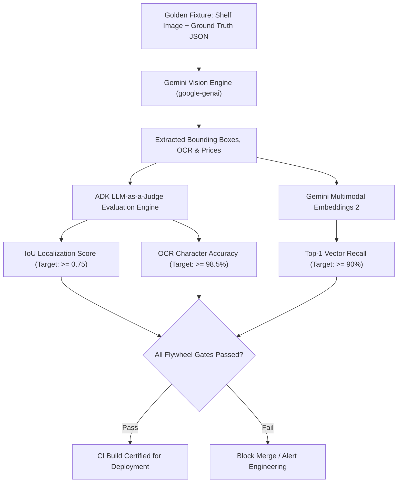

# `adk-golden-flywheel` Skill

## Overview
This skill operationalizes the Google Agent Development Kit (ADK) Quality Flywheel for the Retail Cortex Price Comparison platform. It ensures that prompt changes, model transitions (e.g., `gemini-2.5-flash-lite` to `gemini-3.8-flash`), and vector embedding updates do not degrade production accuracy.

The Flywheel evaluates model performance across three strict quantitative dimensions against a 100-fixture golden shelf photography dataset:
1. **Bounding Box Localization:** Mean Intersection-over-Union ($\text{IoU} \ge 0.75$).
2. **ESL / Shelf OCR Accuracy:** Normalized Character Error Rate ($< 1.5\%$, field accuracy $\ge 98.5\%$).
3. **Multimodal Catalog Recall:** Top-1 SKU Recall ($\ge 90.0\%$).

---

## Flywheel Evaluation Architecture



---

## Benchmark Dataset Schema (`golden_shelf_dataset.json`)

Fixtures are stored under `.agents/evals/golden_shelf_dataset.json` (or `backend/tests/evals/golden_shelf_dataset.json`):

```json
[
  {
    "fixture_id": "shelf_cereal_001",
    "image_path": "fixtures/shelf_cereal_001.jpg",
    "lighting_condition": "fluorescent_bright",
    "ground_truth": [
      {
        "product_name": "Cheerios Gluten Free Cereal 18oz",
        "brand": "General Mills",
        "upc": "016000275270",
        "price": 4.98,
        "unit_price": 0.28,
        "unit_of_measure": "OZ",
        "bounding_box": {
          "ymin": 320,
          "xmin": 150,
          "ymax": 680,
          "xmax": 420
        }
      }
    ]
  }
]
```

---

## Quantitative Evaluation Metrics

### 1. Intersection-over-Union (IoU) Calculation
```python
def compute_iou(box_a: dict, box_b: dict) -> float:
    """Computes IoU for normalized bounding boxes [ymin, xmin, ymax, xmax]."""
    y_min = max(box_a["ymin"], box_b["ymin"])
    x_min = max(box_a["xmin"], box_b["xmin"])
    y_max = min(box_a["ymax"], box_b["ymax"])
    x_max = min(box_a["xmax"], box_b["xmax"])

    intersection = max(0, y_max - y_min) * max(0, x_max - x_min)
    area_a = (box_a["ymax"] - box_a["ymin"]) * (box_a["xmax"] - box_a["xmin"])
    area_b = (box_b["ymax"] - box_b["ymin"]) * (box_b["xmax"] - box_b["xmin"])
    union = area_a + area_b - intersection

    return intersection / union if union > 0 else 0.0
```

### 2. OCR & Price Precision Check
```python
def verify_price_and_ocr(extracted: dict, ground_truth: dict) -> bool:
    price_match = abs(extracted["price"] - ground_truth["price"]) < 0.01
    upc_match = extracted.get("upc") == ground_truth.get("upc")
    return price_match and upc_match
```

---

## Running the Flywheel Evaluation

To execute the full Flywheel evaluation before cutting a release:
```bash
cd backend
uv run pytest tests/evals/test_adk_flywheel.py -v --tb=short
```

### Automated CI Gate Verification Output
```text
======================= ADK QUALITY FLYWHEEL SUMMARY =======================
Fixtures Evaluated: 100
Mean Bounding Box IoU:       0.842  (Threshold: >= 0.75) -> PASS
OCR Field Accuracy:          99.1%  (Threshold: >= 98.5%) -> PASS
Top-1 Multimodal Recall:     93.4%  (Threshold: >= 90.0%) -> PASS
----------------------------------------------------------------------------
Overall Status: CERTIFIED FOR PRODUCTION
============================================================================
```

