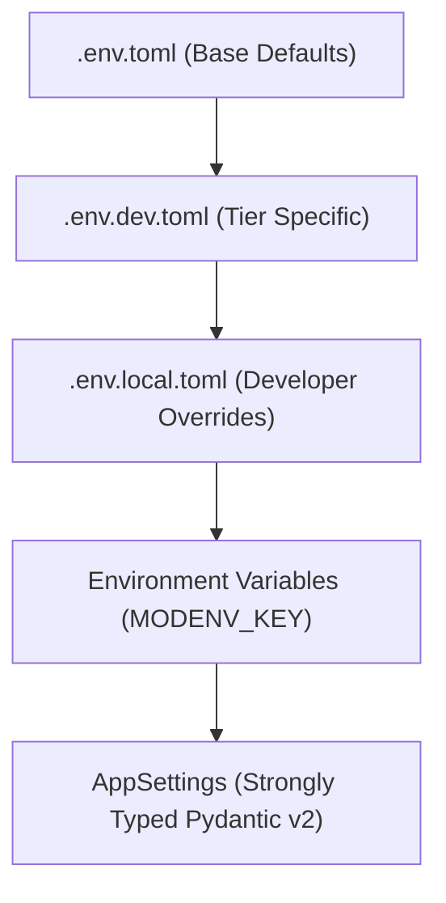

# `modenv-resolver` Skill

## Overview
This skill guides autonomous agents and developers in inspecting, cascading, validating, and decrypting environment configuration managed by [`retail-cortex/modenv`](https://github.com/retail-cortex/modenv) in the Retail Cortex Price Comparison platform.

Under no circumstances should any agent or service read `os.environ` directly in application logic. All configuration must resolve deterministically through `modenv`'s cascading TOML parser and strongly-typed Pydantic `AppSettings`.

---

## Cascading Resolution Hierarchy

`modenv` loads and deeply merges configuration files in the following order of precedence (later files override earlier ones):

1. **Base Defaults:** `.env.toml` (Base application configuration committed to Git; no sensitive secrets).
2. **Environment Tier:** `.env.{environment}.toml` (e.g., `.env.dev.toml`, `.env.prod.toml` containing tier-specific endpoints, VPC connectors, and cloud project IDs).
3. **Local Overrides:** `.env.local.toml` (Developer machine overrides; strictly gitignored).
4. **Process Environment Variables:** Runtime shell variables (e.g., `APP_ENV=dev`, `MODENV_KEY=...`).



---

## Secret URI Schemes

`modenv` transparently resolves secrets using URI prefixes. Never store raw plaintext secrets in `.env.toml`:

| Scheme | URI Syntax | Resolution Target | Local Dev Fallback |
| :--- | :--- | :--- | :--- |
| **GCP Secret Manager** | `cloud://projects/{project}/secrets/{name}/versions/{version}` | Google Cloud Secret Manager API | Requires ADC or service account |
| **Public Key Cryptography** | `pks://{encrypted-base64-payload}` | Asymmetric private key decryption | Requires private key file |
| **Symmetric Encryption** | `simple://{encrypted-base64-payload}` | AES-256-GCM symmetric decryption | Key supplied via `MODENV_KEY` |

---

## Operational Commands & Verification Workflows

### 1. Validate Configuration Files
Run the `modenv` CLI to verify syntax, check for missing variables, and validate schema integrity:
```bash
# In backend root
uv run python -c "
from price_comp_backend.config import settings
print(f'Active Environment: {settings.environment}')
print(f'GCP Project: {settings.gcp.project_id}')
print(f'GCS Bucket: {settings.gcp.storage_bucket}')
print(f'BigQuery Table: {settings.bigquery.table_name}')
assert settings.gcp.project_id, 'gcp.project_id must not be empty'
"
```

### 2. Encrypt a New Secret for Local Development (`simple://`)
When adding credentials (such as API keys or internal database passwords) for development:
```bash
uv run python -c "
import modenv
encrypted = modenv.encrypt_simple('my-secret-token', key='dev-secret-key-32-chars-length!!')
print(f'simple://{encrypted}')
"
```

### 3. Masking & Security Auditing
Before emitting logs, running tests, or checkpointing code:
- Ensure no secret string is printed in stdout or stderr.
- Verify `repr(settings)` masks all `SecretStr` fields (e.g., `SecretStr('**********')`).
- Confirm that `.env.local.toml` is present in `.gitignore`.

---

## Unit Testing Patterns for `modenv`

When writing unit tests verifying configuration loading:
```python
import pytest
from price_comp_backend.config import load_settings

def test_cascading_configuration_resolution(tmp_path, monkeypatch):
    # Setup isolated test TOMLs
    base_toml = tmp_path / ".env.toml"
    base_toml.write_text("""
    [app]
    environment = "test"
    [gcp]
    project_id = "base-project"
    storage_bucket = "base-bucket"
    """)

    dev_toml = tmp_path / ".env.dev.toml"
    dev_toml.write_text("""
    [gcp]
    project_id = "dev-project"
    """)

    monkeypatch.setenv("APP_ENV", "dev")
    settings = load_settings(search_path=tmp_path)

    assert settings.environment == "test"
    assert settings.gcp.project_id == "dev-project"  # Overridden by dev TOML
    assert settings.gcp.storage_bucket == "base-bucket"  # Inherited from base TOML
```

