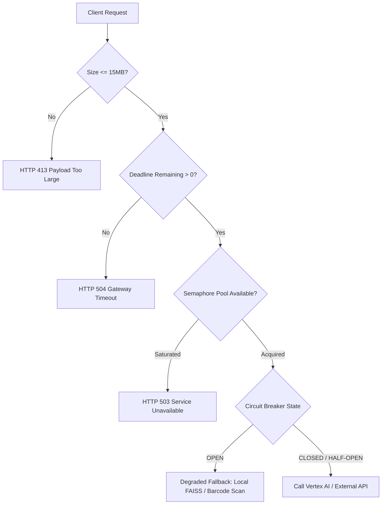

# `resilience-verifier` Skill

## Overview
This skill guides autonomous agents and SREs in validating, stress-testing, and enforcing production resilience patterns in `price_comp_backend.core.resilience`. 

The system implements zero-starvation guarantees to protect upstream Gemini and Vertex AI APIs during bursty retail floor usage.

---

## Resilience Architecture



---

## Concurrency Pool Capacities (Bulkheads)

Every external resource has an isolated `Bulkhead` backed by an `asyncio.Semaphore`:

| Bulkhead Pool | Max Concurrency | Saturated Behavior | Target Service |
| :--- | :--- | :--- | :--- |
| **Vision Pool** | 15 | Immediate `HTTP 503` | Gemini 2.5 Flash Lite shelf parsing |
| **Vector Search Pool** | 30 | Immediate `HTTP 503` | Vertex AI Vector Search / Embeddings |
| **Storage Pool** | 25 | Immediate `HTTP 503` | GCS signed URL generation & uploads |
| **Database/BQ Pool** | 20 | Immediate `HTTP 503` | BigQuery CDC & PostgreSQL |

---

## Circuit Breaker State Machine

- **CLOSED:** Normal operation. All calls route to the primary upstream service.
- **OPEN:** After 5 consecutive failures within a 30-second rolling window. Fast-fails external calls and immediately routes to the local degraded fallback (local in-memory FAISS index or barcode-only scan mode).
- **HALF-OPEN:** After 30 seconds in `OPEN` state, allows 1 trial canary request. If successful, resets to `CLOSED`; if failed, re-trips to `OPEN` for another 30 seconds.

---

## Automated Stress & Resilience Verification Suite

### 1. Verifying Bulkhead Saturation (Fast-Fail HTTP 503)
Run concurrent tasks exceeding the pool limit and verify non-blocking rejection:
```python
import asyncio
import pytest
from price_comp_backend.core.resilience import Bulkhead, BulkheadSaturatedError

@pytest.mark.asyncio
async def test_vision_bulkhead_saturation():
    bulkhead = Bulkhead(name="vision", max_concurrency=2)
    
    async def slow_operation():
        async with bulkhead:
            await asyncio.sleep(0.5)
            return "ok"

    # Launch 2 operations that hold the semaphore
    task1 = asyncio.create_task(slow_operation())
    task2 = asyncio.create_task(slow_operation())
    await asyncio.sleep(0.01)

    # 3rd request must fail immediately without waiting
    with pytest.raises(BulkheadSaturatedError):
        async with bulkhead:
            pass

    await asyncio.gather(task1, task2)
```

### 2. Verifying Circuit Breaker Tripping and Fallback Routing
```python
import pytest
from price_comp_backend.core.resilience import CircuitBreaker, CircuitBreakerOpenError

@pytest.mark.asyncio
async def test_circuit_breaker_trips_to_fallback():
    breaker = CircuitBreaker(failure_threshold=3, recovery_timeout=5.0)

    async def flaky_upstream():
        raise ConnectionError("Vertex AI Timeout")

    # Accumulate 3 failures
    for _ in range(3):
        try:
            await breaker.call(flaky_upstream)
        except ConnectionError:
            pass

    assert breaker.state == "OPEN"

    # Next call should be short-circuited
    with pytest.raises(CircuitBreakerOpenError):
        await breaker.call(flaky_upstream)
```

### 3. Distributed Deadline Propagation Verification
Every request enforces a maximum 5.0-second end-to-end deadline budget:
```python
import time
from price_comp_backend.core.resilience import DeadlineContext

def test_deadline_budget_exhaustion():
    deadline = DeadlineContext(budget_seconds=1.0)
    time.sleep(1.05)
    assert deadline.is_expired() is True
    assert deadline.remaining_seconds() <= 0.0
```

### 4. Running the Complete Resilience Test Gate
```bash
cd backend
uv run pytest tests/test_resilience.py -v
```

