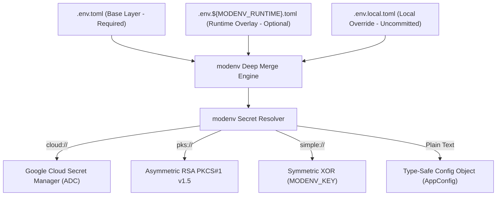

# Specification 001: Foundation, Tooling & Configuration Engine (`retail-cortex/modenv`)

## 1. Specification Metadata
- **Specification ID:** `SPEC-001`
- **Component:** Foundation, Dependency Orchestration & Configuration
- **Target Runtimes:** Python 3.13, Node.js 22 LTS
- **Status:** Approved for Implementation

---

## 2. Technology Architecture

### 2.1 Technology Stack & Tooling
- **Package & Dependency Management:** `uv` (exclusive toolchain for Python 3.13 virtual environments and locks)
- **Configuration Framework:** [`retail-cortex/modenv`](https://github.com/retail-cortex/modenv)
- **Validation & Typing:** Python `typing` library, Pydantic v2, Python dataclasses
- **Static Analysis & Linting:** `Ruff` (formatting and linting)
- **Task Automation:** Root `Makefile`

### 2.2 Configuration Architecture: Cascading TOML & Smart Secrets
The platform eliminates all hardcoded environment values and ad-hoc `.env` key-value pairs in favor of a deterministic, hierarchical TOML engine:



#### Layer Hierarchy
1. `.env.toml`: Required base file containing configuration structure and universal defaults.
2. `.env.${MODENV_RUNTIME}.toml`: Runtime environment overlay (e.g., `dev`, `prod`, `test`). Merged on top of base.
3. `.env.local.toml`: Local developer overrides. Always gitignored; highest precedence.
4. `MODENV_PREFIX`: Optional directory path prefix for containerized environments.

### 2.3 Configuration Schema Definitions

#### Base TOML Template (`.env.toml`)
```toml
[server]
app_name = "walmart-price-comp-backend"
host = "0.0.0.0"
port = 8080
cors_origins = ["http://localhost:5173", "http://localhost:3000"]
request_timeout_seconds = 30

[gcp]
project_id = "retail-cortex-price-comp"
region = "us-central1"
storage_bucket = "wmt-price-comp-scans"

[secrets_store]
type = "cloud"
google_cloud_project = "retail-cortex-price-comp"

[models]
vision_model = "gemini-2.5-flash"
embedding_model = "multimodalembedding@001"
embedding_dimension = 1408
batch_size = 16

[database]
# Resolved transparently via Google Cloud Secret Manager at runtime
url = "cloud://price-comp-db-connection-url"
pool_size = 20
max_overflow = 10

[telemetry]
enabled = true
service_name = "price-comp-backend"
cloud_trace_enabled = true
log_level = "INFO"
sample_rate = 1.0
```

#### Strongly-Typed Backend Configuration Class ([backend/src/price_comp_backend/config.py](file:///Users/rmcguinness/Projects/customers/walmart/price-comp/backend/src/price_comp_backend/config.py))
```python
from dataclasses import dataclass, field
from typing import List
from modenv import load

@dataclass(frozen=True)
class ServerConfig:
    app_name: str = "walmart-price-comp-backend"
    host: str = "0.0.0.0"
    port: int = 8080
    cors_origins: List[str] = field(default_factory=lambda: ["http://localhost:5173"])
    request_timeout_seconds: int = 30

@dataclass(frozen=True)
class GCPConfig:
    project_id: str = "retail-cortex-price-comp"
    region: str = "us-central1"
    storage_bucket: str = "wmt-price-comp-scans"

@dataclass(frozen=True)
class ModelsConfig:
    vision_model: str = "gemini-2.5-flash"
    embedding_model: str = "multimodalembedding@001"
    embedding_dimension: int = 1408
    batch_size: int = 16

@dataclass(frozen=True)
class DatabaseConfig:
    url: str = ""
    pool_size: int = 20
    max_overflow: int = 10

@dataclass(frozen=True)
class TelemetryConfig:
    enabled: bool = True
    service_name: str = "price-comp-backend"
    cloud_trace_enabled: bool = True
    log_level: str = "INFO"
    sample_rate: float = 1.0

@dataclass(frozen=True)
class AppConfig:
    server: ServerConfig = field(default_factory=ServerConfig)
    gcp: GCPConfig = field(default_factory=GCPConfig)
    models: ModelsConfig = field(default_factory=ModelsConfig)
    database: DatabaseConfig = field(default_factory=DatabaseConfig)
    telemetry: TelemetryConfig = field(default_factory=TelemetryConfig)

def get_config() -> AppConfig:
    """Loads configuration by cascading .env.toml, .env.${MODENV_RUNTIME}.toml, and .env.local.toml."""
    return load(AppConfig())
```

---

## 3. Use-Cases & Functional Requirements

### Use-Case 1.1: Local Disconnected Development
- **Actor:** Software Engineer
- **Precondition:** No active connection to Google Cloud Secret Manager or GCP project.
- **Workflow:**
  1. Engineer creates `.env.local.toml` specifying local filesystem mock paths and SQLite / in-memory database URL.
  2. Engineer exports `MODENV_CLOUD_SECRET_PRICE_COMP_DB_CONNECTION_URL="sqlite+aiosqlite:///./test.db"`.
  3. `modenv` detects the environment override, intercepts the `cloud://` scheme, and injects the test database URL without invoking GCP network calls.
- **Expected Outcome:** Backend boots cleanly on developer workstation without network dependencies.

### Use-Case 1.2: Production Staging Deployment
- **Actor:** CI/CD Deployment Pipeline / Cloud Run Runtime
- **Precondition:** Container starts with environment variable `MODENV_RUNTIME="prod"`.
- **Workflow:**
  1. `modenv` resolves `.env.toml`, deep-merges `.env.prod.toml`.
  2. Resolves `cloud://price-comp-db-connection-url` using GCP Secret Manager with attached Cloud Run service account ADC.
  3. Validates required types against frozen `AppConfig`.
- **Expected Outcome:** Production database credentials and telemetry tracing are initialized securely without plain-text secret exposure in Git or environment dumps.

---

## 4. Spec-Driven Implementation Tasks (Gemini 3.8 Flash Directives)

### Task 1.1: Initialize UV Workspace and Root Tooling
1. Verify Python 3.13 interpreter availability.
2. Generate root `Makefile` supporting standard lifecycle commands:
   - `make install`: Sets up `uv` virtual environment and installs backend and client dependencies.
   - `make lint`: Runs `ruff check` and `ruff format --check` on backend, `npm run lint` on client.
   - `make test`: Runs `pytest` with coverage on backend, `vitest run` on client.
   - `make dev`: Concurrently runs FastAPI backend and Vite frontend.
3. Configure `.gitignore` to prevent committing `.env.local.toml`, `uv.lock` temporary files, `.venv`, and coverage reports.

### Task 1.2: Configure `modenv` and Configuration Bindings
1. Add `modenv` to backend dependencies via `uv add modenv`.
2. Author default `.env.toml` at repository root matching Section 2.3.
3. Create `.env.dev.toml` with development overrides (e.g., debug log level, local test database).
4. Implement [`backend/src/price_comp_backend/config.py`](file:///Users/rmcguinness/Projects/customers/walmart/price-comp/backend/src/price_comp_backend/config.py) using frozen dataclasses and `modenv.load`.

---

## 5. Verification & Acceptance Criteria

### Automated Tests ([backend/tests/test_config.py](file:///Users/rmcguinness/Projects/customers/walmart/price-comp/backend/tests/test_config.py))
- Test that `get_config()` returns an instance of `AppConfig` with expected default parameters.
- Test that `.env.local.toml` overrides values from `.env.toml` without mutating sibling fields.
- Test that `cloud://` secrets are correctly intercepted via mock environment variables `MODENV_CLOUD_SECRET_*`.
- Test that missing required fields or invalid types raise expected configuration parsing errors.

### Quality Gates
- `uv run ruff check .` passes with zero warnings.
- `uv run pytest tests/test_config.py` passes with 100% test success.

