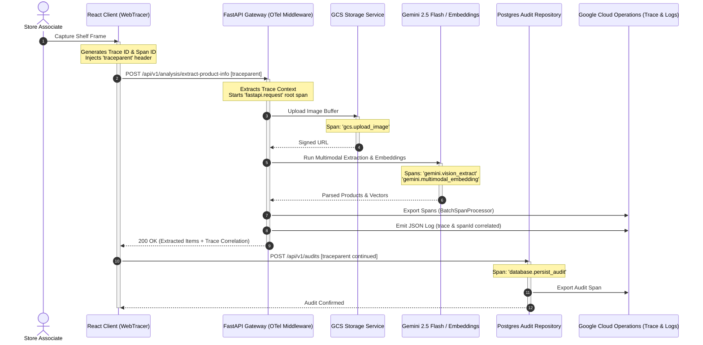

# Specification 002: Distributed Tracing & Structured Cloud Logging (OpenTelemetry & Google Cloud Trace)

## 1. Specification Metadata
- **Specification ID:** `SPEC-002`
- **Component:** Observability, Telemetry & Distributed Tracing
- **Target Runtimes:** Python 3.13, Browser (Web OpenTelemetry)
- **Status:** Approved for Implementation

---

## 2. Technology Architecture

### 2.1 Technology Stack & Tooling
- **Tracing Standard:** OpenTelemetry (OTel) Semantic Conventions v1.26+
- **Backend SDK & Exporter:** `opentelemetry-api`, `opentelemetry-sdk`, `opentelemetry-exporter-gcp-trace`
- **Auto-Instrumentation:** `opentelemetry-instrumentation-fastapi`, `opentelemetry-instrumentation-httpx`
- **Frontend SDK:** `@opentelemetry/sdk-trace-web`, `@opentelemetry/instrumentation-fetch`, `@opentelemetry/context-zone`
- **Cloud Platform Target:** Google Cloud Trace, Google Cloud Logging

### 2.2 Distributed Trace Lifecycle Architecture
The platform establishes an end-to-end W3C Trace Context propagation pipeline connecting user interactions in the React mobile client directly to downstream Google Cloud AI inference and database operations:



### 2.3 Telemetry Implementation Specifications

#### Backend Telemetry Module ([backend/src/price_comp_backend/core/telemetry.py](file:///Users/rmcguinness/Projects/customers/walmart/price-comp/backend/src/price_comp_backend/core/telemetry.py))
```python
import logging
import json
from typing import Any, Dict
from opentelemetry import trace
from opentelemetry.sdk.trace import TracerProvider
from opentelemetry.sdk.trace.export import BatchSpanProcessor, ConsoleSpanExporter
from opentelemetry.exporter.cloud_trace import CloudTraceSpanExporter
from opentelemetry.instrumentation.fastapi import FastAPIInstrumentor
from opentelemetry.instrumentation.httpx import HTTPXClientInstrumentor
from fastapi import FastAPI
from price_comp_backend.config import AppConfig

tracer = trace.get_tracer("price-comp-backend")

class GoogleCloudLoggingFormatter(logging.Formatter):
    """Custom logging formatter injecting GCP trace and span correlation IDs."""
    
    def __init__(self, project_id: str):
        super().__init__()
        self.project_id = project_id

    def format(self, record: logging.LogRecord) -> str:
        span = trace.get_current_span()
        span_context = span.get_span_context() if span else None
        
        log_payload: Dict[str, Any] = {
            "severity": record.levelname,
            "message": record.getMessage(),
            "logger": record.name,
            "timestamp": self.formatTime(record, self.datefmt)
        }
        
        if span_context and span_context.is_valid:
            trace_id = format(span_context.trace_id, "032x")
            span_id = format(span_context.span_id, "016x")
            log_payload["logging.googleapis.com/trace"] = f"projects/{self.project_id}/traces/{trace_id}"
            log_payload["logging.googleapis.com/spanId"] = span_id
            log_payload["logging.googleapis.com/trace_sampled"] = span_context.trace_flags.sampled

        if record.exc_info:
            log_payload["exception"] = self.formatException(record.exc_info)
            
        return json.dumps(log_payload)

def setup_telemetry(app: FastAPI, config: AppConfig) -> None:
    """Configures OpenTelemetry tracer provider, exporters, and FastAPI middleware."""
    provider = TracerProvider()
    
    if config.telemetry.cloud_trace_enabled:
        cloud_exporter = CloudTraceSpanExporter(project_id=config.gcp.project_id)
        provider.add_span_processor(BatchSpanProcessor(cloud_exporter))
    else:
        provider.add_span_processor(BatchSpanProcessor(ConsoleSpanExporter()))
        
    trace.set_tracer_provider(provider)
    
    # Configure root logger with GCP JSON formatter
    root_logger = logging.getLogger()
    root_logger.setLevel(config.telemetry.log_level)
    handler = logging.StreamHandler()
    handler.setFormatter(GoogleCloudLoggingFormatter(config.gcp.project_id))
    root_logger.handlers = [handler]
    
    # Auto-instrument FastAPI and HTTPX
    FastAPIInstrumentor.instrument_app(app, tracer_provider=provider)
    HTTPXClientInstrumentor().instrument()
```

#### Frontend Web Tracer Setup ([client/src/telemetry.ts](file:///Users/rmcguinness/Projects/customers/walmart/price-comp/client/src/telemetry.ts))
```typescript
import { WebTracerProvider } from '@opentelemetry/sdk-trace-web';
import { ZoneContextManager } from '@opentelemetry/context-zone';
import { registerInstrumentations } from '@opentelemetry/instrumentation';
import { FetchInstrumentation } from '@opentelemetry/instrumentation-fetch';
import { trace } from '@opentelemetry/api';

export const initClientTelemetry = (serviceName = 'price-comp-client'): void => {
  const provider = new WebTracerProvider();
  provider.register({
    contextManager: new ZoneContextManager(),
  });

  registerInstrumentations({
    instrumentations: [
      new FetchInstrumentation({
        propagateTraceHeaderCorsUrls: [
          /.*\/api\/v1\/.*/,
          /.*localhost:8080.*/
        ],
        clearTimingResources: true,
      }),
    ],
  });
};

export const getClientTracer = () => trace.get_tracer('price-comp-client');
```

---

## 3. Use-Cases & Functional Requirements

### Use-Case 2.1: End-to-End Latency Diagnostics
- **Actor:** Reliability Engineer / Associate
- **Precondition:** Store associate uploads a high-density 12-item shelf photo.
- **Workflow:**
  1. Frontend creates child span `client.camera_capture` and issues fetch request.
  2. `FetchInstrumentation` sets W3C `traceparent` header.
  3. FastAPI middleware extracts context and tracks overall request latency.
  4. Services record granular execution metrics:
     - `gcs.upload_image`: bytes uploaded, upload latency.
     - `gemini.vision_extract`: token counts, model inference latency.
     - `gemini.multimodal_embedding`: batch embedding computation latency.
     - `vector_search.cosine_match`: nearest neighbor query latency.
  5. If inference exceeds threshold (e.g., > 3000ms), spans pinpoint the exact bottleneck.
- **Expected Outcome:** Single unified trace displayed in Google Cloud Trace console showing full timeline across tiers.

### Use-Case 2.2: Log-to-Trace Correlation during Extraction Errors
- **Actor:** Developer / Support Engineer
- **Precondition:** Gemini API returns an upstream 429 quota exception or unparseable payload.
- **Workflow:**
  1. Exception is caught in `vision.py` within active span context.
  2. Logger outputs structured JSON with `severity: ERROR`, error stack, and `logging.googleapis.com/trace`.
  3. Support clicks the log entry in Google Cloud Logs Explorer and is navigated directly into Cloud Trace with the offending span highlighted.
- **Expected Outcome:** Zero unlinked error logs; immediate diagnostic resolution.

---

## 4. Spec-Driven Implementation Tasks (Gemini 3.8 Flash Directives)

### Task 2.1: Backend OpenTelemetry Implementation
1. Add dependencies: `uv add opentelemetry-api opentelemetry-sdk opentelemetry-exporter-gcp-trace opentelemetry-instrumentation-fastapi opentelemetry-instrumentation-httpx google-cloud-logging`.
2. Implement [`backend/src/price_comp_backend/core/telemetry.py`](file:///Users/rmcguinness/Projects/customers/walmart/price-comp/backend/src/price_comp_backend/core/telemetry.py) matching Section 2.3.
3. Attach `setup_telemetry(app, config)` to FastAPI lifespan startup in [`main.py`](file:///Users/rmcguinness/Projects/customers/walmart/price-comp/backend/src/price_comp_backend/main.py).

### Task 2.2: Frontend Web Tracer Implementation
1. Add client dependencies: `npm install @opentelemetry/api @opentelemetry/sdk-trace-web @opentelemetry/instrumentation @opentelemetry/instrumentation-fetch @opentelemetry/context-zone`.
2. Implement [`client/src/telemetry.ts`](file:///Users/rmcguinness/Projects/customers/walmart/price-comp/client/src/telemetry.ts).
3. Call `initClientTelemetry()` at application initialization in [`client/src/main.tsx`](file:///Users/rmcguinness/Projects/customers/walmart/price-comp/client/src/main.tsx).

---

## 5. Verification & Acceptance Criteria

### Automated Tests ([backend/tests/test_telemetry.py](file:///Users/rmcguinness/Projects/customers/walmart/price-comp/backend/tests/test_telemetry.py))
- Test that `GoogleCloudLoggingFormatter` formats log records into valid JSON containing `severity` and `message`.
- Test that active span contexts inject `logging.googleapis.com/trace` and `logging.googleapis.com/spanId`.
- Test that FastAPI requests with incoming `traceparent` headers properly extract and continue the trace ID.
- Test that HTTP client calls via `httpx` automatically propagate `traceparent` outbound headers.

### Quality Gates
- Zero log entries use standard `print()` or unformatted plain text.
- Cloud Trace span export passes cleanly in mocked test environments.

