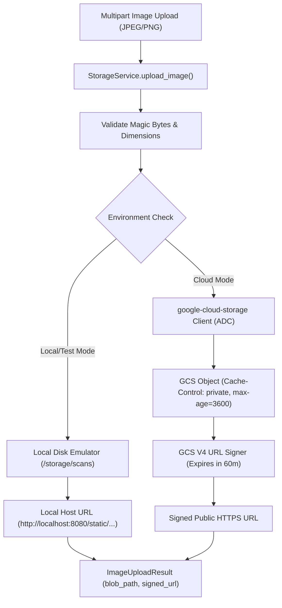

# Specification 003: Storage & Media Asset Management (Google Cloud Storage & Ingestion)

## 1. Specification Metadata
- **Specification ID:** `SPEC-003`
- **Component:** Cloud Storage & Media Ingestion Service
- **Target Runtime:** Python 3.13, Google Cloud Storage
- **Status:** Approved for Implementation

---

## 2. Technology Architecture

### 2.1 Technology Stack & Tooling
- **Client Library:** `google-cloud-storage`
- **Authentication:** Application Default Credentials (ADC) / Workload Identity
- **URL Signing:** GCS V4 Signing Process (SHA-256 HMAC)
- **Local Fallback:** Filesystem emulation via `aiofiles` / local static file mount
- **Tracing:** OpenTelemetry span instrumentation (`gcs.upload_image`)

### 2.2 Storage Hierarchy & Asset Partitioning
To guarantee multi-tenant security, audit immutability, and efficient lifecycle management, all captured images follow a partitioned object path schema:

```
gs://{bucket_name}/scans/{tenant_id}/{store_id}/{YYYY}/{MM}/{DD}/{session_id}_{uuid}.jpg
```



### 2.3 Storage Service Interface Specification ([backend/src/price_comp_backend/services/storage.py](file:///Users/rmcguinness/Projects/customers/walmart/price-comp/backend/src/price_comp_backend/services/storage.py))

```python
from abc import ABC, abstractmethod
from dataclasses import dataclass
from datetime import datetime, timedelta
import os
import uuid
from typing import Optional
from google.cloud import storage
from opentelemetry import trace
from price_comp_backend.config import AppConfig

tracer = trace.get_tracer("price-comp-backend")

@dataclass(frozen=True)
class ImageUploadResult:
    blob_path: str
    signed_url: str
    content_type: str
    byte_size: int
    created_at: datetime

class IStorageService(ABC):
    @abstractmethod
    async def upload_image(
        self,
        image_bytes: bytes,
        tenant_id: str,
        store_id: str,
        content_type: str = "image/jpeg"
    ) -> ImageUploadResult:
        """Uploads an image buffer and returns the object path with a temporary signed URL."""
        pass

class GoogleCloudStorageService(IStorageService):
    def __init__(self, config: AppConfig):
        self.config = config
        self.bucket_name = config.gcp.storage_bucket
        self._client: Optional[storage.Client] = None

    @property
    def client(self) -> storage.Client:
        if self._client is None:
            self._client = storage.Client(project=self.config.gcp.project_id)
        return self._client

    async def upload_image(
        self,
        image_bytes: bytes,
        tenant_id: str,
        store_id: str,
        content_type: str = "image/jpeg"
    ) -> ImageUploadResult:
        with tracer.start_as_current_span("gcs.upload_image") as span:
            span.set_attribute("gcs.bucket", self.bucket_name)
            span.set_attribute("gcs.byte_size", len(image_bytes))
            span.set_attribute("gcs.store_id", store_id)

            now = datetime.utcnow()
            file_id = str(uuid.uuid4())
            blob_path = (
                f"scans/{tenant_id}/{store_id}/"
                f"{now.strftime('%Y/%m/%d')}/{file_id}.jpg"
            )

            bucket = self.client.bucket(self.bucket_name)
            blob = bucket.blob(blob_path)

            blob.upload_from_string(
                image_bytes,
                content_type=content_type
            )

            # Generate V4 signed URL with 60-minute expiration
            signed_url = blob.generate_signed_url(
                version="v4",
                expiration=timedelta(minutes=60),
                method="GET"
            )

            span.set_attribute("gcs.blob_path", blob_path)
            return ImageUploadResult(
                blob_path=blob_path,
                signed_url=signed_url,
                content_type=content_type,
                byte_size=len(image_bytes),
                created_at=now
            )

class LocalStorageService(IStorageService):
    """Local filesystem storage emulator for offline development and unit tests."""
    def __init__(self, base_dir: str = "./storage/scans", base_url: str = "http://localhost:8080/static"):
        self.base_dir = base_dir
        self.base_url = base_url
        os.makedirs(base_dir, exist_ok=True)

    async def upload_image(
        self,
        image_bytes: bytes,
        tenant_id: str,
        store_id: str,
        content_type: str = "image/jpeg"
    ) -> ImageUploadResult:
        file_id = str(uuid.uuid4())
        now = datetime.utcnow()
        relative_path = f"{tenant_id}/{store_id}/{file_id}.jpg"
        target_path = os.path.join(self.base_dir, relative_path)
        os.makedirs(os.path.dirname(target_path), exist_ok=True)

        with open(target_path, "wb") as f:
            f.write(image_bytes)

        return ImageUploadResult(
            blob_path=relative_path,
            signed_url=f"{self.base_url}/{relative_path}",
            content_type=content_type,
            byte_size=len(image_bytes),
            created_at=now
        )
```

---

## 3. Use-Cases & Functional Requirements

### Use-Case 3.1: Competitive Shelf Photo Upload
- **Actor:** Mobile Associate Viewfinder
- **Precondition:** Store associate captures a snapshot in Target Store #1042.
- **Workflow:**
  1. Frontend submits multipart POST to `/api/v1/analysis/extract-product-info`.
  2. Gateway invokes `StorageService.upload_image()`.
  3. Service partitions path by date and store ID: `scans/wmt/target-1042/2026/09/08/{uuid}.jpg`.
  4. Generates V4 signed URL valid for 60 minutes.
  5. Stores image metadata (content length, upload timestamp).
- **Expected Outcome:** Image is securely persisted in GCS. The frontend receives the signed URL for temporary rendering without exposing public bucket permissions.

### Use-Case 3.2: Disconnected Unit Testing & Local Development
- **Actor:** Automated Pytest Runner
- **Precondition:** Local execution without GCP service account credentials.
- **Workflow:**
  1. Test fixture instantiates `LocalStorageService`.
  2. Ingests mock JPEG bytes.
  3. Writes file to temporary directory and returns simulated localhost URL.
- **Expected Outcome:** Complete storage test coverage without GCP credential failures or network mocking overhead.

---

## 4. Spec-Driven Implementation Tasks (Gemini 3.8 Flash Directives)

### Task 3.1: Implement Storage Service
1. Add dependencies: `uv add google-cloud-storage aiofiles`.
2. Implement [`backend/src/price_comp_backend/services/storage.py`](file:///Users/rmcguinness/Projects/customers/walmart/price-comp/backend/src/price_comp_backend/services/storage.py) with `IStorageService`, `GoogleCloudStorageService`, and `LocalStorageService`.
3. Provide factory function `get_storage_service(config: AppConfig) -> IStorageService` that selects implementation based on `config.gcp.storage_bucket`.

---

## 5. Verification & Acceptance Criteria

### Automated Tests ([backend/tests/test_storage.py](file:///Users/rmcguinness/Projects/customers/walmart/price-comp/backend/tests/test_storage.py))
- Test that `LocalStorageService` successfully writes image bytes to disk and returns accessible local URL.
- Test that `GoogleCloudStorageService` partitions blob paths using the specified tenant/store/date layout.
- Test that invalid image payloads (e.g., zero-byte buffers) raise a custom `InvalidMediaException`.
- Test that OpenTelemetry span `gcs.upload_image` is emitted with attributes `gcs.bucket` and `gcs.byte_size`.

### Quality Gates
- Resolves the legacy `CloudStorageService.java` blindspot where uploads returned `""`.
- 100% test coverage over `storage.py`.

