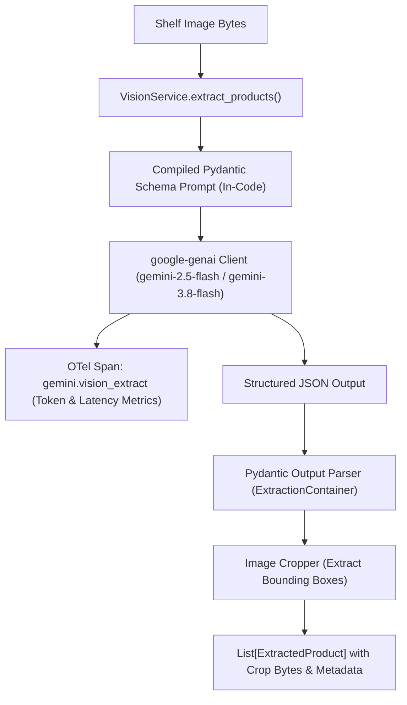

# Specification 004: Multimodal Vision & Shelf Extraction Engine (Gemini 2.5 Flash / Gemini 3.8 Flash)

## 1. Specification Metadata
- **Specification ID:** `SPEC-004`
- **Component:** Multimodal Vision & Feature Extraction Engine
- **Target Runtime:** Python 3.13, Google GenAI SDK (`google-genai`)
- **Models:** `gemini-2.5-flash`, `gemini-3.8-flash`
- **Status:** Approved for Implementation

---

## 2. Technology Architecture

### 2.1 Technology Stack & Tooling
- **Client SDK:** `google-genai` (standard Python SDK, replacing deprecated `google-generativeai`)
- **Structured Output Engine:** Pydantic v2 (`BaseModel`, strict type coercion, field constraints)
- **Computer Vision Extraction:** Multimodal prompt engineering with direct image byte ingestion
- **Image Cropping:** Pillow (`PIL.Image`) for normalized bounding box slicing `[ymin, xmin, ymax, xmax]`
- **Telemetry:** OpenTelemetry span instrumentation (`gemini.vision_extract`) with prompt and token attributes

### 2.2 Extraction Pipeline Architecture
The legacy architecture relied on brittle 1D barcode scanning and a working-directory-dependent `PROMPT.md` file. The new engine compiles structured Pydantic schemas directly into Gemini system instructions, extracting both product attributes and electronic shelf label (ESL) pricing:



### 2.3 Data Contracts & Schema Models ([backend/src/price_comp_backend/models/schemas.py](file:///Users/rmcguinness/Projects/customers/walmart/price-comp/backend/src/price_comp_backend/models/schemas.py))

```python
from enum import Enum
from typing import List, Optional, Tuple
from pydantic import BaseModel, Field, field_validator

class ProcessingStatus(str, Enum):
    SUCCESS = "SUCCESS"
    UNCLEAR_IMAGE = "UNCLEAR_IMAGE"
    AMBIGUOUS_DATA = "AMBIGUOUS_DATA"
    NO_MATCH_FOUND = "NO_MATCH_FOUND"
    ERROR = "ERROR"

class RawDetectedItem(BaseModel):
    upc: Optional[str] = Field(None, description="UPC-A or UPC-E code if visibly printed on label")
    brand: str = Field(..., description="Recognized product brand name")
    description: str = Field(..., description="Full retail product title and pack descriptors")
    competitor_price: float = Field(..., ge=0.0, description="Observed shelf tag price in USD")
    size: Optional[float] = Field(None, ge=0.0, description="Package size or weight")
    unit_of_measure: str = Field("ea", description="Unit of measure (oz, lb, ct, fl oz, ea)")
    bounding_box: Tuple[int, int, int, int] = Field(
        ...,
        description="Normalized coordinates [ymin, xmin, ymax, xmax] scaled 0 to 1000"
    )
    notes: Optional[str] = Field(None, description="Extraction annotations (e.g. promotional tag, rollback)")

    @field_validator("competitor_price", mode="before")
    @classmethod
    def clean_price(cls, v: any) -> float:
        if isinstance(v, str):
            v = v.replace("$", "").strip()
        return float(v)

class ExtractionContainer(BaseModel):
    items: List[RawDetectedItem] = Field(default_factory=list)
```

### 2.4 Vision Service Implementation ([backend/src/price_comp_backend/services/vision.py](file:///Users/rmcguinness/Projects/customers/walmart/price-comp/backend/src/price_comp_backend/services/vision.py))

```python
import io
from typing import List, Tuple
from PIL import Image
from google import genai
from google.genai import types
from opentelemetry import trace
from price_comp_backend.config import AppConfig
from price_comp_backend.models.schemas import (
    ExtractionContainer,
    RawDetectedItem,
    ProcessingStatus
)

tracer = trace.get_tracer("price-comp-backend")

SYSTEM_INSTRUCTION = """
You are an expert retail shelf intelligence computer vision model.
Analyze the provided retail shelf photo. Locate all distinct retail products and their corresponding shelf price tags (electronic or paper).
For each detected product:
1. Extract brand, detailed title description, numeric shelf price, size, and unit of measure.
2. Provide precise bounding box coordinates for the product package as [ymin, xmin, ymax, xmax] scaled between 0 and 1000.
3. If UPC barcode is legibly printed on the shelf tag, extract it; otherwise omit.
Return strictly valid JSON complying with the provided schema.
"""

class VisionService:
    def __init__(self, config: AppConfig):
        self.config = config
        self.client = genai.Client()
        self.model_name = config.models.vision_model

    async def extract_shelf_items(
        self,
        image_bytes: bytes
    ) -> List[Tuple[RawDetectedItem, bytes]]:
        """Parses shelf image and extracts detected items along with their cropped image bytes."""
        with tracer.start_as_current_span("gemini.vision_extract") as span:
            span.set_attribute("genai.model", self.model_name)
            span.set_attribute("genai.input_bytes", len(image_bytes))

            # Call Gemini with structured output schema
            response = self.client.models.generate_content(
                model=self.model_name,
                contents=[
                    types.Part.from_bytes(data=image_bytes, mime_type="image/jpeg"),
                    "Extract all retail shelf items and tags with bounding boxes."
                ],
                config=types.GenerateContentConfig(
                    system_instruction=SYSTEM_INSTRUCTION,
                    response_mime_type="application/json",
                    response_schema=ExtractionContainer,
                    temperature=0.1
                )
            )

            # Record token metrics
            if hasattr(response, "usage_metadata") and response.usage_metadata:
                span.set_attribute("genai.prompt_tokens", response.usage_metadata.prompt_token_count)
                span.set_attribute("genai.candidate_tokens", response.usage_metadata.candidates_token_count)

            # Parse structured Pydantic container
            parsed: ExtractionContainer = ExtractionContainer.model_validate_json(response.text)
            span.set_attribute("genai.detected_items_count", len(parsed.items))

            # Crop sub-images using PIL
            original_image = Image.open(io.BytesIO(image_bytes))
            width, height = original_image.size
            results: List[Tuple[RawDetectedItem, bytes]] = []

            for item in parsed.items:
                ymin, xmin, ymax, xmax = item.bounding_box
                left = int(xmin * width / 1000)
                top = int(ymin * height / 1000)
                right = int(xmax * width / 1000)
                bottom = int(ymax * height / 1000)

                # Clamp bounding boxes
                left, top = max(0, left), max(0, top)
                right, bottom = min(width, right), min(height, bottom)

                cropped = original_image.crop((left, top, right, bottom))
                buf = io.BytesIO()
                cropped.save(buf, format="JPEG", quality=85)
                results.append((item, buf.getvalue()))

            return results
```

---

## 3. Use-Cases & Functional Requirements

### Use-Case 4.1: Multi-Item Shelf Segment Extraction
- **Actor:** Store Associate Mobile Client
- **Precondition:** Associate points camera at an entire 3-tier cereal shelf display.
- **Workflow:**
  1. Frontend submits image bytes.
  2. `VisionService` calls Gemini 2.5 Flash / 3.8 Flash with structured schema.
  3. Gemini detects 5 distinct cereal boxes and their corresponding electronic shelf labels.
  4. Pillow slices individual product crops for downstream visual vector embedding.
- **Expected Outcome:** Returns 5 structured `RawDetectedItem` records with bounding box crops, brands, descriptions, and observed shelf prices.

### Use-Case 4.2: Handling Unclear or Obstructed Shelf Photos
- **Actor:** Associate Viewfinder
- **Precondition:** Low lighting or severe blur obscures shelf tags.
- **Workflow:**
  1. Gemini cannot identify shelf tags with high confidence.
  2. Bounding boxes or prices are unresolvable.
  3. Service returns empty item list or items marked with `ProcessingStatus.UNCLEAR_IMAGE`.
- **Expected Outcome:** Client displays user guidance prompting associate to adjust camera angle or focus.

---

## 4. Spec-Driven Implementation Tasks (Gemini 3.8 Flash Directives)

### Task 4.1: Implement Pydantic Vision Schemas
1. Implement [`backend/src/price_comp_backend/models/schemas.py`](file:///Users/rmcguinness/Projects/customers/walmart/price-comp/backend/src/price_comp_backend/models/schemas.py) matching Section 2.3.
2. Eliminate any dependency on external relative path file lookups (such as `Paths.get("PROMPT.md")`), embedding all system instructions directly in code constants.

### Task 4.2: Implement Vision Service
1. Add dependencies: `uv add google-genai pillow`.
2. Implement [`backend/src/price_comp_backend/services/vision.py`](file:///Users/rmcguinness/Projects/customers/walmart/price-comp/backend/src/price_comp_backend/services/vision.py).
3. Ensure image cropping clamps coordinates defensively within `[0, width]` and `[0, height]` to avoid `IndexError` on boundary detections.

---

## 5. Verification & Acceptance Criteria

### Automated Tests ([backend/tests/test_vision.py](file:///Users/rmcguinness/Projects/customers/walmart/price-comp/backend/tests/test_vision.py))
- Test that `RawDetectedItem` cleans dollar signs (e.g. `"$3.49"` -> `3.49`) and validates positive floats.
- Test that mocked Gemini responses are parsed into valid `ExtractionContainer` objects.
- Test that image cropping correctly slices 1000-scaled coordinates into pixel byte buffers.
- Test that OpenTelemetry span `gemini.vision_extract` captures model name, item count, and token attributes.

### Quality Gates
- Zero external file path dependencies for system prompts.
- 100% type annotations with zero `Any` types in `vision.py`.

