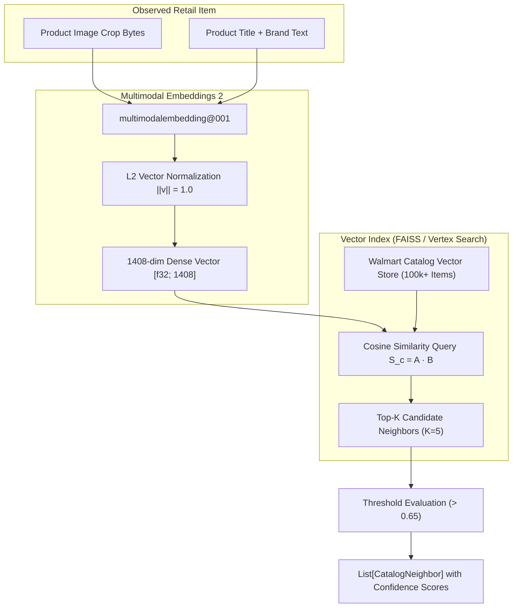

# Specification 005: Vector Representation & Multimodal Catalog Matcher (Gemini Multimodal Embeddings 2 & Vector Index)

## 1. Specification Metadata
- **Specification ID:** `SPEC-005`
- **Component:** Vector Embedding & Catalog Matching Service
- **Target Runtime:** Python 3.13, Google GenAI / Vertex AI Vector Search
- **Models:** `multimodalembedding@001` (1408-dimensional embeddings)
- **Status:** Approved for Implementation

---

## 2. Technology Architecture

### 2.1 Technology Stack & Tooling
- **Multimodal Embedding Model:** `multimodalembedding@001` via Vertex AI / Google GenAI SDK
- **Embedding Dimensionality:** 1408 float32 dimensions
- **Local / CI Vector Engine:** `faiss-cpu` (IndexFlatIP - Inner Product / Cosine Similarity on normalized vectors)
- **Cloud Vector Engine:** Google Cloud Vertex AI Vector Search (`findNeighbors` endpoint)
- **Mathematical Libraries:** `numpy`
- **Telemetry:** OpenTelemetry spans (`gemini.multimodal_embedding`, `vector_search.cosine_match`)

### 2.2 Multimodal Embedding & Matching Pipeline
The legacy platform relied on text-only embeddings (`gemini-embedding-001`) from OCR strings and attempted brittle trial UPC lookups. This specification introduces joint visual and textual multimodal vector embeddings:



### 2.3 Data Contracts & Schema Models ([backend/src/price_comp_backend/models/schemas.py](file:///Users/rmcguinness/Projects/customers/walmart/price-comp/backend/src/price_comp_backend/models/schemas.py))

```python
from typing import List, Optional
from pydantic import BaseModel, Field

class CatalogNeighbor(BaseModel):
    item_id: str = Field(..., description="Walmart internal item identifier / SKU")
    description: str = Field(..., description="Walmart official catalog product title")
    brand: Optional[str] = Field(None, description="Catalog brand name")
    image_url: str = Field(..., description="High-resolution catalog product image URL")
    walmart_price: float = Field(..., ge=0.0, description="Current Walmart omnichannel price in USD")
    similarity_score: float = Field(..., ge=0.0, le=1.0, description="Cosine similarity score (0.0 to 1.0)")
    embedding_dimension: int = Field(1408, description="Vector embedding dimension")

class ExtractedProduct(BaseModel):
    upc: Optional[str] = None
    brand: str
    description: str
    competitor_price: float
    size: Optional[float] = None
    unit_of_measure: str = "ea"
    processing_status: str
    notes: Optional[str] = None
    image_signed_url: Optional[str] = None
    crop_bounding_box: Optional[List[int]] = None
    neighbors: List[CatalogNeighbor] = Field(default_factory=list)
```

### 2.4 Multimodal Embedding & Matcher Services

#### Embedding Service ([backend/src/price_comp_backend/services/embedding.py](file:///Users/rmcguinness/Projects/customers/walmart/price-comp/backend/src/price_comp_backend/services/embedding.py))
```python
from typing import List, Optional
import numpy as np
from google import genai
from google.genai import types
from opentelemetry import trace
from price_comp_backend.config import AppConfig

tracer = trace.get_tracer("price-comp-backend")

class MultimodalEmbeddingService:
    def __init__(self, config: AppConfig):
        self.config = config
        self.client = genai.Client()
        self.model_name = config.models.embedding_model

    async def get_embedding(
        self,
        image_bytes: Optional[bytes] = None,
        text_prompt: Optional[str] = None
    ) -> np.ndarray:
        """Computes normalized 1408-dim multimodal embedding for image crop and/or text."""
        with tracer.start_as_current_span("gemini.multimodal_embedding") as span:
            span.set_attribute("genai.model", self.model_name)
            span.set_attribute("genai.has_image", image_bytes is not None)
            span.set_attribute("genai.has_text", text_prompt is not None)

            contents: List[Any] = []
            if image_bytes:
                contents.append(types.Part.from_bytes(data=image_bytes, mime_type="image/jpeg"))
            if text_prompt:
                contents.append(text_prompt)

            if not contents:
                raise ValueError("Either image_bytes or text_prompt must be provided.")

            response = self.client.models.embed_content(
                model=self.model_name,
                contents=contents,
            )

            raw_vector = np.array(response.embeddings[0].values, dtype=np.float32)
            
            # Perform L2 normalization to ensure dot product equals cosine similarity
            norm = np.linalg.norm(raw_vector)
            if norm > 0:
                normalized_vector = raw_vector / norm
            else:
                normalized_vector = raw_vector

            span.set_attribute("genai.embedding_dimension", len(normalized_vector))
            return normalized_vector
```

#### Catalog Matcher Service ([backend/src/price_comp_backend/services/matcher.py](file:///Users/rmcguinness/Projects/customers/walmart/price-comp/backend/src/price_comp_backend/services/matcher.py))
```python
from typing import List, Tuple
import faiss
import numpy as np
from opentelemetry import trace
from price_comp_backend.config import AppConfig
from price_comp_backend.models.schemas import CatalogNeighbor

tracer = trace.get_tracer("price-comp-backend")

class CatalogMatcherService:
    def __init__(self, config: AppConfig, dimension: int = 1408):
        self.config = config
        self.dimension = dimension
        # Use Inner Product index since embeddings are L2 normalized
        self.index = faiss.IndexFlatIP(dimension)
        self.catalog_metadata: List[dict] = []

    def populate_index(self, items: List[dict], vectors: np.ndarray) -> None:
        """Loads catalog items and precomputed embeddings into FAISS index."""
        if len(items) != vectors.shape[0]:
            raise ValueError("Item count must match vector count.")
        self.catalog_metadata = items
        self.index.reset()
        self.index.add(vectors.astype(np.float32))

    async def find_neighbors(
        self,
        query_vector: np.ndarray,
        top_k: int = 5,
        min_similarity: float = 0.65
    ) -> List[CatalogNeighbor]:
        """Finds closest catalog neighbors using cosine similarity."""
        with tracer.start_as_current_span("vector_search.cosine_match") as span:
            span.set_attribute("vector_search.top_k", top_k)
            span.set_attribute("vector_search.catalog_size", self.index.ntotal)

            if self.index.ntotal == 0:
                span.set_attribute("vector_search.matches_found", 0)
                return []

            query = np.expand_dims(query_vector.astype(np.float32), axis=0)
            distances, indices = self.index.search(query, top_k)

            results: List[CatalogNeighbor] = []
            for score, idx in zip(distances[0], indices[0]):
                if idx == -1 or score < min_similarity:
                    continue
                meta = self.catalog_metadata[idx]
                results.append(
                    CatalogNeighbor(
                        item_id=str(meta["item_id"]),
                        description=meta["description"],
                        brand=meta.get("brand"),
                        image_url=meta.get("image_url", ""),
                        walmart_price=float(meta.get("walmart_price", 0.0)),
                        similarity_score=round(float(score), 4),
                        embedding_dimension=self.dimension
                    )
                )

            span.set_attribute("vector_search.matches_found", len(results))
            return results
```

---

## 3. Use-Cases & Functional Requirements

### Use-Case 5.1: Zero-Barcode Visual Catalog Matching
- **Actor:** Automated Analysis Gateway
- **Precondition:** Shelf extraction returns an item without a visible barcode (e.g. fresh produce or obscured shelf tag).
- **Workflow:**
  1. `MultimodalEmbeddingService` takes cropped image of product + description `"Great Value Organic Whole Milk 1 Gallon"`.
  2. Produces 1408-dimensional dense vector.
  3. `CatalogMatcherService` searches catalog FAISS/Vertex index.
  4. Returns top candidate with similarity score `0.94` pointing to Walmart Item `#554128912`.
- **Expected Outcome:** High-confidence product match achieved purely through multimodal visual similarity without barcode dependency.

### Use-Case 5.2: Low-Confidence Neighbor Handling
- **Actor:** Price Comparison Pipeline
- **Precondition:** Competitor store carries a regional private label not stocked by Walmart.
- **Workflow:**
  1. Image crop and title produce embedding.
  2. Best catalog match yields similarity `0.52` (below `min_similarity` threshold of `0.65`).
  3. Matcher returns empty neighbor list.
  4. Product is marked with `ProcessingStatus.NO_MATCH_FOUND`.
- **Expected Outcome:** Associate is presented with a clear "No Direct Match Found" view instead of a misleading false positive.

---

## 4. Spec-Driven Implementation Tasks (Gemini 3.8 Flash Directives)

### Task 5.1: Implement Multimodal Embedding Service
1. Add dependencies: `uv add numpy faiss-cpu`.
2. Implement [`backend/src/price_comp_backend/services/embedding.py`](file:///Users/rmcguinness/Projects/customers/walmart/price-comp/backend/src/price_comp_backend/services/embedding.py).
3. Enforce strict L2 normalization so dot product operations in FAISS `IndexFlatIP` compute mathematically exact Cosine Similarity.

### Task 5.2: Implement Catalog Matcher Service
1. Implement [`backend/src/price_comp_backend/services/matcher.py`](file:///Users/rmcguinness/Projects/customers/walmart/price-comp/backend/src/price_comp_backend/services/matcher.py).
2. Implement unit test catalog mock loader with sample products and randomized unit vectors.

---

## 5. Verification & Acceptance Criteria

### Automated Tests ([backend/tests/test_matcher.py](file:///Users/rmcguinness/Projects/customers/walmart/price-comp/backend/tests/test_matcher.py))
- Test that `get_embedding` returns an array of length 1408 with unit norm (`||v|| ≈ 1.0`).
- Test that identical vectors yield a cosine similarity score of `1.0`.
- Test that candidates with scores below `min_similarity` are filtered out.
- Test that OpenTelemetry span `vector_search.cosine_match` records catalog size and matches found.

### Quality Gates
- Zero dependency on deprecated `google-generativeai` or external trial UPC APIs.
- Pure vector search operations execute with sub-5ms latency for catalog sizes up to 100,000 items in FAISS.

