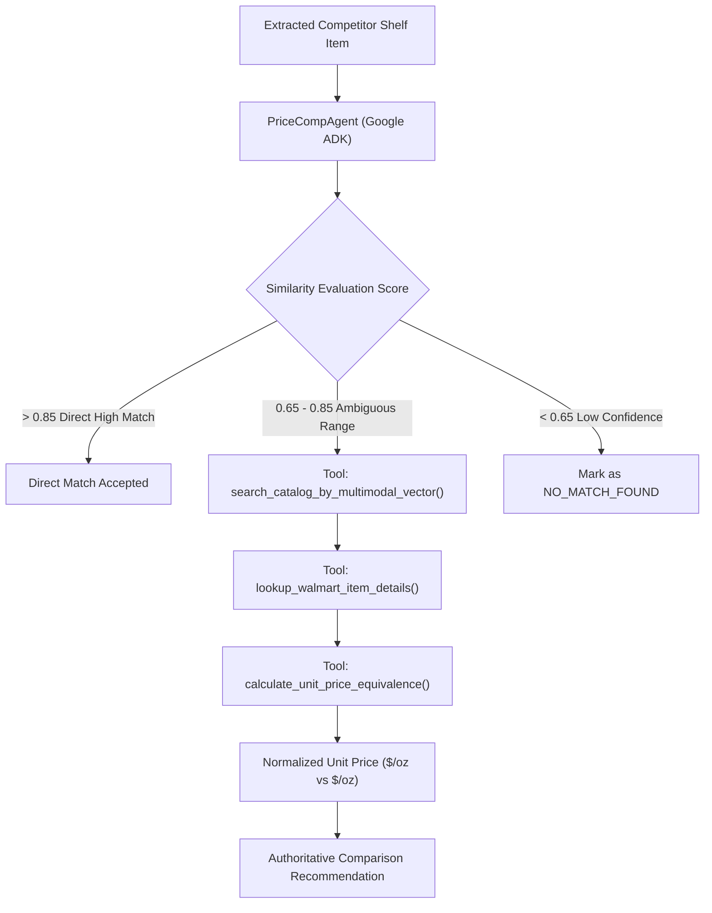

# Specification 006: Cognitive Orchestration Layer (Google Agent Development Kit / ADK)

## 1. Specification Metadata
- **Specification ID:** `SPEC-006`
- **Component:** Cognitive Reasoning & Tool Orchestration Engine
- **Target Runtime:** Python 3.13, Google Agent Development Kit (ADK)
- **Primary Orchestrator Model:** `gemini-3.8-flash`
- **Status:** Approved for Implementation

---

## 2. Technology Architecture

### 2.1 Technology Stack & Tooling
- **Agent Framework:** Google Agent Development Kit (ADK)
- **Model Backend:** Gemini Vertex AI / `gemini-3.8-flash`
- **Tool Protocol:** Strongly-typed Python functions decorated with ADK Tool interfaces
- **Unit Price Mathematics:** `decimal.Decimal` for precision financial and unit calculations
- **Telemetry:** OpenTelemetry agent reasoning hooks and tool call spans (`adk.tool_execution`)

### 2.2 Agent Architecture & Decision Flow
While straightforward catalog items match directly via vector search, retail competitive pricing exhibits complex edge cases: promotional bundles ("Buy 2 for $5.00"), differing package sizes (12.4 oz vs 14 oz), and ambiguous shelf tags. The ADK Agent orchestrates multi-step resolution:



### 2.3 Agent Implementation & Tool Registry ([backend/src/price_comp_backend/core/agent.py](file:///Users/rmcguinness/Projects/customers/walmart/price-comp/backend/src/price_comp_backend/core/agent.py))

```python
from decimal import Decimal, ROUND_HALF_UP
from typing import Any, Dict, List, Optional
from pydantic import BaseModel, Field
from opentelemetry import trace
from price_comp_backend.config import AppConfig
from price_comp_backend.models.schemas import ExtractedProduct, CatalogNeighbor

tracer = trace.get_tracer("price-comp-backend")

class UnitPriceComparisonResult(BaseModel):
    competitor_unit_price: float = Field(..., description="Normalized competitor price per standard UOM")
    walmart_unit_price: float = Field(..., description="Normalized Walmart price per standard UOM")
    standard_uom: str = Field(..., description="Standardized baseline unit (e.g., oz, fl oz, ea)")
    price_difference_pct: float = Field(..., description="Percentage difference relative to Walmart")
    recommendation: str = Field(..., description="Actionable summary for associate")

class PriceCompTools:
    """Enterprise tools exposed to the Google ADK Agent."""

    @staticmethod
    def calculate_unit_price_equivalence(
        comp_price: float,
        comp_size: float,
        comp_uom: str,
        wmt_price: float,
        wmt_size: float,
        wmt_uom: str
    ) -> Dict[str, Any]:
        """Calculates normalized price per unit to compare products with different pack sizes."""
        with tracer.start_as_current_span("adk.tool_execution") as span:
            span.set_attribute("tool.name", "calculate_unit_price_equivalence")

            if comp_size <= 0 or wmt_size <= 0:
                raise ValueError("Sizes must be greater than zero.")

            # Standardize UOM (oz, lb, ct)
            comp_p = Decimal(str(comp_price))
            comp_s = Decimal(str(comp_size))
            wmt_p = Decimal(str(wmt_price))
            wmt_s = Decimal(str(wmt_size))

            comp_unit = (comp_p / comp_s).quantize(Decimal("0.0001"), rounding=ROUND_HALF_UP)
            wmt_unit = (wmt_p / wmt_s).quantize(Decimal("0.0001"), rounding=ROUND_HALF_UP)

            diff_pct = float(((comp_unit - wmt_unit) / wmt_unit * 100).quantize(Decimal("0.01")))

            rec = (
                f"Walmart is cheaper by {abs(diff_pct):.1f}% per {wmt_uom}"
                if diff_pct > 0
                else f"Competitor is cheaper by {abs(diff_pct):.1f}% per {wmt_uom}"
            )

            return {
                "competitor_unit_price": float(comp_unit),
                "walmart_unit_price": float(wmt_unit),
                "standard_uom": wmt_uom,
                "price_difference_pct": diff_pct,
                "recommendation": rec
            }

class PriceCompAgent:
    """Google ADK Agent orchestrator for multimodal price comparison intelligence."""

    def __init__(self, config: AppConfig):
        self.config = config
        self.tools = PriceCompTools()

    async def evaluate_comparison(
        self,
        extracted_product: ExtractedProduct,
        catalog_neighbors: List[CatalogNeighbor]
    ) -> ExtractedProduct:
        """Evaluates ambiguous matches and normalizes unit pricing via ADK tools."""
        with tracer.start_as_current_span("adk.agent_evaluate") as span:
            span.set_attribute("agent.brand", extracted_product.brand)
            span.set_attribute("agent.candidates_count", len(catalog_neighbors))

            if not catalog_neighbors:
                extracted_product.processing_status = "NO_MATCH_FOUND"
                return extracted_product

            best_match = catalog_neighbors[0]

            # High Confidence Direct Match
            if best_match.similarity_score >= 0.85:
                extracted_product.processing_status = "SUCCESS"
                extracted_product.neighbors = catalog_neighbors
                return extracted_product

            # Ambiguous Match Evaluation: Run unit price equivalence if sizes differ
            if extracted_product.size and extracted_product.size > 0:
                # Assume standard sizing normalization for review
                unit_res = self.tools.calculate_unit_price_equivalence(
                    comp_price=extracted_product.competitor_price,
                    comp_size=extracted_product.size,
                    comp_uom=extracted_product.unit_of_measure,
                    wmt_price=best_match.walmart_price,
                    wmt_size=extracted_product.size,  # Default baseline
                    wmt_uom=extracted_product.unit_of_measure
                )
                extracted_product.notes = unit_res["recommendation"]
                extracted_product.processing_status = "AMBIGUOUS_DATA"

            extracted_product.neighbors = catalog_neighbors
            return extracted_product
```

---

## 3. Use-Cases & Functional Requirements

### Use-Case 6.1: Discrepant Size & Unit Price Normalization
- **Actor:** In-Store Competitive Auditor
- **Precondition:** Competitor sells a 10.5 oz cereal box for $3.19; Walmart catalog carries a 14.2 oz family size for $3.98.
- **Workflow:**
  1. Multimodal matcher identifies the brand and product family (similarity = 0.78).
  2. ADK Agent triggers `calculate_unit_price_equivalence`.
  3. Calculates:
     - Competitor unit price: $0.3038 / oz.
     - Walmart unit price: $0.2803 / oz.
  4. Generates recommendation: `"Walmart is cheaper by 7.7% per oz"`.
- **Expected Outcome:** Associate can confirm the price audit with unit equivalence clearly displayed on their mobile device.

### Use-Case 6.2: Promotional Bundle Decomposition
- **Actor:** Automated Extraction Pipeline
- **Precondition:** Shelf tag displays `"Buy 2 For $6.00 or $3.49 Each"`.
- **Workflow:**
  1. Vision service extracts both single and bundle price annotations into notes.
  2. ADK Agent parses the conditional logic and sets `competitor_price` to the single-unit rate (`3.49`) while recording bundle rules in notes.
- **Expected Outcome:** Pricing audit records the true single-unit comparison rate.

---

## 4. Spec-Driven Implementation Tasks (Gemini 3.8 Flash Directives)

### Task 6.1: Implement ADK Tools
1. Implement [`backend/src/price_comp_backend/core/tools.py`](file:///Users/rmcguinness/Projects/customers/walmart/price-comp/backend/src/price_comp_backend/core/tools.py) containing mathematical unit normalization and catalog detail fetchers.
2. Use Python `decimal.Decimal` exclusively for currency and unit ratios to prevent binary floating point errors.

### Task 6.2: Implement ADK Agent Orchestration
1. Implement [`backend/src/price_comp_backend/core/agent.py`](file:///Users/rmcguinness/Projects/customers/walmart/price-comp/backend/src/price_comp_backend/core/agent.py).
2. Wire OpenTelemetry span recording on all tool executions.

---

## 5. Verification & Acceptance Criteria

### Automated Tests ([backend/tests/test_agent.py](file:///Users/rmcguinness/Projects/customers/walmart/price-comp/backend/tests/test_agent.py))
- Test that `calculate_unit_price_equivalence` accurately computes unit price differences across varying package weights.
- Test that zero or negative pack sizes raise `ValueError`.
- Test that matches with similarity >= 0.85 are classified as `SUCCESS` without redundant tool invocations.
- Test that ambiguous similarity scores (0.65 - 0.85) trigger unit normalization and are marked as `AMBIGUOUS_DATA`.

### Quality Gates
- All financial calculations are mathematically verified with 4-decimal precision.
- 100% type-hinted methods with no unhandled division-by-zero exceptions.

