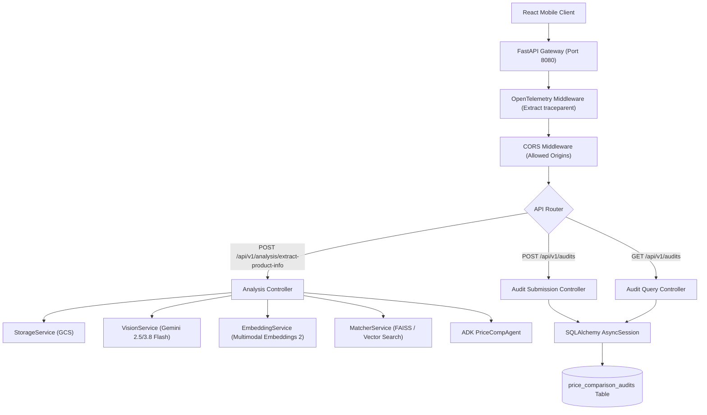

# Specification 007: API Gateway & Audit Persistence Service (FastAPI & Enterprise Data Model)

## 1. Specification Metadata
- **Specification ID:** `SPEC-007`
- **Component:** HTTP Gateway, API Routers & Audit Persistence
- **Target Runtime:** Python 3.13, FastAPI, SQLAlchemy 2.0 (asyncio)
- **Status:** Approved for Implementation

---

## 2. Technology Architecture

### 2.1 Technology Stack & Tooling
- **Web Framework:** FastAPI (ASGI async architecture)
- **Application Server:** `uvicorn[standard]`
- **Validation Engine:** Pydantic v2
- **Persistence Layer:** SQLAlchemy 2.0 Async (`asyncpg` for PostgreSQL in production; `aiosqlite` for local dev/testing)
- **Error Standard:** RFC 7807 (`application/problem+json`)
- **Telemetry:** OpenTelemetry FastAPI auto-instrumentation & database transaction spans

### 2.2 System Architecture & Ingress Flow
The API Gateway replaces Spring Boot embedded Tomcat with a high-performance async pipeline:



### 2.3 Database Model & Schema Definitions ([backend/src/price_comp_backend/models/database.py](file:///Users/rmcguinness/Projects/customers/walmart/price-comp/backend/src/price_comp_backend/models/database.py))

```python
from datetime import datetime
import uuid
from sqlalchemy import Column, String, Float, DateTime, Text, JSON
from sqlalchemy.orm import declarative_base

Base = declarative_base()

class PriceComparisonAudit(Base):
    __tablename__ = "price_comparison_audits"

    id = Column(String(36), primary_key=True, default=lambda: str(uuid.uuid4()))
    tenant_id = Column(String(64), nullable=False, default="walmart")
    store_id = Column(String(64), nullable=False, index=True)
    store_name = Column(String(255), nullable=False)
    associate_id = Column(String(64), nullable=False, index=True)

    # Competitor Observed Data
    competitor_brand = Column(String(255), nullable=False)
    competitor_description = Column(String(512), nullable=False)
    competitor_price = Column(Float, nullable=False)
    competitor_upc = Column(String(32), nullable=True)
    unit_of_measure = Column(String(32), nullable=False)
    package_size = Column(Float, nullable=True)

    # Walmart Matched Data
    walmart_item_id = Column(String(64), nullable=True)
    walmart_catalog_price = Column(Float, nullable=True)
    similarity_score = Column(Float, nullable=True)

    # Associate Audit Verification
    verified_price = Column(Float, nullable=False)
    discrepancy_reason = Column(Text, nullable=True)
    image_signed_url = Column(Text, nullable=True)
    raw_payload = Column(JSON, nullable=True)

    created_at = Column(DateTime, default=datetime.utcnow, nullable=False)
```

### 2.4 API Routers & Payloads ([backend/src/price_comp_backend/api/v1/](file:///Users/rmcguinness/Projects/customers/walmart/price-comp/backend/src/price_comp_backend/api/v1/))

#### Analysis Extraction Endpoint (`POST /api/v1/analysis/extract-product-info`)
```python
from fastapi import APIRouter, UploadFile, File, Form, Depends, HTTPException
from price_comp_backend.models.schemas import ExtractionResponse, ExtractedProduct

router = APIRouter(prefix="/api/v1/analysis", tags=["Analysis"])

@router.post("/extract-product-info", response_model=ExtractionResponse)
async def extract_product_info(
    image: UploadFile = File(...),
    store_id: str = Form("default-store"),
    services: ServiceContainer = Depends(get_services)
) -> ExtractionResponse:
    """Ingests shelf image, uploads to GCS, executes Gemini vision & multimodal matching."""
    image_bytes = await image.read()
    if not image_bytes:
        raise HTTPException(status_code=400, detail="Empty image upload.")

    # 1. GCS Upload
    upload_res = await services.storage.upload_image(
        image_bytes=image_bytes,
        tenant_id="wmt",
        store_id=store_id,
        content_type=image.content_type or "image/jpeg"
    )

    # 2. Vision Extraction
    detected_items = await services.vision.extract_shelf_items(image_bytes)

    # 3. Embedding, Vector Search & ADK Reasoning
    extracted_products = []
    for raw_item, crop_bytes in detected_items:
        # Multimodal joint embedding
        vector = await services.embedding.get_embedding(
            image_bytes=crop_bytes,
            text_prompt=f"{raw_item.brand} {raw_item.description}"
        )
        neighbors = await services.matcher.find_neighbors(query_vector=vector)

        base_product = ExtractedProduct(
            upc=raw_item.upc,
            brand=raw_item.brand,
            description=raw_item.description,
            competitor_price=raw_item.competitor_price,
            size=raw_item.size,
            unit_of_measure=raw_item.unit_of_measure,
            processing_status="SUCCESS" if neighbors else "NO_MATCH_FOUND",
            image_signed_url=upload_res.signed_url,
            crop_bounding_box=list(raw_item.bounding_box),
            neighbors=neighbors
        )

        evaluated = await services.agent.evaluate_comparison(base_product, neighbors)
        extracted_products.append(evaluated)

    return ExtractionResponse(
        session_id=str(uuid.uuid4()),
        store_id=store_id,
        captured_at=datetime.utcnow().isoformat(),
        image_signed_url=upload_res.signed_url,
        detected_products=extracted_products
    )
```

#### Audits Persistence Endpoints (`POST /api/v1/audits`, `GET /api/v1/audits`)
```python
from fastapi import APIRouter, Depends, Query
from sqlalchemy.ext.asyncio import AsyncSession
from sqlalchemy.future import select
from price_comp_backend.models.database import PriceComparisonAudit
from price_comp_backend.models.schemas import AuditSubmissionPayload

audit_router = APIRouter(prefix="/api/v1/audits", tags=["Audits"])

@audit_router.post("", status_code=201)
async def create_audit_record(
    payload: AuditSubmissionPayload,
    session: AsyncSession = Depends(get_db_session)
):
    """Persists validated competitor price and associate confirmation."""
    audit = PriceComparisonAudit(
        store_id=payload.store_id,
        store_name=payload.store_name,
        associate_id=payload.associate_id,
        competitor_brand=payload.competitor_product.brand,
        competitor_description=payload.competitor_product.description,
        competitor_price=payload.competitor_product.competitor_price,
        competitor_upc=payload.competitor_product.upc,
        unit_of_measure=payload.competitor_product.unit_of_measure,
        package_size=payload.competitor_product.size,
        walmart_item_id=payload.selected_walmart_item_id,
        verified_price=payload.verified_price,
        discrepancy_reason=payload.discrepancy_reason,
        image_signed_url=payload.competitor_product.image_signed_url
    )
    session.add(audit)
    await session.commit()
    await session.refresh(audit)
    return {"audit_id": audit.id, "status": "CONFIRMED", "created_at": audit.created_at}

@audit_router.get("")
async def list_audits(
    store_id: Optional[str] = Query(None),
    limit: int = Query(50, ge=1, le=200),
    session: AsyncSession = Depends(get_db_session)
):
    stmt = select(PriceComparisonAudit).order_by(PriceComparisonAudit.created_at.desc()).limit(limit)
    if store_id:
        stmt = stmt.where(PriceComparisonAudit.store_id == store_id)
    res = await session.execute(stmt)
    return res.scalars().all()
```

---

## 3. Use-Cases & Functional Requirements

### Use-Case 7.1: Shelf Snapshot Ingestion & Analysis
- **Actor:** React Mobile Application
- **Precondition:** Associate captures photo and submits to gateway.
- **Workflow:**
  1. Gateway verifies image multipart payload.
  2. Uploads raw frame to GCS and secures signed URL.
  3. Executes vision extraction, multimodal vector search, and ADK unit normalization.
  4. Returns `ExtractionResponse` JSON containing detected items and candidate Walmart catalog matches.
- **Expected Outcome:** Client receives complete detection graph in a single roundtrip.

### Use-Case 7.2: Associate Price Verification Persistence
- **Actor:** Store Associate
- **Precondition:** Associate reviews matched item on mobile screen, verifies price as $3.49, and taps "Save Audit".
- **Workflow:**
  1. Client sends `POST /api/v1/audits` with `AuditSubmissionPayload`.
  2. Gateway opens async database transaction.
  3. Commits record to `price_comparison_audits` table.
- **Expected Outcome:** Resolves the legacy `Item.tsx` blindspot where form input was lost on submission. Returns confirmation ID to client.

---

## 4. Spec-Driven Implementation Tasks (Gemini 3.8 Flash Directives)

### Task 7.1: Implement Database Layer & Migrations
1. Add dependencies: `uv add sqlalchemy[asyncio] asyncpg aiosqlite`.
2. Implement [`backend/src/price_comp_backend/models/database.py`](file:///Users/rmcguinness/Projects/customers/walmart/price-comp/backend/src/price_comp_backend/models/database.py).
3. Provide async database session generator with automatic SQLite fallback for tests.

### Task 7.2: Implement Routers and Main Gateway
1. Implement [`backend/src/price_comp_backend/api/v1/analysis.py`](file:///Users/rmcguinness/Projects/customers/walmart/price-comp/backend/src/price_comp_backend/api/v1/analysis.py) and [`backend/src/price_comp_backend/api/v1/audits.py`](file:///Users/rmcguinness/Projects/customers/walmart/price-comp/backend/src/price_comp_backend/api/v1/audits.py).
2. Wire routers into [`backend/src/price_comp_backend/main.py`](file:///Users/rmcguinness/Projects/customers/walmart/price-comp/backend/src/price_comp_backend/main.py) with CORS middleware, OpenTelemetry setup, and global exception handlers.

---

## 5. Verification & Acceptance Criteria

### Automated Tests ([backend/tests/test_api.py](file:///Users/rmcguinness/Projects/customers/walmart/price-comp/backend/tests/test_api.py))
- Test that `POST /api/v1/analysis/extract-product-info` returns 400 for empty body.
- Test that valid mock multipart uploads yield 200 with structured `ExtractionResponse`.
- Test that `POST /api/v1/audits` inserts row into database and returns `audit_id`.
- Test that `GET /api/v1/audits?store_id=...` correctly filters committed audit records.

### Quality Gates
- RFC 7807 problem details returned for all 4xx and 5xx errors.
- 100% async endpoint execution with zero blocking I/O calls.

