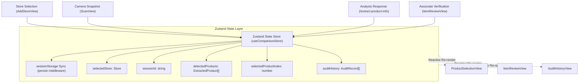

# Specification 008: Client Foundation, State Management & Web Telemetry (React 19, Vite 7 & Zustand)

## 1. Specification Metadata
- **Specification ID:** `SPEC-008`
- **Component:** Frontend Architecture, State Store & Web Telemetry
- **Target Runtimes:** React 19, TypeScript 5.9, Vite 7
- **Status:** Approved for Implementation

---

## 2. Technology Architecture

### 2.1 Technology Stack & Tooling
- **Core Framework:** React 19 (Functional components, Hooks, Arrow functions)
- **Language:** TypeScript 5.9 (Strict type checking, `tsc -b`)
- **Build Tool:** Vite 7 (ES modules, fast HMR, proxy routing)
- **State Management:** Zustand 5.x with `persist` middleware (sessionStorage backed)
- **Telemetry:** `@opentelemetry/sdk-trace-web`, `@opentelemetry/instrumentation-fetch`
- **Icons & UI:** Lucide React (clean SVG icons replacing heavy FontAwesome)
- **Configuration:** `@retail-cortex/modenv` / Vite environment injection

### 2.2 Client State Architecture & Elimination of Fragile Routing State
The legacy client suffered from a critical blindspot: relying entirely on transient `history.state` (`location.state`). A browser refresh or direct URL bookmark crashed the application with undefined object errors. The new architecture centralizes application lifecycle in a Zustand store persisted across reloads:



### 2.3 Store Implementation Specification ([client/src/stores/useComparisonStore.ts](file:///Users/rmcguinness/Projects/customers/walmart/price-comp/client/src/stores/useComparisonStore.ts))

```typescript
import { create } from 'zustand';
import { persist, createJSONStorage } from 'zustand/middleware';
import { ExtractedProduct, CatalogNeighbor } from '../types/product';

export interface StoreLocation {
  id: string;
  name: string;
  address: string;
  lat: number;
  lng: number;
}

export interface ComparisonState {
  selectedStore: StoreLocation | null;
  sessionId: string | null;
  imageSignedUrl: string | null;
  detectedProducts: ExtractedProduct[];
  selectedProductIndex: number;
  isAnalyzing: boolean;
  error: string | null;

  // Actions
  setSelectedStore: (store: StoreLocation) => void;
  setAnalysisResult: (sessionId: string, signedUrl: string, products: ExtractedProduct[]) => void;
  setSelectedProductIndex: (index: number) => void;
  updateProductDetails: (index: number, updated: Partial<ExtractedProduct>) => void;
  selectCatalogNeighbor: (productIndex: number, neighbor: CatalogNeighbor) => void;
  setIsAnalyzing: (analyzing: boolean) => void;
  setError: (error: string | null) => void;
  resetScan: () => void;
}

export const useComparisonStore = create<ComparisonState>()(
  persist(
    (set) => ({
      selectedStore: null,
      sessionId: null,
      imageSignedUrl: null,
      detectedProducts: [],
      selectedProductIndex: 0,
      isAnalyzing: false,
      error: null,

      setSelectedStore: (store: StoreLocation) => set({ selectedStore: store, error: null }),

      setAnalysisResult: (sessionId: string, signedUrl: string, products: ExtractedProduct[]) =>
        set({
          sessionId,
          imageSignedUrl: signedUrl,
          detectedProducts: products,
          selectedProductIndex: 0,
          isAnalyzing: false,
          error: null,
        }),

      setSelectedProductIndex: (index: number) => set({ selectedProductIndex: index }),

      updateProductDetails: (index: number, updated: Partial<ExtractedProduct>) =>
        set((state) => {
          const products = [...state.detectedProducts];
          if (products[index]) {
            products[index] = { ...products[index], ...updated };
          }
          return { detectedProducts: products };
        }),

      selectCatalogNeighbor: (productIndex: number, neighbor: CatalogNeighbor) =>
        set((state) => {
          const products = [...state.detectedProducts];
          if (products[productIndex]) {
            // Place selected neighbor at head of list
            const currentNeighbors = products[productIndex].neighbors.filter(
              (n) => n.itemId !== neighbor.itemId
            );
            products[productIndex].neighbors = [neighbor, ...currentNeighbors];
          }
          return { detectedProducts: products };
        }),

      setIsAnalyzing: (analyzing: boolean) => set({ isAnalyzing: analyzing }),
      setError: (error: string | null) => set({ error, isAnalyzing: false }),

      resetScan: () =>
        set({
          sessionId: null,
          imageSignedUrl: null,
          detectedProducts: [],
          selectedProductIndex: 0,
          isAnalyzing: false,
          error: null,
        }),
    }),
    {
      name: 'wmt-price-comp-store',
      storage: createJSONStorage(() => sessionStorage),
    }
  )
);
```

### 2.4 API Client with Telemetry Context Injection ([client/src/services/api.ts](file:///Users/rmcguinness/Projects/customers/walmart/price-comp/client/src/services/api.ts))

```typescript
import { ExtractionResponse, AuditSubmissionPayload } from '../types/product';

const API_BASE_URL = '/api/v1';

export const analyzeShelfImage = async (
  imageBlob: Blob,
  storeId: string
): Promise<ExtractionResponse> => {
  const formData = new FormData();
  formData.append('image', imageBlob, 'shelf_scan.jpg');
  formData.append('store_id', storeId);

  // FetchInstrumentation automatically injects W3C traceparent header
  const response = await fetch(`${API_BASE_URL}/analysis/extract-product-info`, {
    method: 'POST',
    body: formData,
  });

  if (!response.ok) {
    const errorBody = await response.json().catch(() => ({}));
    throw new Error(errorBody.detail || `Analysis failed with status ${response.status}`);
  }

  return response.json();
};

export const submitPriceAudit = async (
  payload: AuditSubmissionPayload
): Promise<{ audit_id: string; status: string }> => {
  const response = await fetch(`${API_BASE_URL}/audits`, {
    method: 'POST',
    headers: {
      'Content-Type': 'application/json',
    },
    body: JSON.stringify(payload),
  });

  if (!response.ok) {
    throw new Error(`Audit submission failed with status ${response.status}`);
  }

  return response.json();
};
```

---

## 3. Use-Cases & Functional Requirements

### Use-Case 8.1: Page Refresh During Store Audit Flow
- **Actor:** Store Associate Mobile Browser
- **Precondition:** Associate captures shelf photo, selects item #2, and accidentally refreshes the browser.
- **Workflow:**
  1. Browser reloads application at `/review-match`.
  2. Zustand `persist` middleware rehydrates `selectedStore`, `detectedProducts`, and `selectedProductIndex` from `sessionStorage`.
  3. View mounts immediately with intact product data and images.
- **Expected Outcome:** Eliminates the legacy blank screen crash caused by missing `location.state`.

### Use-Case 8.2: Outgoing Request Trace Propagation
- **Actor:** Web OpenTelemetry Client
- **Precondition:** Associate submits image for analysis.
- **Workflow:**
  1. `FetchInstrumentation` intercepts outgoing `fetch()` to `/api/v1/analysis/*`.
  2. Injects W3C `traceparent: 00-{traceId}-{spanId}-01`.
  3. Backend extracts trace ID and attaches all subsequent server spans to the same trace tree.
- **Expected Outcome:** Single unified trace timeline covering both frontend network initiation and backend operations.

---

## 4. Spec-Driven Implementation Tasks (Gemini 3.8 Flash Directives)

### Task 8.1: Setup Zustand State Store
1. Install client dependencies: `npm install zustand lucide-react clsx tailwind-merge`.
2. Implement [`client/src/stores/useComparisonStore.ts`](file:///Users/rmcguinness/Projects/customers/walmart/price-comp/client/src/stores/useComparisonStore.ts) adhering to Section 2.3.
3. Replace all legacy references to `useLocation().state` across views with reactive selectors from `useComparisonStore()`.

### Task 8.2: Implement Telemetry-Aware API Client
1. Implement [`client/src/services/api.ts`](file:///Users/rmcguinness/Projects/customers/walmart/price-comp/client/src/services/api.ts).
2. Clean up [`client/vite.config.ts`](file:///Users/rmcguinness/Projects/customers/walmart/price-comp/client/vite.config.ts) proxy paths to target `/api/v1` on `http://localhost:8080`.

---

## 5. Verification & Acceptance Criteria

### Automated Tests ([client/src/stores/__tests__/useComparisonStore.test.ts](file:///Users/rmcguinness/Projects/customers/walmart/price-comp/client/src/stores/__tests__/useComparisonStore.test.ts))
- Test that updating product details correctly mutates product state at the specified index.
- Test that `selectCatalogNeighbor` rearranges the selected neighbor to index 0.
- Test that `resetScan` clears active scan data while preserving `selectedStore`.
- Test that rehydration from `sessionStorage` restores state cleanly.

### Quality Gates
- Zero dependencies on `location.state`.
- All React components implement typed arrow function syntax: `const Component = ({ ... }: Props) => { ... };`.

