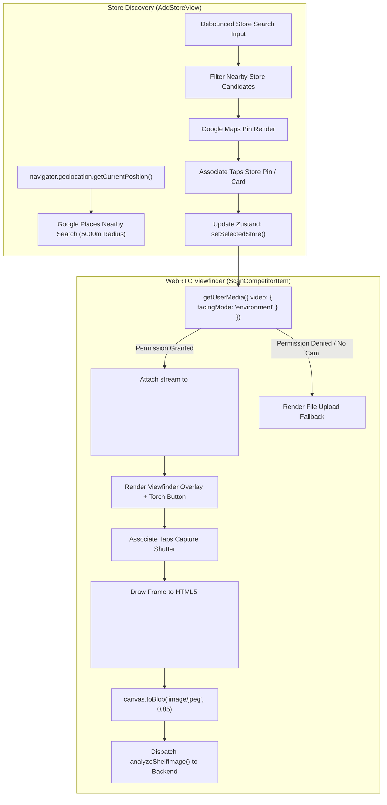

# Specification 009: In-Store Hardware Capture (WebRTC) & Geolocation Store Discovery

## 1. Specification Metadata
- **Specification ID:** `SPEC-009`
- **Component:** Camera Hardware Interface & Store Geolocation
- **Target Runtimes:** Browser (WebRTC MediaDevices API, Canvas API, Google Places)
- **Status:** Approved for Implementation

---

## 2. Technology Architecture

### 2.1 Technology Stack & Tooling
- **Camera Capture:** WebRTC `MediaDevices.getUserMedia()` with `facingMode: 'environment'`
- **Frame Extraction:** HTML5 `<canvas>` rendering (`CanvasRenderingContext2D.drawImage`) and `toBlob()`
- **Hardware Controls:** `MediaStreamTrack.applyConstraints()` for hardware torch/flash manipulation
- **Geolocation & Maps:** `@vis.gl/react-google-maps`, Google Places API
- **Fallback:** Standard HTML file picker `<input type="file" accept="image/*" capture="environment">`

### 2.2 Camera & Store Discovery Architecture
The legacy client had a simulated non-functional camera viewfinder that immediately dumped associates into an empty error state. This specification replaces it with a production-grade WebRTC viewfinder and debounced Places API store finder:



### 2.3 WebRTC Camera Hook Specification ([client/src/hooks/useCamera.ts](file:///Users/rmcguinness/Projects/customers/walmart/price-comp/client/src/hooks/useCamera.ts))

```typescript
import { useState, useRef, useEffect, useCallback } from 'react';

interface UseCameraResult {
  videoRef: React.RefObject<HTMLVideoElement | null>;
  canvasRef: React.RefObject<HTMLCanvasElement | null>;
  isActive: boolean;
  hasPermission: boolean | null;
  torchSupported: boolean;
  isTorchOn: boolean;
  error: string | null;
  startCamera: () => Promise<void>;
  stopCamera: () => void;
  toggleTorch: () => Promise<void>;
  captureFrame: () => Promise<Blob | null>;
}

export const useCamera = (): UseCameraResult => {
  const videoRef = useRef<HTMLVideoElement | null>(null);
  const canvasRef = useRef<HTMLCanvasElement | null>(null);
  const [isActive, setIsActive] = useState<boolean>(false);
  const [hasPermission, setHasPermission] = useState<boolean | null>(null);
  const [torchSupported, setTorchSupported] = useState<boolean>(false);
  const [isTorchOn, setIsTorchOn] = useState<boolean>(false);
  const [error, setError] = useState<string | null>(null);
  const streamRef = useRef<MediaStream | null>(null);

  const startCamera = useCallback(async () => {
    try {
      setError(null);
      const constraints: MediaStreamConstraints = {
        video: {
          facingMode: { ideal: 'environment' },
          width: { ideal: 1920 },
          height: { ideal: 1080 },
        },
        audio: false,
      };

      const stream = await navigator.mediaDevices.getUserMedia(constraints);
      streamRef.current = stream;

      if (videoRef.current) {
        videoRef.current.srcObject = stream;
        await videoRef.current.play();
      }

      setHasPermission(true);
      setIsActive(true);

      // Inspect torch capability on track
      const track = stream.getVideoTracks()[0];
      const capabilities = track.getCapabilities ? (track.getCapabilities() as any) : {};
      if (capabilities.torch) {
        setTorchSupported(true);
      }
    } catch (err: any) {
      setHasPermission(false);
      setIsActive(false);
      setError(err.message || 'Camera access denied or unavailable.');
    }
  }, []);

  const stopCamera = useCallback(() => {
    if (streamRef.current) {
      streamRef.current.getTracks().forEach((track) => track.stop());
      streamRef.current = null;
    }
    if (videoRef.current) {
      videoRef.current.srcObject = null;
    }
    setIsActive(false);
    setIsTorchOn(false);
  }, []);

  const toggleTorch = useCallback(async () => {
    if (!streamRef.current || !torchSupported) return;
    const track = streamRef.current.getVideoTracks()[0];
    try {
      const nextTorch = !isTorchOn;
      await (track as any).applyConstraints({
        advanced: [{ torch: nextTorch }],
      });
      setIsTorchOn(nextTorch);
    } catch (err: any) {
      setError('Unable to toggle device torch.');
    }
  }, [isTorchOn, torchSupported]);

  const captureFrame = useCallback((): Promise<Blob | null> => {
    return new Promise((resolve) => {
      const video = videoRef.current;
      const canvas = canvasRef.current;
      if (!video || !canvas || !isActive) {
        resolve(null);
        return;
      }

      canvas.width = video.videoWidth || 1280;
      canvas.height = video.videoHeight || 720;
      const ctx = canvas.getContext('2d');
      if (!ctx) {
        resolve(null);
        return;
      }

      ctx.drawImage(video, 0, 0, canvas.width, canvas.height);
      canvas.toBlob(
        (blob) => resolve(blob),
        'image/jpeg',
        0.85
      );
    });
  }, [isActive]);

  useEffect(() => {
    return () => {
      stopCamera();
    };
  }, [stopCamera]);

  return {
    videoRef,
    canvasRef,
    isActive,
    hasPermission,
    torchSupported,
    isTorchOn,
    error,
    startCamera,
    stopCamera,
    toggleTorch,
    captureFrame,
  };
};
```

### 2.4 Store Search Debouncing ([client/src/views/AddStoreView.tsx](file:///Users/rmcguinness/Projects/customers/walmart/price-comp/client/src/views/AddStoreView.tsx))
- Implements a 300ms debounced input filter over Places API search results.
- Dynamically highlights matched competitor names and street addresses in the bottom sheet.
- Dispatches `setSelectedStore()` to the Zustand store upon selection and navigates to `/scan`.

---

## 3. Use-Cases & Functional Requirements

### Use-Case 9.1: Live Camera Shelf Capture
- **Actor:** In-Store Retail Associate
- **Precondition:** Associate selects competitor store and navigates to camera viewfinder.
- **Workflow:**
  1. Viewfinder mounts; `startCamera()` acquires environment camera stream.
  2. Associate aims camera at shelf display.
  3. If ambient shelf lighting is dim, associate taps the torch toggle button.
  4. Associate taps shutter button; `captureFrame()` renders current video frame to hidden canvas.
  5. Canvas generates JPEG blob.
  6. UI transitions into analysis modal while dispatching blob to `/api/v1/analysis/extract-product-info`.
- **Expected Outcome:** Completely replaces the simulated click-through with live hardware frame capture.

### Use-Case 9.2: Camera Permission Rejection Fallback
- **Actor:** User with Disabled Camera Permissions
- **Precondition:** User denies browser camera permissions.
- **Workflow:**
  1. `useCamera` catches permission error and sets `hasPermission: false`.
  2. Viewfinder displays clear warning banner with instructions to enable camera in browser settings.
  3. Displays alternate `<input type="file" accept="image/*">` allowing user to upload existing photos.
- **Expected Outcome:** Application remains fully functional even when hardware camera access is unavailable.

---

## 4. Spec-Driven Implementation Tasks (Gemini 3.8 Flash Directives)

### Task 9.1: Implement Camera Hook & Component
1. Implement [`client/src/hooks/useCamera.ts`](file:///Users/rmcguinness/Projects/customers/walmart/price-comp/client/src/hooks/useCamera.ts) matching Section 2.3.
2. Implement [`client/src/components/camera/CameraViewfinder.tsx`](file:///Users/rmcguinness/Projects/customers/walmart/price-comp/client/src/components/camera/CameraViewfinder.tsx) with shutter button, torch icon, and target shelf alignment guides.

### Task 9.2: Implement Debounced Store Search
1. Update [`client/src/views/AddStoreView.tsx`](file:///Users/rmcguinness/Projects/customers/walmart/price-comp/client/src/views/AddStoreView.tsx).
2. Attach debounced search listener to the store input field to filter nearby places.

---

## 5. Verification & Acceptance Criteria

### Automated Tests ([client/src/hooks/__tests__/useCamera.test.ts](file:///Users/rmcguinness/Projects/customers/walmart/price-comp/client/src/hooks/__tests__/useCamera.test.ts))
- Test that `startCamera()` invokes `navigator.mediaDevices.getUserMedia` with `facingMode: 'environment'`.
- Test that permission rejections properly set `hasPermission: false` without crashing.
- Test that `stopCamera()` halts all active tracks in the media stream.

### Quality Gates
- No inert/simulated buttons: every UI shutter and torch toggle interacts with real browser APIs.
- Clean memory cleanup: media tracks are reliably closed when navigating away from the view.

