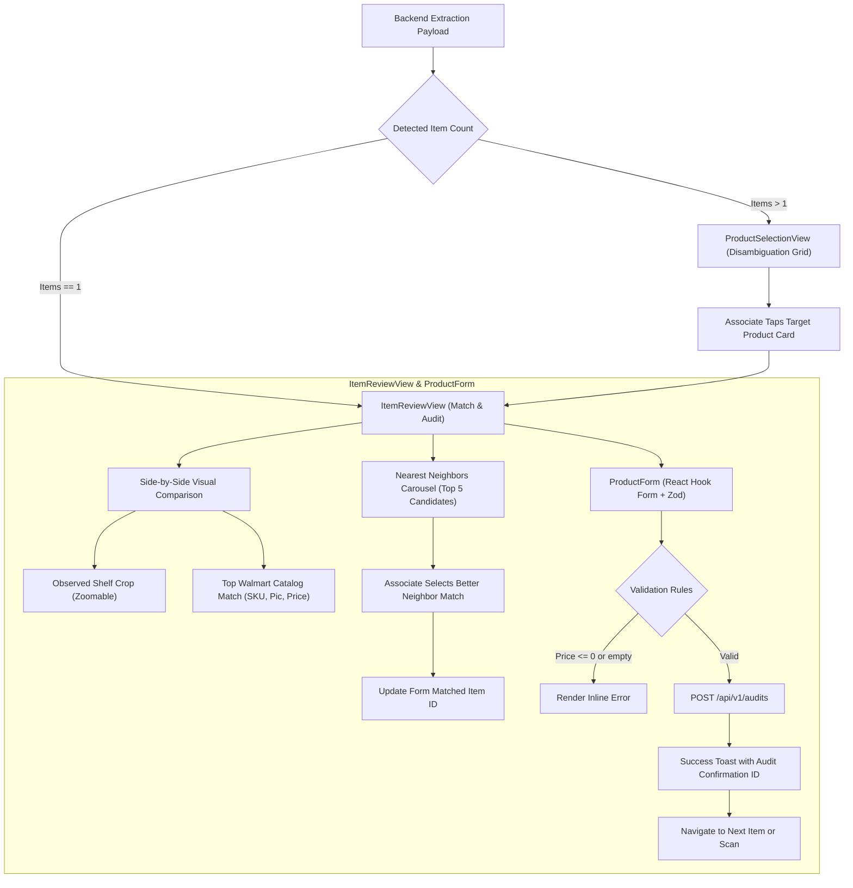

# Specification 010: Disambiguation UI, Match Review & Audit Form Interface

## 1. Specification Metadata
- **Specification ID:** `SPEC-010`
- **Component:** UI Components, Disambiguation & Audit Review Form
- **Target Runtimes:** React 19, TypeScript 5.9, Tailwind CSS / CSS Modules
- **Status:** Approved for Implementation

---

## 2. Technology Architecture

### 2.1 Technology Stack & Tooling
- **Component Model:** Functional React 19 components with arrow function syntax
- **Form Management:** React Hook Form (`useForm`)
- **Schema Validation:** Zod (`zodResolver`)
- **Icons:** Lucide React (`Camera`, `CheckCircle`, `AlertTriangle`, `Search`, `ArrowRight`, `ZoomIn`)
- **State Integration:** Zustand (`useComparisonStore`)
- **Asset Fallback:** Inline SVG placeholder components (resolving missing `./broken.png` blindspot)

### 2.2 User Interaction & Form Validation Flow
The legacy client contained hardcoded mock strings (e.g. static UPC `"1234567890"`, static price `"$2.00 at store #100"`), broken asset paths, and form inputs that did not submit. This specification details dynamic, schema-driven components:



### 2.3 Form Validation Schema ([client/src/schemas/auditSchema.ts](file:///Users/rmcguinness/Projects/customers/walmart/price-comp/client/src/schemas/auditSchema.ts))

```typescript
import { z } from 'zod';

export const auditFormSchema = z.object({
  brand: z.string().min(1, 'Brand is required'),
  description: z.string().min(2, 'Description must be at least 2 characters'),
  competitorPrice: z.coerce.number().positive('Competitor price must be greater than zero'),
  verifiedPrice: z.coerce.number().positive('Verified price must be greater than zero'),
  size: z.coerce.number().optional(),
  unitOfMeasure: z.string().default('ea'),
  upc: z.string().optional(),
  selectedWalmartItemId: z.string().optional(),
  discrepancyReason: z.string().optional(),
  associateNotes: z.string().optional(),
});

export type AuditFormValues = z.infer<typeof auditFormSchema>;
```

### 2.4 Product Form Component ([client/src/components/products/ProductForm.tsx](file:///Users/rmcguinness/Projects/customers/walmart/price-comp/client/src/components/products/ProductForm.tsx))

```tsx
import React, { useState } from 'react';
import { useForm } from 'react-hook-form';
import { zodResolver } from '@hookform/resolvers/zod';
import { auditFormSchema, AuditFormValues } from '../../schemas/auditSchema';
import { useComparisonStore } from '../../stores/useComparisonStore';
import { submitPriceAudit } from '../../services/api';
import { CheckCircle, AlertTriangle, Loader2 } from 'lucide-react';

export const ProductForm = () => {
  const {
    detectedProducts,
    selectedProductIndex,
    selectedStore,
    updateProductDetails,
  } = useComparisonStore();

  const product = detectedProducts[selectedProductIndex];
  const [isSubmitting, setIsSubmitting] = useState<boolean>(false);
  const [submissionSuccess, setSubmissionSuccess] = useState<string | null>(null);
  const [submitError, setSubmitError] = useState<string | null>(null);

  const topNeighbor = product?.neighbors?.[0];

  const {
    register,
    handleSubmit,
    formState: { errors },
  } = useForm<AuditFormValues>({
    resolver: zodResolver(auditFormSchema),
    defaultValues: {
      brand: product?.brand || '',
      description: product?.description || '',
      competitorPrice: product?.competitorPrice || 0,
      verifiedPrice: product?.competitorPrice || 0,
      size: product?.size || undefined,
      unitOfMeasure: product?.unitOfMeasure || 'ea',
      upc: product?.upc || '',
      selectedWalmartItemId: topNeighbor?.itemId || '',
      discrepancyReason: '',
      associateNotes: '',
    },
  });

  if (!product) {
    return <div className="p-4 text-gray-500">No product selected for review.</div>;
  }

  const onSubmit = async (data: AuditFormValues) => {
    if (!selectedStore) {
      setSubmitError('Please select a competitor store before submitting.');
      return;
    }

    try {
      setIsSubmitting(true);
      setSubmitError(null);

      const result = await submitPriceAudit({
        storeId: selectedStore.id,
        storeName: selectedStore.name,
        associateId: 'associate-current', // Injected from Auth Context
        competitorProduct: {
          ...product,
          brand: data.brand,
          description: data.description,
          competitorPrice: data.competitorPrice,
          size: data.size,
          unitOfMeasure: data.unitOfMeasure,
          upc: data.upc,
        },
        selectedWalmartItemId: data.selectedWalmartItemId,
        verifiedPrice: data.verifiedPrice,
        discrepancyReason: data.discrepancyReason,
      });

      updateProductDetails(selectedProductIndex, {
        brand: data.brand,
        description: data.description,
        competitorPrice: data.competitorPrice,
      });

      setSubmissionSuccess(`Audit confirmed! ID: ${result.audit_id}`);
    } catch (err: any) {
      setSubmitError(err.message || 'Failed to submit price audit.');
    } finally {
      setIsSubmitting(false);
    }
  };

  return (
    <form onSubmit={handleSubmit(onSubmit)} className="space-y-4 p-4 bg-white rounded-lg shadow-sm">
      <h3 className="text-lg font-semibold text-gray-800">Verify Price Audit</h3>

      {submissionSuccess && (
        <div className="flex items-center gap-2 p-3 bg-green-50 text-green-700 rounded-md">
          <CheckCircle className="w-5 h-5 flex-shrink-0" />
          <span>{submissionSuccess}</span>
        </div>
      )}

      {submitError && (
        <div className="flex items-center gap-2 p-3 bg-red-50 text-red-700 rounded-md">
          <AlertTriangle className="w-5 h-5 flex-shrink-0" />
          <span>{submitError}</span>
        </div>
      )}

      <div className="grid grid-cols-1 md:grid-cols-2 gap-4">
        <div>
          <label className="block text-sm font-medium text-gray-700">Brand</label>
          <input
            {...register('brand')}
            className="mt-1 block w-full rounded-md border border-gray-300 p-2 text-sm focus:border-blue-500"
          />
          {errors.brand && <p className="text-xs text-red-500 mt-1">{errors.brand.message}</p>}
        </div>

        <div>
          <label className="block text-sm font-medium text-gray-700">Observed Price ($)</label>
          <input
            type="number"
            step="0.01"
            {...register('competitorPrice')}
            className="mt-1 block w-full rounded-md border border-gray-300 p-2 text-sm focus:border-blue-500"
          />
          {errors.competitorPrice && (
            <p className="text-xs text-red-500 mt-1">{errors.competitorPrice.message}</p>
          )}
        </div>
      </div>

      <div>
        <label className="block text-sm font-medium text-gray-700">Product Title</label>
        <input
          {...register('description')}
          className="mt-1 block w-full rounded-md border border-gray-300 p-2 text-sm focus:border-blue-500"
        />
        {errors.description && (
          <p className="text-xs text-red-500 mt-1">{errors.description.message}</p>
        )}
      </div>

      <div className="grid grid-cols-2 gap-4">
        <div>
          <label className="block text-sm font-medium text-gray-700">Verified Price ($)</label>
          <input
            type="number"
            step="0.01"
            {...register('verifiedPrice')}
            className="mt-1 block w-full rounded-md border border-gray-300 p-2 text-sm focus:border-blue-500"
          />
          {errors.verifiedPrice && (
            <p className="text-xs text-red-500 mt-1">{errors.verifiedPrice.message}</p>
          )}
        </div>

        <div>
          <label className="block text-sm font-medium text-gray-700">UPC (Optional)</label>
          <input
            {...register('upc')}
            placeholder="Scan or enter UPC"
            className="mt-1 block w-full rounded-md border border-gray-300 p-2 text-sm focus:border-blue-500"
          />
        </div>
      </div>

      {topNeighbor && (
        <div className="p-3 bg-blue-50 rounded-md border border-blue-100 flex items-center justify-between">
          <div>
            <span className="text-xs font-semibold text-blue-800 uppercase tracking-wider">
              Matched Walmart SKU
            </span>
            <p className="text-sm font-medium text-blue-900">{topNeighbor.description}</p>
            <p className="text-xs text-blue-700">
              Walmart Price: ${topNeighbor.walmartPrice.toFixed(2)} | {(topNeighbor.similarityScore * 100).toFixed(1)}% Match
            </p>
          </div>
        </div>
      )}

      <div>
        <label className="block text-sm font-medium text-gray-700">Discrepancy Notes</label>
        <textarea
          {...register('discrepancyReason')}
          rows={2}
          placeholder="E.g., Competitor tag was on clearance rollback"
          className="mt-1 block w-full rounded-md border border-gray-300 p-2 text-sm focus:border-blue-500"
        />
      </div>

      <button
        type="submit"
        disabled={isSubmitting}
        className="w-full flex items-center justify-center gap-2 py-2.5 px-4 rounded-md bg-blue-600 text-white font-medium hover:bg-blue-700 disabled:bg-blue-300 transition-colors"
      >
        {isSubmitting ? (
          <>
            <Loader2 className="w-4 h-4 animate-spin" />
            <span>Submitting Audit...</span>
          </>
        ) : (
          <span>Commit Price Audit</span>
        )}
      </button>
    </form>
  );
};
```

### 2.5 Resilient Asset Image Component ([client/src/components/common/ProductImage.tsx](file:///Users/rmcguinness/Projects/customers/walmart/price-comp/client/src/components/common/ProductImage.tsx))
- Implements image loading error boundary.
- When `src` fails or returns 404, renders an inline SVG placeholder with `ImageOff` icon instead of referencing non-existent `./broken.png`.

---

## 3. Use-Cases & Functional Requirements

### Use-Case 10.1: Multi-Item Disambiguation
- **Actor:** Retail Associate
- **Precondition:** Shelf photo contains multiple products (e.g., 3 salsa jars).
- **Workflow:**
  1. UI routes to `/select-product`.
  2. Renders card grid showing brand, cropped thumbnail, observed price, and title for each detected item.
  3. Associate selects jar #2 (Mild Chunky Salsa).
  4. Store updates `selectedProductIndex` to 1 and navigates to `/review-match`.
- **Expected Outcome:** Associate can inspect and audit each product individually without rescanning.

### Use-Case 10.2: Price Audit Form Submission
- **Actor:** Retail Associate
- **Precondition:** Associate reviews matched salsa jar and notes an electronic tag discrepancy ($2.99 vs $3.29).
- **Workflow:**
  1. Associate edits `verifiedPrice` to $3.29.
  2. Enters reason: `"Shelf tag clearance rollback"`.
  3. Taps "Commit Price Audit".
  4. Form validates fields via Zod, issues `POST /api/v1/audits`, and renders confirmation toast.
- **Expected Outcome:** Fixes the legacy `Item.tsx` blindspot; price verification is persisted with complete audit traceability.

---

## 4. Spec-Driven Implementation Tasks (Gemini 3.8 Flash Directives)

### Task 10.1: Implement Zod Validation Schemas & Form
1. Install dependencies: `npm install react-hook-form @hookform/resolvers zod`.
2. Implement [`client/src/schemas/auditSchema.ts`](file:///Users/rmcguinness/Projects/customers/walmart/price-comp/client/src/schemas/auditSchema.ts).
3. Implement [`client/src/components/products/ProductForm.tsx`](file:///Users/rmcguinness/Projects/customers/walmart/price-comp/client/src/components/products/ProductForm.tsx).

### Task 10.2: Implement Resilient Image Component
1. Implement [`client/src/components/common/ProductImage.tsx`](file:///Users/rmcguinness/Projects/customers/walmart/price-comp/client/src/components/common/ProductImage.tsx).
2. Clean up all references to `broken.png` in neighbor item cards and found/not-found views.

---

## 5. Verification & Acceptance Criteria

### Automated Tests ([client/src/components/products/__tests__/ProductForm.test.tsx](file:///Users/rmcguinness/Projects/customers/walmart/price-comp/client/src/components/products/__tests__/ProductForm.test.tsx))
- Test that submitting with negative or non-numeric price displays validation error.
- Test that successful form submission triggers `submitPriceAudit` API and renders success confirmation.
- Test that missing image assets gracefully fall back to SVG placeholder without console errors.

### Quality Gates
- Zero hardcoded fallback strings (`"1234567890"` or third-party image domains).
- All form mutations persist to backend `/api/v1/audits`.

