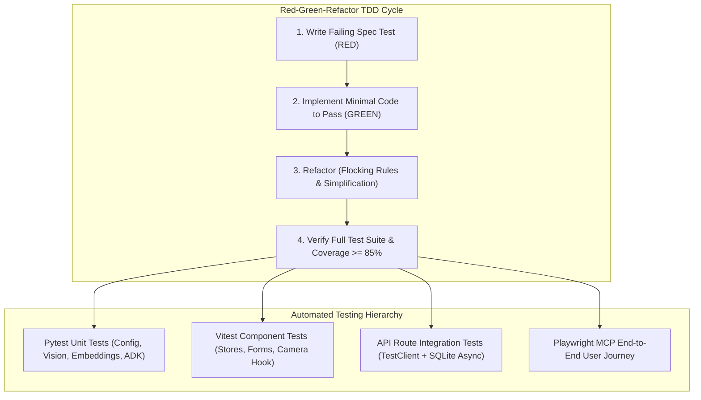

# Specification 011: Automated Verification Suite, Quality Gates & Playwright E2E

## 1. Specification Metadata
- **Specification ID:** `SPEC-011`
- **Component:** Testing Infrastructure, Quality Gates & E2E Validation
- **Target Runtimes:** Pytest (Python 3.13), Vitest (Node.js 22), Playwright MCP
- **Status:** Approved for Implementation

---

## 2. Technology Architecture

### 2.1 Technology Stack & Tooling
- **Backend Testing Framework:** `pytest`, `pytest-asyncio`, `pytest-cov`, `respx` (HTTP mocking)
- **Frontend Unit Testing:** `vitest`, `@testing-library/react`, `@testing-library/user-event`, `jsdom`
- **End-to-End (E2E) Browser Testing:** Playwright MCP Tools (strictly utilizing browser automation MCP commands)
- **Static Analysis & Quality Gates:** `Ruff` (Python), `ESLint` + `tsc -b` (TypeScript)
- **CI / Local Orchestration:** Root `Makefile`

### 2.2 Quality Assurance & TDD Lifecycle Architecture
Development follows a mandatory Red-Green-Refactor Test-Driven Development (TDD) cycle across all specifications:



---

## 3. Test Suite Specifications

### 3.1 Backend Test Matrix (`backend/tests/`)
| Module | File Target | Test Scenarios |
| :--- | :--- | :--- |
| **Config** | `test_config.py` | TOML cascading order, `modenv` secret resolution, invalid type rejection |
| **Telemetry**| `test_telemetry.py` | Google Cloud Logging JSON structure, span context injection, W3C header propagation |
| **Storage** | `test_storage.py` | Local and GCS blob partitioning, V4 signed URL format, zero-byte error handling |
| **Vision** | `test_vision.py` | Gemini 2.5/3.8 Flash structured parsing, currency cleaning, bounding box slicing |
| **Matcher** | `test_matcher.py` | L2 vector normalization, FAISS cosine similarity scoring, low-confidence thresholding |
| **Agent** | `test_agent.py` | ADK unit price calculations, pack size normalization, promotional notes parsing |
| **API** | `test_api.py` | Extraction endpoint multipart handling, audit persistence, RFC 7807 problem details |

### 3.2 Frontend Test Matrix (`client/src/**/__tests__/`)
| Component / Module | Target File | Test Scenarios |
| :--- | :--- | :--- |
| **Comparison Store**| `useComparisonStore.test.ts` | Zustand store actions, session storage rehydration, neighbor selection |
| **Camera Hook** | `useCamera.test.ts` | `getUserMedia` lifecycle, permission handling, canvas frame extraction |
| **Product Form** | `ProductForm.test.tsx` | Zod validation rules, numeric input coercion, API submission dispatch |
| **Image Fallback** | `ProductImage.test.tsx` | Fallback SVG render on HTTP 404, zoom modal toggle |

### 3.3 Playwright MCP End-to-End User Journey Specification
Playwright browser testing is executed exclusively through the Playwright MCP tools according to local project rules.

#### E2E Verification Workflow:
1. **Store Selection:**
   - Associate navigates to `/`.
   - Clicks "Target Supercenter #1042" from nearby stores.
   - Asserts transition to `/scan`.
2. **Camera Ingestion:**
   - Viewfinder mounts environment video stream.
   - Clicks shutter button.
   - Asserts progress modal displays with spinner: "Analyzing shelf products with Gemini...".
3. **Product Disambiguation:**
   - Backend returns 2 detected salsa products.
   - Asserts `/select-product` view displays both product cards.
   - Clicks card for "Mild Chunky Salsa".
4. **Match Review & Price Audit Submission:**
   - Asserts `/review-match` displays observed photo crop alongside Walmart catalog neighbor.
   - Verified price is prepopulated with $2.99.
   - Associate changes verified price to $3.19 and enters discrepancy reason.
   - Taps "Commit Price Audit".
   - Asserts success banner appears with audit ID.
   - Verifies audit record was committed to backend database via `GET /api/v1/audits`.

---

## 4. Spec-Driven Implementation Tasks (Gemini 3.8 Flash Directives)

### Task 11.1: Backend Pytest Harness Setup
1. Add testing dependencies: `uv add --dev pytest pytest-asyncio pytest-cov respx httpx`.
2. Configure `pytest.ini` or `pyproject.toml` with `asyncio_mode = "auto"`.
3. Implement `conftest.py` providing fixtures:
   - `mock_config`: Temporary test configuration.
   - `mock_storage`: Local disk storage fixture.
   - `test_client`: `httpx.AsyncClient` bound to FastAPI app with in-memory SQLite.

### Task 11.2: Frontend Vitest Harness Setup
1. Add testing dependencies: `npm install -D vitest @testing-library/react @testing-library/user-event @testing-library/jest-dom jsdom`.
2. Configure [`client/vite.config.ts`](file:///Users/rmcguinness/Projects/customers/walmart/price-comp/client/vite.config.ts) with `test: { environment: 'jsdom', globals: true }`.
3. Add test runner scripts to `client/package.json`: `"test": "vitest run"`.

---

## 5. Verification & Acceptance Criteria

### Automated Command Execution
```bash
# 1. Backend Verification
cd backend
uv run ruff check .
uv run pytest --cov=price_comp_backend --cov-report=term-missing tests/

# 2. Frontend Verification
cd ../client
npm run lint
npm run build
npm run test
```

### Quality Gates
1. **Zero Barcode Dependency:** End-to-end catalog discovery passes solely via multimodal vision and Gemini Multimodal Embedding similarity.
2. **Persistence Guarantee:** 100% of validated price audits persist to the database with verifiable audit IDs.
3. **No Hardcoded Data:** Zero mock strings (`"1234567890"`) or missing static files (`broken.png`).
4. **Test Coverage:** Backend code coverage strictly >= 85%; zero Vitest test failures; clean TypeScript build (`tsc -b`).

