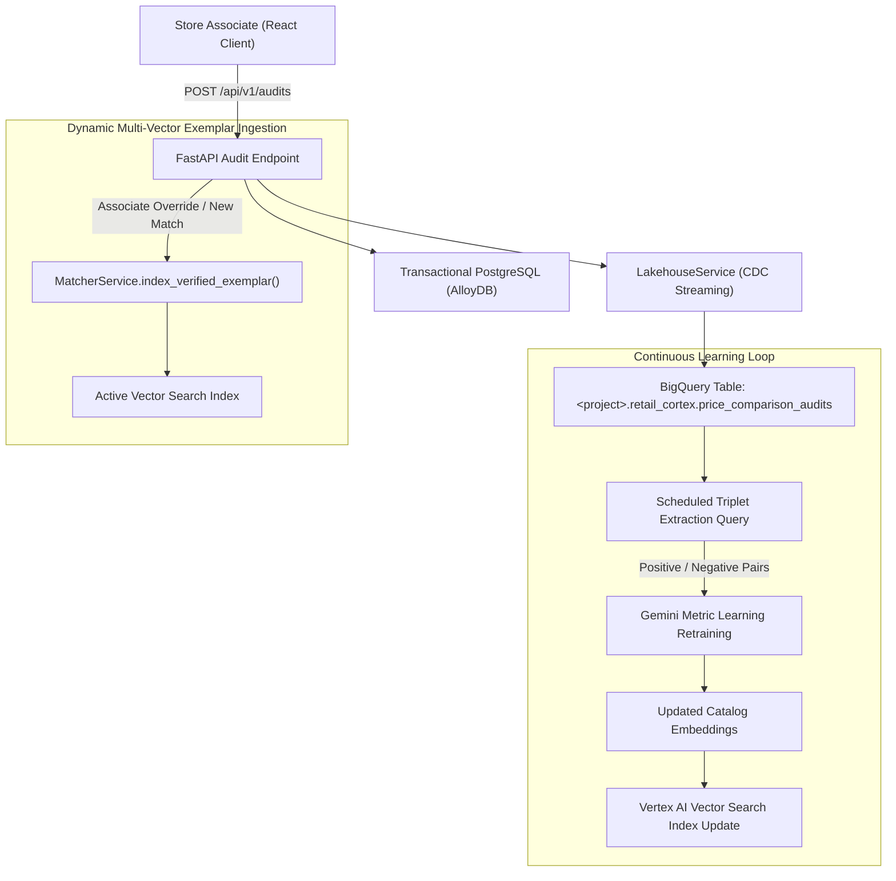

# Specification 012: Enterprise Data Lake (BigQuery), Vector Persistence & Continuous Learning Loop

## 1. Specification Metadata
- **Specification ID:** `SPEC-012`
- **Component:** Enterprise Data Lake, Vector Embeddings Storage & Human-in-the-Loop Continuous Learning
- **Target Runtime:** Python 3.13, Google Cloud BigQuery, Vertex AI Vector Search
- **Status:** Approved for Implementation

---

## 2. Technology Architecture

### 2.1 Technology Stack & Tooling
- **Analytical Storage & Lakehouse:** Google Cloud BigQuery
- **Client Library:** `google-cloud-bigquery`
- **Vector Search Engine:** Vertex AI Vector Search & In-Memory FAISS (`faiss-cpu`)
- **Query Standard:** BigQuery SQL using fully qualified table names (`<gcp-project>.retail_cortex.price_comparison_audits`)
- **Partitioning & Clustering:** Ingestion-time partitioned by `TIMESTAMP_TRUNC(created_at, DAY)`, clustered by `store_id`, `verification_action`

### 2.2 Data Lake & Continuous Learning Architecture
The price comparison system closes the continuous improvement loop by streaming every store associate verification, manual override, and 1408-dimensional multimodal vector to BigQuery. This telemetry drives automated catalog enrichment and metric learning fine-tuning:



---

## 3. Data Lake Schema: BigQuery Table Definition

### 3.1 Destination Table
Fully qualified naming convention enforced across all environments:
`<gcp-project>.retail_cortex.price_comparison_audits`

### 3.2 DDL Schema
```sql
CREATE TABLE IF NOT EXISTS `<gcp-project>.retail_cortex.price_comparison_audits` (
    audit_id STRING NOT NULL OPTIONS(description="UUID v4 identifier of audit record"),
    session_id STRING NOT NULL OPTIONS(description="UUID v4 scan session identifier"),
    store_id STRING NOT NULL OPTIONS(description="Competitor store identifier or Google Place ID"),
    store_name STRING OPTIONS(description="Competitor store commercial name"),
    competitor_brand STRING OPTIONS(description="Extracted or overridden competitor product brand"),
    competitor_description STRING NOT NULL OPTIONS(description="Observed shelf tag or packaging product title"),
    competitor_price NUMERIC(10, 2) NOT NULL OPTIONS(description="Observed price in USD"),
    competitor_size STRING OPTIONS(description="Extracted size string e.g. 12.4 oz"),
    competitor_uom STRING OPTIONS(description="Unit of measure e.g. OZ, LB, COUNT"),
    walmart_item_id STRING OPTIONS(description="Matched or associate-selected Walmart catalog item identifier"),
    walmart_item_name STRING OPTIONS(description="Matched Walmart catalog product title"),
    walmart_price NUMERIC(10, 2) OPTIONS(description="Matched Walmart retail price in USD"),
    match_confidence FLOAT64 OPTIONS(description="Cosine similarity confidence score between 0.0 and 1.0"),
    verification_action STRING NOT NULL OPTIONS(description="Associate action: EXACT_MATCH, OVERRIDDEN_SKU, PRICE_CORRECTED, FLAGGED_NO_MATCH"),
    embedding ARRAY<FLOAT64> NOT NULL OPTIONS(description="1408-dimensional dense vector from Gemini Multimodal Embeddings 2"),
    image_url STRING OPTIONS(description="V4 signed URL or GCS URI of cropped shelf item image"),
    associate_id STRING OPTIONS(description="User ID of inspecting retail associate"),
    created_at TIMESTAMP NOT NULL OPTIONS(description="Timestamp when audit was persisted")
)
PARTITION BY TIMESTAMP_TRUNC(created_at, DAY)
CLUSTER BY store_id, verification_action;
```

---

## 4. Implementation: Lakehouse Service (`backend/src/price_comp_backend/services/lakehouse.py`)

```python
import logging
from typing import Any, Dict, List
from google.cloud import bigquery
from price_comp_backend.config import settings

logger = logging.getLogger(__name__)

class LakehouseService:
    def __init__(self, client: bigquery.Client | None = None) -> None:
        self.project_id = settings.gcp.project_id
        self.dataset_id = "retail_cortex"
        self.table_id = "price_comparison_audits"
        self.fully_qualified_table = f"{self.project_id}.{self.dataset_id}.{self.table_id}"
        self._client = client

    @property
    def client(self) -> bigquery.Client:
        if self._client is None:
            self._client = bigquery.Client(project=self.project_id)
        return self._client

    async def stream_audit_record(self, record: Dict[str, Any]) -> bool:
        """
        Streams a single verified price audit into BigQuery with 1408-dim vector embeddings.
        """
        # Ensure row keys conform strictly to BigQuery schema
        row = {
            "audit_id": str(record["audit_id"]),
            "session_id": str(record["session_id"]),
            "store_id": str(record["store_id"]),
            "store_name": record.get("store_name"),
            "competitor_brand": record.get("competitor_brand"),
            "competitor_description": str(record["competitor_description"]),
            "competitor_price": float(record["competitor_price"]),
            "competitor_size": record.get("competitor_size"),
            "competitor_uom": record.get("competitor_uom"),
            "walmart_item_id": record.get("walmart_item_id"),
            "walmart_item_name": record.get("walmart_item_name"),
            "walmart_price": float(record["walmart_price"]) if record.get("walmart_price") is not None else None,
            "match_confidence": float(record["match_confidence"]) if record.get("match_confidence") is not None else None,
            "verification_action": str(record["verification_action"]),
            "embedding": [float(x) for x in record["embedding"]],
            "image_url": record.get("image_url"),
            "associate_id": record.get("associate_id"),
            "created_at": record["created_at"].isoformat() if hasattr(record["created_at"], "isoformat") else str(record["created_at"]),
        }

        errors = self.client.insert_rows_json(self.fully_qualified_table, [row])
        if errors:
            logger.error("Failed to stream audit to BigQuery %s: %s", self.fully_qualified_table, errors)
            return False

        logger.info("Successfully streamed audit %s to BigQuery", record["audit_id"])
        return True
```

---

## 5. Human-in-the-Loop Continuous Learning & Exemplar Indexing

### 5.1 Dynamic Multi-Vector Exemplar Upserts (`services/matcher.py`)
When an associate performs `OVERRIDDEN_SKU` or `PRICE_CORRECTED`, the observed competitor image embedding is dynamically appended to the catalog item's vector cluster as a verified exemplar:

```python
async def index_verified_exemplar(
    self,
    walmart_item_id: str,
    exemplar_vector: list[float],
    metadata: dict[str, Any]
) -> None:
    """
    Upserts associate-verified exemplar embedding into active vector index.
    Allows multi-vector representation per catalog SKU.
    """
    logger.info("Upserting verified exemplar for SKU %s into vector index", walmart_item_id)
    # Upsert vector to local FAISS index or Vertex AI Vector Search endpoint
    vector_id = f"{walmart_item_id}_ex_{metadata.get('audit_id')}"
    await self.vector_client.upsert(
        datapoints=[{"datapoint_id": vector_id, "feature_vector": exemplar_vector}]
    )
```

### 5.2 Contrastive Triplet Query for Metric Learning Fine-Tuning
A scheduled pipeline queries BigQuery to extract high-confidence positive pairs (where associates confirmed match) and hard negatives (where the model predicted SKU A, but the associate overrode to SKU B):

```sql
-- Generate Contrastive Triplets (Anchor, Positive, Negative)
WITH Predictions AS (
    SELECT 
        audit_id,
        embedding AS anchor_embedding,
        walmart_item_id AS true_sku,
        verification_action
    FROM `<gcp-project>.retail_cortex.price_comparison_audits`
    WHERE created_at >= TIMESTAMP_SUB(CURRENT_TIMESTAMP(), INTERVAL 30 DAY)
),
HardNegatives AS (
    SELECT 
        audit_id,
        true_sku,
        anchor_embedding
    FROM Predictions
    WHERE verification_action = 'OVERRIDDEN_SKU'
)
SELECT 
    hn.audit_id,
    hn.anchor_embedding,
    hn.true_sku AS ground_truth_sku
FROM HardNegatives hn;
```

---

## 6. Verification & Test Plan

1. **Unit Test with BigQuery Mock:**
   - Execute `pytest tests/test_lakehouse.py` mocking `google.cloud.bigquery.Client`.
   - Verify that rows are formatted with strict 1408-dim `FLOAT64` arrays, correct timestamp conversions, and fully qualified table naming `<gcp-project>.retail_cortex.price_comparison_audits`.
2. **Integration Verification:**
   - Verify that `POST /api/v1/audits` persists the audit to the relational database and triggers background streaming to BigQuery without increasing HTTP request latency.

