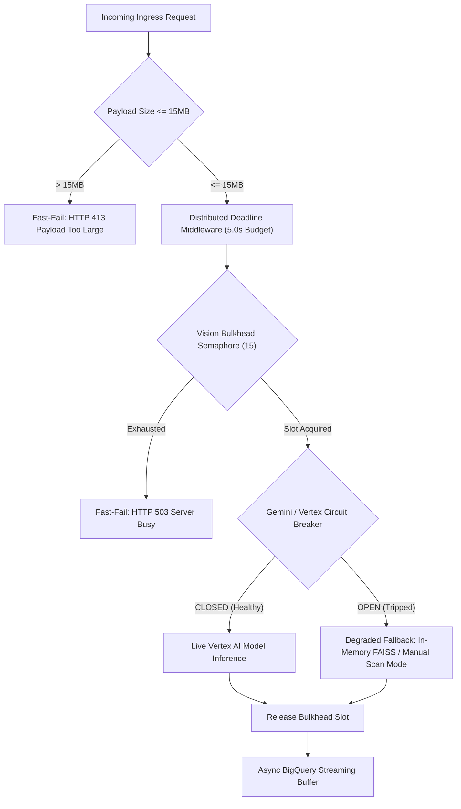

# Specification 014: Production Operations, Resilience Engineering & Antigravity Agentic Maintenance

## 1. Specification Metadata
- **Specification ID:** `SPEC-014`
- **Component:** SRE, Fault Tolerance, Bulkheads, Circuit Breakers & Antigravity Agentic Tooling
- **Target Runtime:** Python 3.13, Google Cloud Run, Cloud Monitoring
- **Status:** Approved for Implementation

---

## 2. Technology Architecture

### 2.1 Technology Stack & Tooling
- **Resilience Engine:** Python `asyncio` primitives, `core/resilience.py`
- **Concurrency Control:** `asyncio.Semaphore` pools (Bulkheads)
- **Circuit Breaker:** State-machine breaker (`CLOSED`, `OPEN`, `HALF_OPEN`) with degraded fallbacks
- **Health Probes:** RFC-compliant `/healthz` (liveness) and `/readyz` (readiness)
- **Agent Maintenance:** Google Antigravity IDE configuration (`.gemini/GEMINI.md`) and ADK Quality Flywheel (`tests/evals/`)

### 2.2 End-to-End Resilience Architecture
Retail environments present extreme operating conditions: bursty image uploads during associate shifts and unstable in-store cellular connectivity. The system protects backend resources via strict isolation layers:



---

## 3. Resilience Implementation (`backend/src/price_comp_backend/core/resilience.py`)

### 3.1 Bulkhead Concurrency Pools & Circuit Breaker
```python
import asyncio
import time
import logging
from enum import Enum
from typing import Callable, Any, Coroutine
from fastapi import HTTPException, status

logger = logging.getLogger(__name__)

class CircuitState(str, Enum):
    CLOSED = "CLOSED"
    OPEN = "OPEN"
    HALF_OPEN = "HALF_OPEN"

class Bulkhead:
    """Bounded semaphore preventing cascading resource exhaustion."""
    def __init__(self, max_concurrent: int, name: str) -> None:
        self.semaphore = asyncio.Semaphore(max_concurrent)
        self.name = name

    async def acquire_or_reject(self) -> None:
        try:
            # Non-blocking or minimal wait timeout to prevent request buildup
            await asyncio.wait_for(self.semaphore.acquire(), timeout=0.1)
        except asyncio.TimeoutError:
            logger.warning("Bulkhead %s saturated. Rejecting request with 503.", self.name)
            raise HTTPException(
                status_code=status.HTTP_503_SERVICE_UNAVAILABLE,
                detail=f"Resource pool {self.name} is currently saturated. Please retry shortly."
            )

    def release(self) -> None:
        self.semaphore.release()

class CircuitBreaker:
    """Protects downstream Vertex AI and external APIs with graceful fallback."""
    def __init__(
        self,
        failure_threshold: int = 5,
        recovery_time_seconds: float = 30.0,
        name: str = "default"
    ) -> None:
        self.failure_threshold = failure_threshold
        self.recovery_time_seconds = recovery_time_seconds
        self.name = name
        self.state = CircuitState.CLOSED
        self.failure_count = 0
        self.last_state_change = time.time()

    async def call_with_fallback(
        self,
        func: Callable[[], Coroutine[Any, Any, Any]],
        fallback: Callable[[], Coroutine[Any, Any, Any]]
    ) -> Any:
        now = time.time()
        
        # Check recovery transition
        if self.state == CircuitState.OPEN and (now - self.last_state_change > self.recovery_time_seconds):
            logger.info("CircuitBreaker %s moving to HALF_OPEN state", self.name)
            self.state = CircuitState.HALF_OPEN

        if self.state == CircuitState.OPEN:
            logger.warning("CircuitBreaker %s OPEN. Routing to fallback immediately.", self.name)
            return await fallback()

        try:
            result = await func()
            if self.state == CircuitState.HALF_OPEN:
                logger.info("CircuitBreaker %s probe succeeded. Resetting to CLOSED.", self.name)
                self.state = CircuitState.CLOSED
                self.failure_count = 0
            return result
        except Exception as ex:
            self.failure_count += 1
            logger.error("Call failed in CircuitBreaker %s (Count: %d): %s", self.name, self.failure_count, ex)
            if self.failure_count >= self.failure_threshold:
                logger.error("CircuitBreaker %s tripped to OPEN state!", self.name)
                self.state = CircuitState.OPEN
                self.last_state_change = time.time()
            return await fallback()

# Global Resource Bulkheads
vision_bulkhead = Bulkhead(max_concurrent=15, name="gemini_vision")
vector_bulkhead = Bulkhead(max_concurrent=30, name="vector_search")
storage_bulkhead = Bulkhead(max_concurrent=25, name="cloud_storage")
```

---

## 4. Production Health Probes & SRE Probing

### 4.1 Liveness & Readiness Endpoints (`main.py`)
```python
from fastapi import FastAPI, Response, status
from price_comp_backend.services.storage import StorageService
from price_comp_backend.services.matcher import MatcherService

app = FastAPI()

@app.get("/healthz", status_code=status.HTTP_200_OK)
async def healthz() -> dict[str, str]:
    """Liveness probe: verifies process event loop is active."""
    return {"status": "HEALTHY"}

@app.get("/readyz")
async def readyz(response: Response) -> dict[str, Any]:
    """Readiness probe: validates database connection, GCS credentials, and vector index."""
    checks = {
        "storage": await StorageService.check_liveness(),
        "vector_index": await MatcherService.check_liveness(),
    }
    
    all_ready = all(checks.values())
    if not all_ready:
        response.status_code = status.HTTP_503_SERVICE_UNAVAILABLE
        return {"status": "UNREADY", "checks": checks}
        
    return {"status": "READY", "checks": checks}
```

---

## 5. Antigravity Agentic Tooling & ADK Quality Flywheel

### 5.1 Workspace Rules Configuration (`.gemini/GEMINI.md`)
The new project space includes root agentic directives enforcing TDD, memory guidelines, and code review standards for autonomous agents:

```markdown
# Antigravity Autonomous Agent Directives

1. **Test-Driven Development (TDD):** Every feature must follow Red-Green-Refactor with 100% type coverage.
2. **Deterministic Configuration:** Never hardcode secrets or IPs. Always use `retail-cortex/modenv`.
3. **Resilience Enforcement:** All external API calls MUST be wrapped with bulkheads and circuit breakers.
4. **Data Lake Compliance:** BigQuery SQL queries MUST always use fully qualified table names `<gcp-project>.<dataset>.<table-name>`.
5. **Quality Flywheel:** Prior to merging agent code changes, `pytest tests/evals/test_adk_flywheel.py` MUST be executed to guarantee zero regression on the golden test suite.
```

### 5.2 ADK Quality Flywheel Golden Evaluation (`tests/evals/test_adk_flywheel.py`)
A golden dataset of 100 benchmark shelf photographs validates model accuracy before any deployment:

```python
import pytest
from price_comp_backend.services.vision import VisionService
from price_comp_backend.services.matcher import MatcherService

@pytest.mark.evals
async def test_adk_golden_flywheel_benchmarks():
    """
    Quality Flywheel evaluation verifying:
    - Bounding Box Intersection over Union (IoU >= 0.75)
    - OCR Character Accuracy (>= 98.5%)
    - Top-1 Catalog Recall (>= 90.0%)
    """
    vision_service = VisionService()
    matcher_service = MatcherService()
    
    # Run evaluation across fixtures/golden_shelf_dataset.json
    results = await run_golden_suite(vision_service, matcher_service)
    
    assert results.mean_iou >= 0.75, f"IoU regression detected: {results.mean_iou}"
    assert results.ocr_accuracy >= 0.985, f"OCR regression: {results.ocr_accuracy}"
    assert results.top1_recall >= 0.90, f"Catalog recall regression: {results.top1_recall}"
```

### 5.3 Offline Local Development Sidecars
To enable zero-cloud-cost local development and agent workflows:
1. **Mock GCS Sidecar (`tests/fixtures/gcs_emulator/`):** Implements local file write and HMAC signed URL generation on `localhost:8080/media/`.
2. **In-Memory FAISS Vector Index:** Boots a pre-seeded index from `tests/fixtures/catalog_vectors.npy` without contacting Vertex AI.
3. **Mock `modenv` Secrets:** Resolves `simple://` local encryption keys, completely bypassing Google Cloud Secret Manager during test execution.

