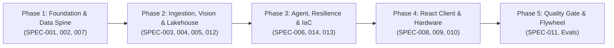

# Autonomous Agent Execution Workflow & Master Prompts (`workflow.md`)

This document contains the complete, copy-pasteable prompt sequence for executing the Spec-Driven Development (SDD) build across all five phases. 

Each phase prompt is completely self-contained, specifying the exact agent persona, skills to load, context documents to reference, specification files to execute, mandatory TDD test requirements, linting gates, and git checkpoint commit formats.

---

## Phased Execution Roadmap Overview



---

## Phase 1: Foundation, Tooling, modenv & OpenTelemetry Spine

### Execution Context
* **Assigned Agent Role:** `FoundationEngineer`
* **Governing Specifications:**
  * [`.agents/spec/SPEC-001-foundation-modenv.md`](file:///Users/rmcguinness/Projects/customers/walmart/price-comp/.agents/spec/SPEC-001-foundation-modenv.md)
  * [`.agents/spec/SPEC-002-telemetry-otel.md`](file:///Users/rmcguinness/Projects/customers/walmart/price-comp/.agents/spec/SPEC-002-telemetry-otel.md)
  * [`.agents/spec/SPEC-007-api-gateway-schemas.md`](file:///Users/rmcguinness/Projects/customers/walmart/price-comp/.agents/spec/SPEC-007-api-gateway-schemas.md)
* **Active Skills:** [`.agents/skills/modenv-resolver/SKILL.md`](file:///Users/rmcguinness/Projects/customers/walmart/price-comp/.agents/skills/modenv-resolver/SKILL.md)
* **Domain Context:** [`.agents/context/security_rules.md`](file:///Users/rmcguinness/Projects/customers/walmart/price-comp/.agents/context/security_rules.md), [`.agents/context/telemetry_conventions.md`](file:///Users/rmcguinness/Projects/customers/walmart/price-comp/.agents/context/telemetry_conventions.md)

### Master Prompt for Phase 1
```text
You are the FoundationEngineer for the Retail Cortex Price Comparison platform.
Your mandate is to scaffold the Python 3.13 backend workspace, establish configuration management via retail-cortex/modenv, configure distributed OpenTelemetry tracing with Google Cloud Trace, and define the complete Pydantic v2 enterprise data models.

CRITICAL DIRECTIVES:
- Python 3.13 managed exclusively with uv.
- Never read os.environ directly in application logic; use modenv cascading TOML resolution.
- Never hardcode credentials; support cloud://, pks://, and simple:// URI resolution schemes.
- All OpenTelemetry spans and logs must correlate W3C traceparent headers.
- Strictly adhere to Red-Green-Refactor TDD. Write failing tests before code.

EXECUTION STEPS:
1. Initialize Backend Environment:
   Execute in the repository root:
   uv init --python 3.13 backend
   cd backend
   uv add fastapi uvicorn[standard] pydantic modenv \
       opentelemetry-api opentelemetry-sdk opentelemetry-exporter-gcp-trace \
       opentelemetry-instrumentation-fastapi opentelemetry-instrumentation-httpx \
       google-genai google-cloud-storage google-cloud-bigquery google-cloud-logging \
       numpy faiss-cpu httpx
   uv add --dev pytest pytest-asyncio pytest-cov ruff mypy

2. Configuration Layer (SPEC-001):
   - Create root configuration files: `.env.toml`, `.env.dev.toml`, and `.env.local.toml`.
   - Implement `backend/src/price_comp_backend/config.py` with strongly typed `AppSettings` loading through modenv.
   - Enforce SecretStr for all sensitive attributes (keys, DB passwords).
   - Write `backend/tests/test_config.py` verifying cascading override hierarchy (.env.toml -> .env.dev.toml -> .env.local.toml) and simple:// decryption.

3. Observability & Telemetry Core (SPEC-002):
   - Implement `backend/src/price_comp_backend/core/telemetry.py` configuring TracerProvider, CloudTraceSpanExporter (with local ConsoleSpanExporter fallback for test/dev), and W3C TraceContextPropagator.
   - Implement custom JSON structured log formatter injecting `logging.googleapis.com/trace` and `logging.googleapis.com/spanId`.
   - Write `backend/tests/test_telemetry.py` validating that spans extract and inject W3C traceparent headers correctly.

4. Data Schemas & API Models (SPEC-007):
   - Implement `backend/src/price_comp_backend/models/schemas.py`:
     - `ProcessingStatus` (SUCCESS, PARTIAL_EXTRACTION, SERVICE_DEGRADED, EXTRACTION_FAILED)
     - `BoundingBox` [ymin, xmin, ymax, xmax] normalized to 0-1000.
     - `ExtractedProduct` (UPC, Brand, Description, Price, UnitPrice, UnitOfMeasure, Confidence, BoundingBox).
     - `NeighborItem` (Catalog SKU, Brand, Name, WalmartPrice, CompetitorPrice, SimilarityScore, ImageUrl).
     - `ProductExtractionResponse` (Extraction ID, Status, Items, SignedUrl).
     - `AuditCreateRequest` and `AuditRecord` (Associate ID, Store ID, Action Enum, Detected vs Selected SKU).
   - Write `backend/tests/test_schemas.py` validating serialization, validation constraints, and RFC 7807 problem details.

VERIFICATION & ACCEPTANCE:
- Run static linting: `cd backend && uv run ruff check .`
- Run test suite: `uv run pytest tests/test_config.py tests/test_telemetry.py tests/test_schemas.py -v`
- Git commit: `git commit -m "feat(SPEC-001,002,007): initialize backend, modenv config, OTel tracing and Pydantic schemas"`
```

---

## Phase 2: Ingestion, Multimodal Vision, Embeddings & Lakehouse

### Execution Context
* **Assigned Agent Role:** `VisionServiceSpecialist` & `LakehouseDataEngineer`
* **Governing Specifications:**
  * [`.agents/spec/SPEC-003-storage-gcs.md`](file:///Users/rmcguinness/Projects/customers/walmart/price-comp/.agents/spec/SPEC-003-storage-gcs.md)
  * [`.agents/spec/SPEC-004-multimodal-vision.md`](file:///Users/rmcguinness/Projects/customers/walmart/price-comp/.agents/spec/SPEC-004-multimodal-vision.md)
  * [`.agents/spec/SPEC-005-vector-matcher.md`](file:///Users/rmcguinness/Projects/customers/walmart/price-comp/.agents/spec/SPEC-005-vector-matcher.md)
  * [`.agents/spec/SPEC-012-bigquery-lakehouse-hitl.md`](file:///Users/rmcguinness/Projects/customers/walmart/price-comp/.agents/spec/SPEC-012-bigquery-lakehouse-hitl.md)
* **Active Skills:** [`.agents/skills/bigquery-streaming/SKILL.md`](file:///Users/rmcguinness/Projects/customers/walmart/price-comp/.agents/skills/bigquery-streaming/SKILL.md)
* **Domain Context:** [`.agents/context/retail_domain_rules.md`](file:///Users/rmcguinness/Projects/customers/walmart/price-comp/.agents/context/retail_domain_rules.md)

### Master Prompt for Phase 2
```text
You are the VisionServiceSpecialist and LakehouseDataEngineer.
Your mandate is to build the asynchronous media ingestion service with Google Cloud Storage, the Gemini 2.5 Flash Lite shelf vision parsing engine, the 1408-dimensional Multimodal Embeddings 2 catalog matcher with local FAISS fallback, and the BigQuery CDC streaming lakehouse pipeline.

CRITICAL DIRECTIVES:
- Standardize on `google-genai` exclusively. Do not import `google-generativeai`.
- System prompts must be package-embedded resources, never relative file path reads.
- All BigQuery SQL statements must use fully qualified table names: `<gcp-project>.<dataset>.<table-name>`.
- Vector embeddings must maintain exactly 1408 float32 dimensions.
- Implement an offline local filesystem emulator for GCS and an in-memory FAISS index so the entire pipeline runs without active GCP credentials in local test suites.

EXECUTION STEPS:
1. Media Storage & V4 Signed URLs (SPEC-003):
   - Implement `backend/src/price_comp_backend/services/storage.py`:
     - Asynchronous upload of shelf capture bytes to GCS bucket (`settings.gcp.storage_bucket`).
     - Generation of Google Cloud V4 signed URLs with a strict 15-minute TTL.
     - Offline sidecar: If `settings.environment == "test"`, store files in `tests/fixtures/gcs_emulator/` and return a local mock URL.
   - Write `backend/tests/test_storage.py` validating async upload, signed URL formats, and offline fallback.

2. Multimodal Vision & Shelf Parsing (SPEC-004):
   - Embed the system prompt inside `backend/src/price_comp_backend/prompts/shelf_extraction.txt`.
   - Implement `backend/src/price_comp_backend/services/vision.py` using `google-genai` client:
     - Parse input image bytes or GCS URI using `gemini-2.5-flash-lite`.
     - Enforce structured JSON schema extraction with bounding boxes [ymin, xmin, ymax, xmax], detected UPCs, and price labels.
     - Add OpenTelemetry span `shelf.vision.parse` with token metric attributes (`genai.tokens.prompt`, `genai.tokens.completion`).
   - Write `backend/tests/test_vision.py` with mock Gemini response payloads validating schema parsing and barcode normalization.

3. Multimodal Vector Matcher & Local FAISS Fallback (SPEC-005):
   - Implement `backend/src/price_comp_backend/services/embedding.py`:
     - Generate 1408-dimensional embeddings using `multimodalembedding@001`.
   - Implement `backend/src/price_comp_backend/services/matcher.py`:
     - Primary: Query Vertex AI Vector Search endpoint.
     - Fallback: Query local FAISS IndexFlatIP (cosine similarity) loaded from disk/memory when Vertex AI is unavailable or in offline test mode.
   - Write `backend/tests/test_matcher.py` validating that query vectors match nearest neighbor items above similarity threshold (0.75).

4. BigQuery Analytical Lakehouse & CDC Streaming (SPEC-012):
   - Implement `backend/src/price_comp_backend/services/lakehouse.py`:
     - Asynchronously stream audit records and 1408-dim vector embeddings into `<gcp-project>.retail_cortex.price_comparison_audits`.
     - Implement contrastive triplet SQL generator `extract_contrastive_triplets(days=30)` for continuous HITL metric learning.
   - Write `backend/tests/test_lakehouse.py` mocking `bigquery.Client` and validating row serialization and schema compliance.

VERIFICATION & ACCEPTANCE:
- Run static linting: `cd backend && uv run ruff check .`
- Run test suite: `uv run pytest tests/test_storage.py tests/test_vision.py tests/test_matcher.py tests/test_lakehouse.py -v`
- Git commit: `git commit -m "feat(SPEC-003,004,005,012): implement GCS storage, Gemini vision, vector matcher and BQ lakehouse"`
```

---

## Phase 3: Cognitive Orchestration, Resilience Guard & Terraform IaC

### Execution Context
* **Assigned Agent Role:** `SREResilienceGuard` & `FoundationEngineer`
* **Governing Specifications:**
  * [`.agents/spec/SPEC-006-adk-agent-reasoning.md`](file:///Users/rmcguinness/Projects/customers/walmart/price-comp/.agents/spec/SPEC-006-adk-agent-reasoning.md)
  * [`.agents/spec/SPEC-014-resilience-sre-maintenance.md`](file:///Users/rmcguinness/Projects/customers/walmart/price-comp/.agents/spec/SPEC-014-resilience-sre-maintenance.md)
  * [`.agents/spec/SPEC-013-terraform-iac-cloud.md`](file:///Users/rmcguinness/Projects/customers/walmart/price-comp/.agents/spec/SPEC-013-terraform-iac-cloud.md)
* **Active Skills:** [`.agents/skills/resilience-verifier/SKILL.md`](file:///Users/rmcguinness/Projects/customers/walmart/price-comp/.agents/skills/resilience-verifier/SKILL.md)
* **Domain Context:** [`.agents/context/retail_domain_rules.md`](file:///Users/rmcguinness/Projects/customers/walmart/price-comp/.agents/context/retail_domain_rules.md)

### Master Prompt for Phase 3
```text
You are the SREResilienceGuard.
Your mandate is to build the Google Agent Development Kit (ADK) cognitive orchestration agent, wrap all backend external calls in resilient bulkheads and circuit breakers, enforce distributed deadlines and payload limits, expose health probes, and author declarative Terraform 1.9+ infrastructure modules.

CRITICAL DIRECTIVES:
- Concurrency bulkheads: Vision Semaphore = 15, Vector Semaphore = 30, Storage Semaphore = 25. Saturated pools must immediately raise BulkheadSaturatedError (HTTP 503).
- Circuit breaker: Trip to OPEN on 5 consecutive failures in 30 seconds; route to local FAISS or barcode-only scan.
- Enforce strict 5.0s distributed deadline budget and 15MB request payload limit.
- Liveness (/healthz) and readiness (/readyz) probes must accurately report internal component health.
- Terraform manifests must pass `terraform fmt -check` and `tflint`.

EXECUTION STEPS:
1. Cognitive Orchestration Layer (SPEC-006):
   - Implement `backend/src/price_comp_backend/core/agent.py`:
     - Define `PriceCompAgent` using Google ADK patterns.
     - Implement tool functions: `normalize_unit_price(shelf_price, quantity, uom)` utilizing `decimal.Decimal` and `disambiguate_pack_size(ocr_description)`.
   - Write `backend/tests/test_agent.py` validating agent reasoning, pack-size normalization, and tool invocation.

2. Production Resilience Core (SPEC-014):
   - Implement `backend/src/price_comp_backend/core/resilience.py`:
     - `Bulkhead` class backed by `asyncio.Semaphore` with non-blocking acquire and fast-fail.
     - `CircuitBreaker` class tracking failure thresholds and state transitions (CLOSED -> OPEN -> HALF-OPEN).
     - `DeadlineMiddleware` enforcing 5.0-second end-to-end distributed deadline budget.
     - `PayloadLimitMiddleware` rejecting request bodies > 15MB with HTTP 413.
   - Implement `/healthz` (liveness) and `/readyz` (readiness checking Vertex AI and BigQuery connectivity) in `backend/src/price_comp_backend/main.py`.
   - Write `backend/tests/test_resilience.py` validating bulkhead saturation (HTTP 503), breaker trips, and deadline exhaustion.

3. Declarative Terraform Modules (SPEC-013):
   - Create `deployments/terraform/`:
     - `modules/storage/`: GCS buckets with Nearline lifecycle rules (90 days).
     - `modules/bigquery/`: Partitioned and clustered `price_comparison_audits` table.
     - `modules/secret_manager/`: Modenv secret parameter containers.
     - `modules/cloud_run/`: Microservice deployment with service account and VPC egress.
     - `modules/iam/`: Least-privilege IAM bindings for `sa-price-comp-backend`.
     - `environments/dev/` and `environments/prod/`: Parameterized root configurations with GCS remote state backend (`backend "gcs"`).
   - Author `.tflint.hcl` configuration.

VERIFICATION & ACCEPTANCE:
- Run backend tests: `cd backend && uv run pytest tests/test_agent.py tests/test_resilience.py -v`
- Validate Terraform: `cd deployments/terraform/environments/dev && terraform fmt -check && terraform init -backend=false && terraform validate`
- Git commit: `git commit -m "feat(SPEC-006,013,014): implement ADK agent, resilience bulkheads/breakers and Terraform IaC"`
```

---

## Phase 4: Client Foundation, WebRTC Hardware & Disambiguation UI

### Execution Context
* **Assigned Agent Role:** `FrontendArchitect`
* **Governing Specifications:**
  * [`.agents/spec/SPEC-008-client-state-zustand.md`](file:///Users/rmcguinness/Projects/customers/walmart/price-comp/.agents/spec/SPEC-008-client-state-zustand.md)
  * [`.agents/spec/SPEC-009-hardware-webrtc-camera.md`](file:///Users/rmcguinness/Projects/customers/walmart/price-comp/.agents/spec/SPEC-009-hardware-webrtc-camera.md)
  * [`.agents/spec/SPEC-010-disambiguation-ui-review.md`](file:///Users/rmcguinness/Projects/customers/walmart/price-comp/.agents/spec/SPEC-010-disambiguation-ui-review.md)
* **Domain Context:** [`.agents/context/telemetry_conventions.md`](file:///Users/rmcguinness/Projects/customers/walmart/price-comp/.agents/context/telemetry_conventions.md)

### Master Prompt for Phase 4
```text
You are the FrontendArchitect for the Retail Cortex Price Comparison platform.
Your mandate is to build the modern React 19 + TypeScript 5.9 + Vite 7 single-page application. You will establish global state with Zustand 5 (persisting to sessionStorage and URL search params), implement real in-store hardware capture via WebRTC (`useCamera`), and build the interactive disambiguation and audit review views.

CRITICAL DIRECTIVES:
- Arrow function component syntax exclusively: `const Component = ({ prop }: Props) => { ... };`.
- Zero mock fallbacks: No dummy UPCs ("1234567890"), static prices ("$2.00"), or broken image paths ("./broken.png").
- Use `lucide-react` for all visual icons.
- All table/card action buttons must be right-aligned using flex containers (`flex justify-end`).
- WebRTC camera must access `navigator.mediaDevices.getUserMedia` with video stream, torch control, canvas snapshot, and file upload fallback.
- Inject W3C `traceparent` headers into all outbound HTTP requests using OpenTelemetry WebTracer.

EXECUTION STEPS:
1. Client Foundation & Build Setup (SPEC-008):
   Execute in repository root:
   cd client
   npm install react react-dom react-router-dom zustand @retail-cortex/modenv \
       @opentelemetry/sdk-trace-web @opentelemetry/instrumentation-fetch @opentelemetry/context-zone \
       lucide-react clsx tailwind-merge
   npm install --save-dev typescript @types/react @types/react-dom vite @vitejs/plugin-react \
       vitest @testing-library/react @testing-library/jest-dom jsdom tailwindcss postcss autoprefixer

2. Web Telemetry & State Management (SPEC-008):
   - Implement `client/src/telemetry.ts`: Configure OpenTelemetry WebTracer injecting W3C `traceparent` headers.
   - Implement `client/src/stores/useComparisonStore.ts`:
     - Zustand 5 persistent store using `persist` middleware backed by `sessionStorage`.
     - Synchronize active store and item IDs with URL search parameters.
     - State actions: `setStore`, `setCapturedImage`, `setExtractedProducts`, `setSelectedMatch`, `updateAuditDecision`.
   - Write `client/tests/useComparisonStore.test.ts` validating state hydration across refreshes and action mutations.

3. Hardware WebRTC Camera & Store Discovery (SPEC-009):
   - Implement `client/src/hooks/useCamera.ts`:
     - Access rear-facing camera (`facingMode: "environment"`).
     - Provide `startStream`, `stopStream`, `toggleTorch`, and `captureFrame` (drawing video frame to hidden HTML5 canvas and exporting blob).
     - Graceful fallback: If WebRTC is unsupported or permission denied, fallback to file `<input type="file" accept="image/*">`.
   - Implement `client/src/components/camera/CameraViewfinder.tsx` with live video stream, torch toggle button, bounding box overlay canvas, and shutter button.
   - Implement `client/src/views/StoreLocatorView.tsx` with debounced search and geolocation radius filtering.

4. Disambiguation UI & Audit Review View (SPEC-010):
   - Implement `client/src/views/DisambiguationView.tsx`:
     - Display detected shelf item on left, top candidate catalog matches on right.
     - Modal image zoom on shelf tag crop for associate verification.
     - Associate action controls: `Confirm Match`, `Select Alternative`, `Adjust Price`, `Flag No Match`.
   - Wire form submission directly to backend `POST /api/v1/audits` with optimistic UI feedback and confirmation toast.
   - Write `client/tests/DisambiguationView.test.tsx` verifying card selection, zoom modal toggle, and form dispatch.

VERIFICATION & ACCEPTANCE:
- Check TypeScript compilation: `cd client && tsc -b`
- Run Vitest component tests: `npm run test`
- Build production bundle: `npm run build`
- Git commit: `git commit -m "feat(SPEC-008,009,010): implement React 19 UI, Zustand store, WebRTC camera and disambiguation views"`
```

---

## Phase 5: Verification Suite, Quality Gates & ADK Quality Flywheel

### Execution Context
* **Assigned Agent Role:** `QualityGatekeeper`
* **Governing Specifications:**
  * [`.agents/spec/SPEC-011-verification-testing-gates.md`](file:///Users/rmcguinness/Projects/customers/walmart/price-comp/.agents/spec/SPEC-011-verification-testing-gates.md)
* **Active Skills:** [`.agents/skills/adk-golden-flywheel/SKILL.md`](file:///Users/rmcguinness/Projects/customers/walmart/price-comp/.agents/skills/adk-golden-flywheel/SKILL.md)
* **Domain Context:** [`.agents/evals/judge_rubric.md`](file:///Users/rmcguinness/Projects/customers/walmart/price-comp/.agents/evals/judge_rubric.md), [`.agents/evals/golden_shelf_dataset.json`](file:///Users/rmcguinness/Projects/customers/walmart/price-comp/.agents/evals/golden_shelf_dataset.json)

### Master Prompt for Phase 5
```text
You are the QualityGatekeeper.
Your mandate is to execute the comprehensive verification test suite, certify that backend code coverage meets or exceeds 85%, validate end-to-end browser user flows via Playwright MCP, and run the ADK Quality Flywheel benchmark evaluation against the golden shelf fixtures.

CRITICAL DIRECTIVES:
- Backend test coverage must be >= 85% (`pytest --cov=price_comp_backend --cov-fail-under=85`).
- Vitest component tests must pass 100% without console warnings.
- Playwright E2E browser tests must be executed via the MCP browser tools (never raw `npx playwright test`).
- ADK Quality Flywheel gates must pass: Mean IoU >= 0.75, OCR Accuracy >= 98.5%, Top-1 Recall >= 90.0%.

EXECUTION STEPS:
1. Backend Unit & Integration Test Gate:
   - Run complete backend test suite with coverage report:
     cd backend
     uv run pytest --cov=price_comp_backend --cov-report=term-missing --cov-fail-under=85 tests/

2. Frontend Component & Unit Test Gate:
   - Run Vitest suite:
     cd client
     npm run test -- --run
     npm run build

3. End-to-End User Journey Verification (Playwright MCP):
   - Launch backend and frontend development servers.
   - Use Playwright MCP tools to navigate the user journey:
     a. Load store locator view -> Select Store #100 (Target).
     b. Navigate to Scan View -> Verify WebRTC viewfinder or file upload.
     c. Ingest test shelf photo fixture (`shelf_cereal_001.jpg`).
     d. Wait for analysis -> Confirm bounding boxes render on canvas.
     e. Transition to Disambiguation Review -> Select primary catalog match.
     f. Submit audit confirmation -> Verify HTTP 201 response and confirmation ID.
     g. Verify W3C `traceparent` header was sent on all API calls.

4. ADK Quality Flywheel Benchmark Execution:
   - Execute benchmark regression against `.agents/evals/golden_shelf_dataset.json`:
     cd backend
     uv run pytest tests/evals/test_adk_flywheel.py -v --tb=short
   - Verify metrics output:
     - Mean Bounding Box IoU >= 0.75
     - OCR Character Precision >= 98.5%
     - Multimodal Top-1 Recall >= 90.0%

VERIFICATION & ACCEPTANCE:
- Confirm all gates pass without warnings or failures.
- Git commit: `git commit -m "feat(SPEC-011): certify full test suite coverage, Playwright E2E flows and ADK Flywheel"`
```
