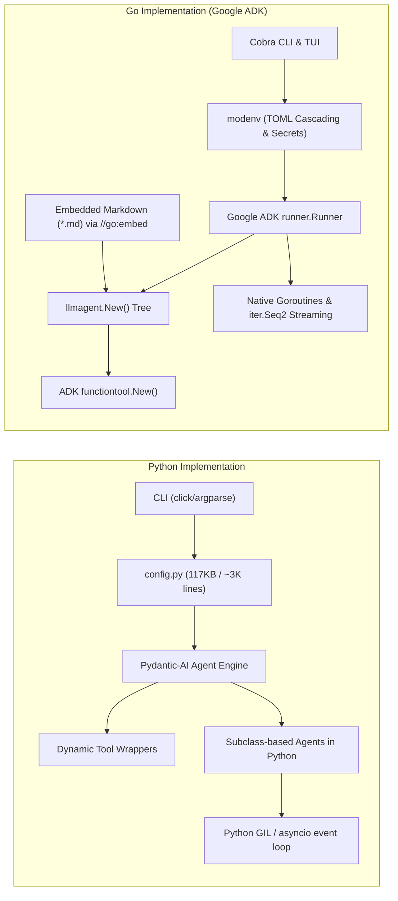

# 📊 Code Puppy: Python vs. Go Architectural & Performance Comparison

A comprehensive comparative analysis between the original **Python** implementation and the new **Go (Google ADK)** implementation across performance benchmarks, architectural complexity, distribution footprint, and maintainability.

---

## 1. ⚡ Empirical Performance Benchmarks

| Metric | Python Implementation | Go (Google ADK) Implementation | Delta / Improvement |
|---|---|---|---|
| **Cold Startup Latency** *(first run / env init)* | **25.295 s** | **0.041 s** (41 ms) | **~617x faster** 🚀 |
| **Warm CLI Latency** *(`--version` / `--help`)* | **0.960 s** (960 ms) | **0.040 s** (40 ms) | **24x faster** ⚡ |
| **Peak Resident Memory (RSS)** | **136.3 MB** | **16.5 MB** | **8.2x less RAM** 📉 |
| **Binary / Distribution Model** | Python 3.11+ venv / pipx + wheels | **Single Static Binary** (`CGO_ENABLED=0`) | **Zero runtime dependencies** |
| **Startup I/O Bound Ops** | 150+ imports, dynamic module resolution | In-memory `embed.FS` parsing in `<1 ms` | Instantaneous |

---

## 2. 🏗️ Codebase Complexity & Size Metrics

| Characteristic | Python (`python/code_puppy`) | Go (`go/`) | Contrast & Impact |
|---|---|---|---|
| **Source Files** | **271 files** | **28 files** | **~90% fewer source files** |
| **Lines of Code (SLOC)** | **86,722 lines** | **3,426 lines** | **~96% reduction in code surface** |
| **Source Weight** | ~3.08 MB source code | ~92 KB source code | High signal-to-noise ratio |
| **Lockfile & Dependencies** | `uv.lock` (528 KB, 150+ dependencies) | `go.mod` (clean dependency tree) | Hermetic, predictable builds |
| **Configuration Architecture** | 117 KB monolithic `config.py` | Typed structs + `retail-cortex/modenv` | Cascading `.env.toml` & secret URIs |

---

## 3. 🧩 Architectural Comparison

### Key Architectural Shifts:

### 1. Agent Definitions
- **Python**: Agent definitions were hardcoded Python classes (`BaseAgent` subclasses) mixed with string templates and dynamic class imports. Adding or customizing an agent required editing Python source files or dealing with loose JSON schemas.
- **Go**: Personas are standardized as **Markdown files with YAML frontmatter** (`pkg/agents/builtin/*.md`). They are baked directly into the binary at compile time via Go's `//go:embed`, yet can also be dynamically dropped into `./agents/*.md` or `~/.code_puppy/agents/*.md` without recompilation.

### 2. Configuration & Secrets
- **Python**: Configuration relied on raw `os.environ` reads, extensive monkey patching, and complex credential stores (`secret_store.py`).
- **Go**: Driven by **`retail-cortex/modenv`** (`pkg/config/config.go`), enabling hierarchical environment cascading (`.env.toml` -> `.env.<runtime>.toml` -> `.env.local.toml`) and native decryption of `cloud://`, `pks://`, and `simple://` secret URIs.

### 3. Tool Execution & Schemas
- **Python**: Used `pydantic-ai` with heavy runtime introspection and multiple monkey patches (`pydantic_patches.py` was 26 KB).
- **Go**: Uses **Google ADK `functiontool.New()`**, which automatically and safely infers compliant JSON Schemas from strongly-typed Go structs at initialization via `github.com/google/jsonschema-go`.

### 4. Concurrency & Streaming
- **Python**: Constrained by the Global Interpreter Lock (GIL) and asyncio thread dispatching. Long shell commands or background subprocesses required intricate coordination to avoid blocking the event loop.
- **Go**: Leverages native goroutines, channel synchronization, and Go 1.23+ `iter.Seq2[*session.Event, error]` streaming, giving fluid TUI rendering with near-zero overhead.

---

## 4. 📦 Packaging & Universal Portability

- **Python**:
  - Requires a pre-installed Python 3.11+ interpreter.
  - Relies on platform-specific C/Rust extensions (`cryptography`, `pydantic-core`, `pillow`), which frequently fail to compile on minimal containers, Termux/Android, or hardened CI runners.
  - Installation involves downloading hundreds of megabytes of wheel archives.
- **Go**:
  - Compiles to a **single static binary** (`CGO_ENABLED=0`).
  - Pre-built universal binaries ready for instant download and execution:
    - `code-puppy-darwin-arm64` (Apple Silicon: 18 MB)
    - `code-puppy-darwin-amd64` (Intel Mac: 19 MB)
    - `code-puppy-linux-amd64` (Linux x86_64: 19 MB)
    - `code-puppy-linux-arm64` (Linux ARM64: 18 MB)
    - `code-puppy-windows-amd64.exe` (Windows x64: 19 MB)
  - Zero dependencies: runs out of the box in `scratch` Docker containers, Alpine Linux, or bare metal.
