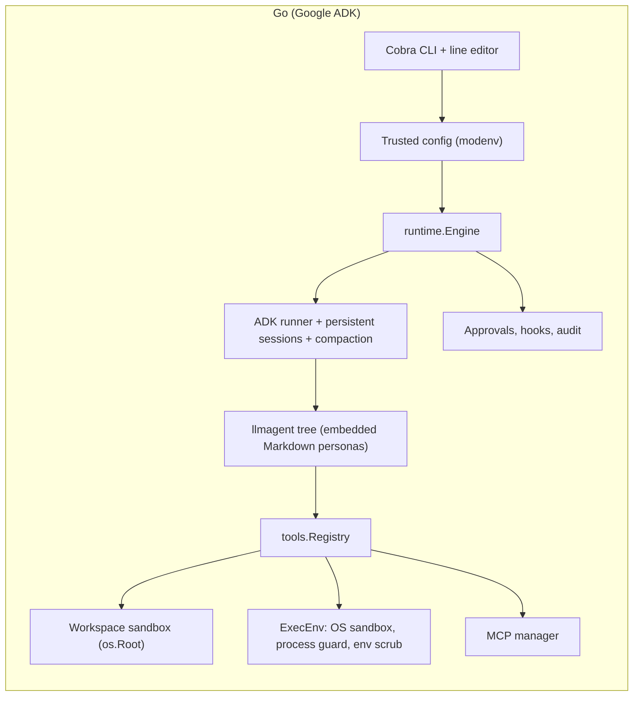

# Code Puppy: Python vs. Go

A comparison of the original **Python** implementation (`python/`) and the **Go / Google ADK** implementation (`go/`).

Go measurements were taken on 2026-09-24 on Apple Silicon (arm64), macOS, warm cache. Python startup and memory figures come from the earlier benchmark and were not re-run. Source counts were measured today for both.

---

## 1. Performance and footprint

| Metric | Python | Go | Notes |
|---|---|---|---|
| Warm `--version` | 0.960 s | **0.020 s** | ~48× faster |
| Interactive start → exit (config, sandbox probe, engine) | — | **0.030 s** | |
| First run of a new binary | 25.3 s (env init) | 0.76 s | Go's first run is macOS scanning the new binary |
| Peak memory (RSS), `--version` | 136.3 MB | **37 MB** | Go was 16.5 MB before MCP, Anthropic, Markdown and line-editor dependencies |
| Distribution | Python 3.11+ venv / pipx + wheels | **Single static binary** (`CGO_ENABLED=0`) | No runtime dependencies |
| Binary size | n/a | 56–61 MB per platform | Grew from ~18 MB; see §4 |

## 2. Code size

| | Python (`python/code_puppy`) | Go (`go/cmd`, `go/pkg`) |
|---|---|---|
| Source files (non-test) | 271 | 65 |
| Non-blank source lines | 71,962 | 11,956 |
| Test files | 380 | 38 |
| Non-blank test lines | — | 6,840 |
| Direct dependencies | 150+ (`uv.lock`) | 17 (`go.mod`) |

---

## 3. Capabilities

✅ supported · ➖ partial · ❌ not found

| Area | Python | Go | Go notes |
|---|---|---|---|
| **Providers** | ✅ many (Gemini, OpenAI/Codex, Anthropic, Z.ai, Gemini Code Assist, round-robin, model catalogue) | ➖ Gemini, Anthropic, OpenAI-compatible, Ollama | No model picker/catalogue; no round-robin |
| **Agents** | ✅ Python classes + JSON | ✅ Markdown + YAML frontmatter, embedded | `./agents` only with `--trust-workspace`; built-ins can't be overridden |
| **Sub-agent delegation** | ✅ | ✅ | Depth-limited `invoke_agent` |
| **Skills** | ✅ | ✅ | |
| **MCP servers** | ✅ | ✅ stdio + HTTP | Per-server approval, prefixes, per-agent scoping; stdio servers sandboxed |
| **Hooks** | ✅ hook engine | ✅ pre/post tool, prompt submit | Exit-2 / JSON block protocol |
| **Plugins** | ✅ plugin system | ❌ | MCP and hooks cover some of the same ground |
| **Approvals** | ✅ confirmations | ✅ diff preview; once / session / always | Saved rules scoped per workspace; never override deny rules |
| **Undo** | ✅ undo manager | ✅ per-turn checkpoints, `/undo`, `/diff` | Refuses to clobber later edits unless forced |
| **Sessions** | ✅ autosave, browser | ✅ persistent, `--resume` / `--continue` | Scoped per workspace |
| **Compaction** | ✅ | ✅ automatic + `/compact [focus]` | |
| **Token / cost tracking** | ✅ | ✅ per turn and session | Cache reads/writes priced; `doctor` flags unpriced models |
| **Project instructions** | ✅ | ✅ `AGENTS.md` / `PUPPY.md` | |
| **Web** | ➖ browser tooling | ✅ `web_fetch`, `web_search` (Brave, Tavily, SearXNG) | SSRF protection on every hop; no browser automation |
| **Images / attachments** | ✅ | ✅ `@image` mentions, `/attach`, `/paste`, `--image`, `view_image` tool | Gemini, Anthropic, OpenAI-compatible; images kept out of session files |
| **i18n** | ✅ | ✅ English, Spanish, Canadian French | `/locale`; external JSON catalogs; model replies in the chosen language |
| **Shell passthrough** | ✅ `!cmd` | ✅ `!cmd` | Runs as the user in the workspace; audited |
| **Plan mode** | ➖ `/plan` (instructions only) | ✅ `/plan`, `--plan` | Enforced: only read-only tools run, including in sub-agents |
| **Slash commands** | ✅ many | ➖ | No `/cd` (the workspace is the sandbox root; use `-d`), `/truncate` (use `/compact`), `/dump_context`/`/load_context`, `/tutorial`, per-agent model pinning |
| **Steering mid-turn** | ✅ Ctrl+T, injected before the next model call | ✅ type or Ctrl+T; delivered with the next tool result | macOS and Linux; late messages become the next prompt |
| **Onboarding / menus** | ✅ wizard, interactive menus | ➖ `config init`, `doctor`, line editor with completion | |
| **Scripting** | ➖ | ✅ `json` / `stream-json`, `--max-turns`, exit codes | |
| **File sandbox** | ➖ access checks (`fs_access.py`) | ✅ `os.Root` roots, read-only roots, blocked globs incl. symlinks | |
| **OS sandbox for shell** | ❌ not found in source | ✅ Seatbelt (macOS), bubblewrap (Linux) | Writes confined, secrets unreadable, network optional |
| **Command policy** | ➖ | ✅ parsed allow / deny / auto-approve | Checks every sub-command, including wrappers and `bash -c` |
| **Process lifetime** | ➖ backgrounding | ✅ nothing outlives the CLI | Guarded even against SIGKILL |
| **Secret handling** | ✅ secret store backends | ✅ env scrubbing, redacted audit log, owner-only files | |
| **Audit log** | ➖ | ✅ JSONL of prompts, tools, approvals, hooks, undo | |
| **Diagnostic log** | ✅ error log (`error_logging.py`) | ✅ `slog` JSONL, async writer, secrets masked | Trace IDs on each line when telemetry is on |
| **Resilience** | ✅ HTTP retry, MCP circuit breaker / health monitor / retry manager | ✅ retries with backoff for every provider, stall timeouts, MCP restart + circuit breaker + timeouts, parallel tool cap | No MCP health dashboard or model round-robin |
| **Telemetry** | ✅ opt-in Logfire | ✅ opt-in OpenTelemetry (OTLP/HTTP traces + logs) | Turn → agent → model/tool spans; content stripped unless `capture_content` |
| **Release** | PyPI | ✅ GoReleaser: SBOMs, keyless cosign signatures, reproducible builds | |

---

## 4. Trade-offs in the Go version

- **Binary size:** the MCP SDK, Anthropic SDK, Markdown renderer (glamour) and line editor took the binary from ~18 MB to ~58 MB. Startup is unaffected. If size matters, the Markdown renderer is the easiest to make optional with a build tag.
- **Breadth:** Python still leads on providers, plugins and interactive menus. Go leads on sandboxing, auditability, scripting and distribution.
- **OS sandbox coverage:** macOS and Linux only. Windows builds run without it and without the process guard.

## 5. Architecture

